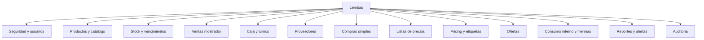
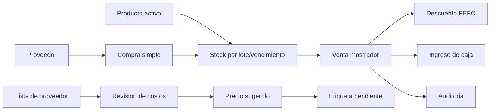

# Vision general

> [!abstract]
> **Lembas** es un sistema web interno para una dietetica de una sola sucursal. Centraliza productos, stock por lote y vencimiento, ventas mostrador simplificadas, caja, proveedores, listas de precios, actualizacion asistida de precios, ofertas, etiquetas, reportes y auditoria.

## Proposito

Reemplazar planillas, anotaciones y registros dispersos por una aplicacion propia con persistencia, trazabilidad y reglas de negocio explicitas. El sistema busca resolver procesos reales del local sin convertirse en un POS fiscal completo ni en un sistema contable avanzado.

## Documentos principales

1. [[01 - Contexto y problema]]
2. [[02 - Alcance del sistema]]
3. [[03.1 - Requisitos funcionales]]
4. [[03.2 - Requisitos no funcionales]]
5. [[03.3 - Matriz de trazabilidad]]
6. [[04.1 - Reglas de negocio]]
7. [[04.2 - Modelo conceptual]]
8. [[05.2 - Casos de uso principales]]
9. [[06.1 - Decision arquitectonica]]
10. [[07.1 - Endpoints]]
11. [[09.1 - Estrategia de testing]]
12. [[10.1 - MVP]]

## Modulos del sistema

## Decision de alcance

| Categoria | Criterio |
|---|---|
| MVP obligatorio | Funcionalidades necesarias para demostrar el circuito operativo basico y la consistencia transaccional. |
| MVP diferencial | Funcionalidades que agregan valor propio al TFI sin desbordar el proyecto. |
| Futuras mejoras | Evoluciones posibles cuando el nucleo ya este estable. |
| Fuera de alcance | Elementos excluidos para evitar complejidad fiscal, contable o comercial innecesaria. |

El detalle se encuentra en [[10.1 - MVP]] y [[10.3 - Roadmap futuro]].

## Circuito central defendible

## Tecnologias propuestas

| Capa | Tecnologia |
|---|---|
| Frontend | Angular |
| Backend | Spring Boot |
| Base de datos | PostgreSQL |
| Seguridad | Spring Security + JWT o sesion segura |
| API | REST + OpenAPI/Swagger |
| Migraciones | Flyway o Liquibase |
| Despliegue | Docker, Nginx y nube |

## Referencias visuales

Las imagenes disponibles estan documentadas en [[Imagenes]] y se enlazan con rutas relativas portables.
