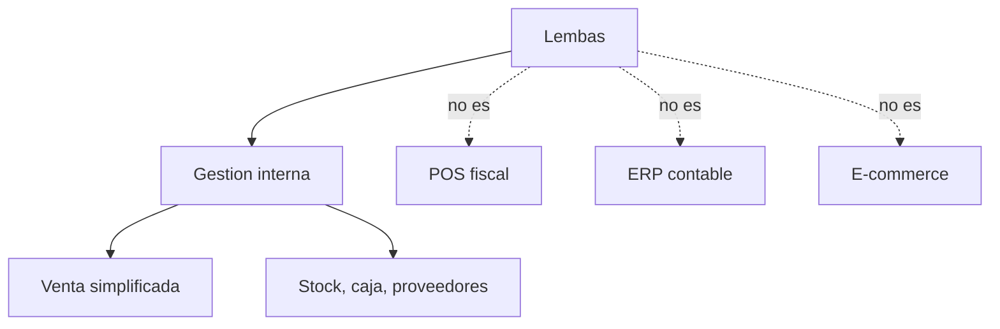

# Alcance del sistema

> [!abstract]
> Lembas es una herramienta de gestion interna. Incluye venta mostrador simplificada porque integra stock y caja, pero no busca ser un POS fiscal, una contabilidad completa ni una plataforma comercial externa.

## Alcance incluido

| Area | Incluye |
|---|---|
| Usuarios | Autenticacion, roles, permisos y baja logica. |
| Productos | Alta, edicion, consulta, desactivacion, categorias, marcas, presentaciones y codigo de barras opcional. |
| Stock | Lotes, vencimientos, movimientos, FEFO, stock bajo y vencimiento proximo. |
| Ventas | Venta mostrador en borrador, scanner, busqueda manual, cantidad editable, precio controlado, confirmacion y anulacion. |
| Caja | Ingreso automatico por venta, movimientos manuales, turnos y cierres. |
| Consumo interno | Registro con razon, descuento FEFO y sin impacto en caja. |
| Mermas/vencimientos | Egresos trazables con motivo. |
| Ofertas | Ofertas por producto, periodo, porcentaje o precio fijo. |
| Proveedores | Gestion de proveedores y mapeo ProductoProveedor. |
| Compras simples | Precarga de compras esperadas a proveedor y control de recepcion con cantidades reales, costos recibidos, vencimientos/lotes opcionales y diferencias, generando stock solo al confirmar. |
| Listas de precios | Excel, texto de WhatsApp y carga manual con revision. |
| Pricing | Historial de costos, reglas de margen/redondeo, precios sugeridos y aprobacion. |
| Etiquetas | Etiquetas pendientes e imprimibles ante cambio de precio/oferta. |
| Reportes | Stock, vencimientos, ventas, caja, consumos, mermas, proveedores, listas y etiquetas. |
| Auditoria | Registro de acciones criticas. |

## MVP obligatorio

El MVP obligatorio es el minimo para demostrar el circuito operativo consistente:

1. Login y roles basicos.
2. Productos, categorias y marcas.
3. Codigo de barras opcional.
4. Stock por lote/vencimiento.
5. Movimientos de stock.
6. Venta mostrador con scanner y busqueda manual.
7. Modificacion de cantidad antes de confirmar.
8. Confirmacion transaccional de venta: stock FEFO + caja + auditoria.
9. Caja con ingreso automatico por venta y cierre basico.
10. Consumo interno y merma simple.
11. Auditoria de acciones criticas.
12. Reportes basicos de stock, ventas, caja y vencimientos.

## MVP diferencial

Aporta valor especifico al caso de una dietetica sin desbordar el alcance:

1. Proveedores multiples por producto.
2. ProductoProveedor para normalizar nombres de proveedor.
3. Carga de listas por Excel.
4. Carga de listas copiadas desde WhatsApp.
5. Comparacion costo anterior vs costo nuevo.
6. Actualizacion asistida de costos y precios con aprobacion.
7. Reglas simples de margen y redondeo.
8. Ofertas temporales.
9. Etiquetas pendientes.
10. Compras simples a proveedor: precargar lo esperado, controlar lo recibido y generar stock con cantidades reales.
11. Reposicion sugerida simple por stock minimo/ideal.

## Futuras mejoras

Se documentan como evolucion, no como compromiso del MVP:

- pedidos a proveedores completos;
- recepcion parcial o avanzada contra pedido;
- pagos a proveedores y cuenta corriente;
- inventario fisico completo;
- reportes de rotacion y tendencias;
- notificaciones por email o WhatsApp externo;
- integracion con impresoras de etiquetas;
- app movil nativa;
- lectura de codigo de barras desde camara;
- promociones combinadas;
- e-commerce acotado;
- integraciones con medios de pago.

## Fuera de alcance

| Elemento | Motivo |
|---|---|
| Facturacion fiscal y AFIP | Requiere normativa e integraciones fiscales ajenas al objetivo. |
| POS fiscal completo | El sistema solo registra venta interna simplificada. |
| Mercado Pago, tarjetas o QR automaticos | Agrega complejidad de conciliacion externa. |
| E-commerce como MVP | Cambia el tipo de sistema y los actores. |
| Multi-sucursal | El negocio objetivo tiene una sola sucursal. |
| Contabilidad avanzada | No es el foco del TFI. |
| Facturas de compra, impuestos, pagos y deuda a proveedores | El modulo de compras solo registra productos comprados e ingreso de stock. |
| Cuentas corrientes y CRM avanzado | Aumenta el alcance comercial. |
| PDF, imagenes, fotos y OCR | Requiere reconocimiento optico y parsing no estructurado. |
| Audio de WhatsApp | No aporta al nucleo operativo. |
| IA generativa | No es necesaria para validar el sistema. |

## Limite conceptual

