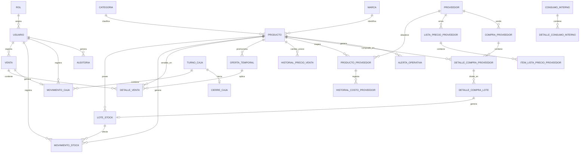

# Modelo conceptual

## Criterios

El modelo debe conservar trazabilidad, evitar eliminacion fisica de datos historicos, representar stock por vencimiento, guardar precio aplicado en ventas, separar costo proveedor de precio de venta y permitir auditoria.

## Entidades por modulo

| Modulo | Entidades principales |
|---|---|
| Seguridad | Usuario, Rol, Permiso |
| Catalogo | Producto, Categoria, Marca, Presentacion |
| Proveedores | Proveedor, ProductoProveedor |
| Compras | CompraProveedor, DetalleCompraProveedor, DetalleCompraLote |
| Listas | ListaPrecioProveedor, ItemListaPrecioProveedor |
| Pricing | HistorialCostoProveedor, ReglaPrecio, HistorialPrecioVenta, EtiquetaPrecio |
| Stock | LoteStock, MovimientoStock, InventarioFisico, DetalleInventarioFisico |
| Ventas | Venta, DetalleVenta |
| Ofertas | OfertaTemporal |
| Consumo | ConsumoInterno, DetalleConsumoInterno |
| Caja | TurnoCaja, MovimientoCaja, CierreCaja |
| Reportes | AlertaOperativa |
| Auditoria | Auditoria |

## Entidades clave

### Producto

Representa un producto interno. Campos sugeridos: id, codigoInterno, codigoBarras, nombre, descripcion, categoria, marca, presentacion, precioVentaBase, costoEstimado, stockMinimo, stockIdeal, controlaVencimiento, etiquetaPendiente, proveedorHabitual, activo.

### ProductoProveedor

Relaciona un producto interno con la forma en que un proveedor lo identifica. Campos: producto, proveedor, codigoProveedor, nombreProveedor, presentacionProveedor, ultimoCosto, fechaUltimaActualizacion, esHabitual, activo.

### LoteStock

Representa cantidad disponible de un producto asociada a lote o vencimiento. Campos: producto, cantidadDisponible, fechaVencimiento, loteProveedor, fechaIngreso, proveedor, estado.

### MovimientoStock

Registra variaciones de stock. Campos: producto, loteStock, tipoMovimiento, cantidad, motivo, usuario, fechaHora, referenciaTipo, referenciaId.

### Venta y DetalleVenta

Venta contiene estado, fecha, usuario, turnoCaja, total y motivo de anulacion. DetalleVenta guarda producto, cantidad, precioBaseHistorico, precioAplicado, descuentoAplicado, ofertaTemporal y subtotal.

### ListaPrecioProveedor e ItemListaPrecioProveedor

ListaPrecioProveedor registra proveedor, metodo de carga, fecha, usuario y estado. ItemListaPrecioProveedor contiene nombre detectado, costo nuevo, costo anterior, diferencia, producto sugerido y estado de reconocimiento.

### CompraProveedor

Representa una compra simple a proveedor. En estado borrador funciona como precarga de lo esperado; al confirmarse como recibida genera ingreso de stock. Campos: proveedor, fechaCompra, fechaRecepcion, estado, usuarioCarga, usuarioRecepcion, observaciones, totalEstimado y totalRecibido.

### DetalleCompraProveedor

Representa cada producto de la compra. Campos: compraProveedor, producto, productoProveedor opcional, cantidadEsperada, cantidadRecibida, costoUnitarioEsperado, costoUnitarioRecibido, subtotalEsperado, subtotalRecibido, estadoRecepcion y observaciones.

### DetalleCompraLote

Representa la division de una linea recibida en uno o mas lotes. Campos: detalleCompraProveedor, cantidad, fechaVencimiento opcional, loteProveedor opcional y observaciones. Cada DetalleCompraLote confirmado genera un LoteStock.

### Auditoria

Registra usuario, accion, entidad, entidadId, fechaHora, datosAntes, datosDespues y detalle.

## Diagrama ER conceptual

## Observaciones de implementacion

- En JPA conviene usar DTOs para API y no exponer entidades directamente.
- Los agregados transaccionales principales son Venta, ConsumoInterno, ListaPrecioProveedor y Recepcion/Pedido si se implementa.
- Los historiales y auditoria deben ser append-only o modificables solo por mecanismos administrativos excepcionales.
