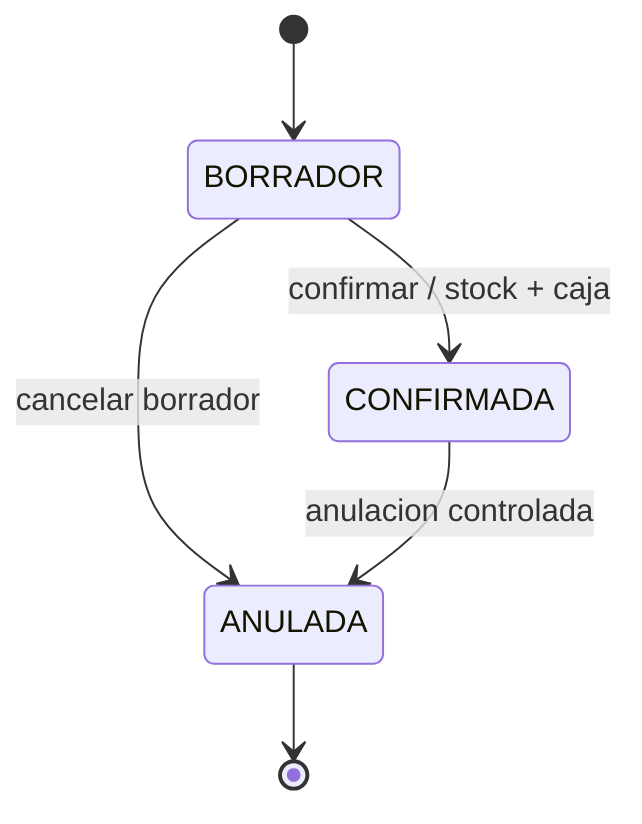
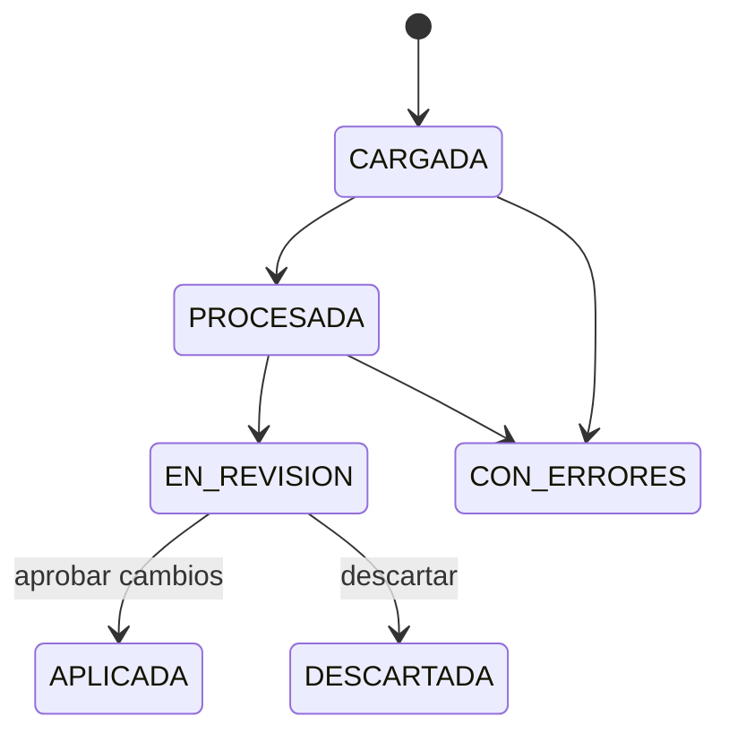
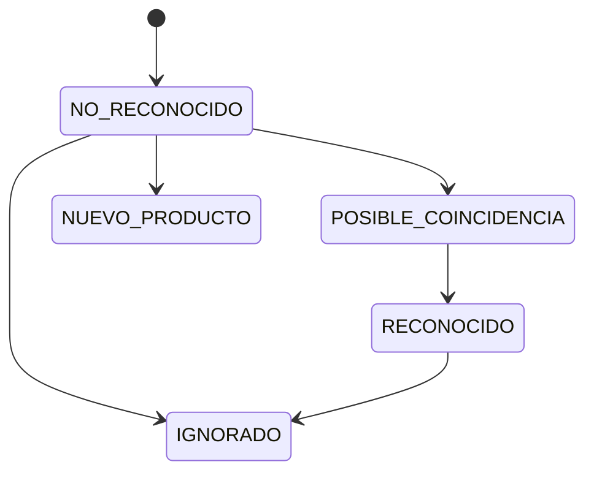
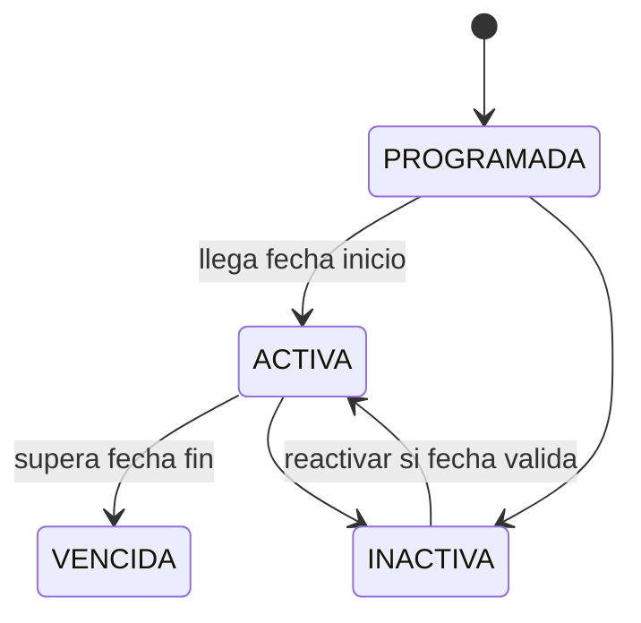
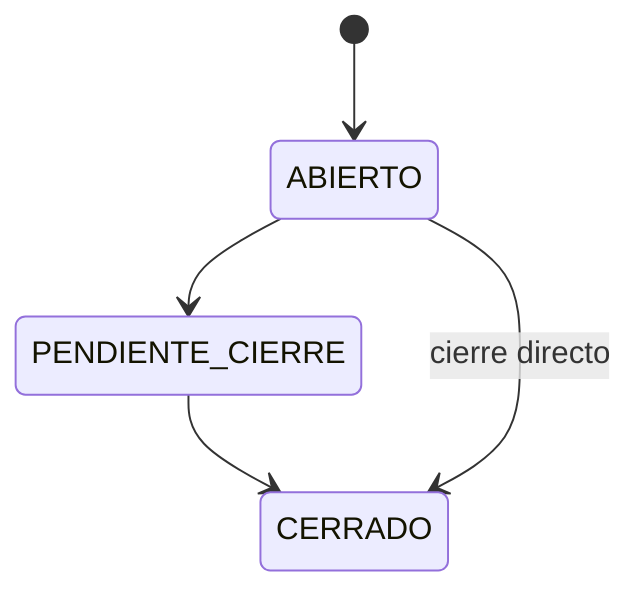
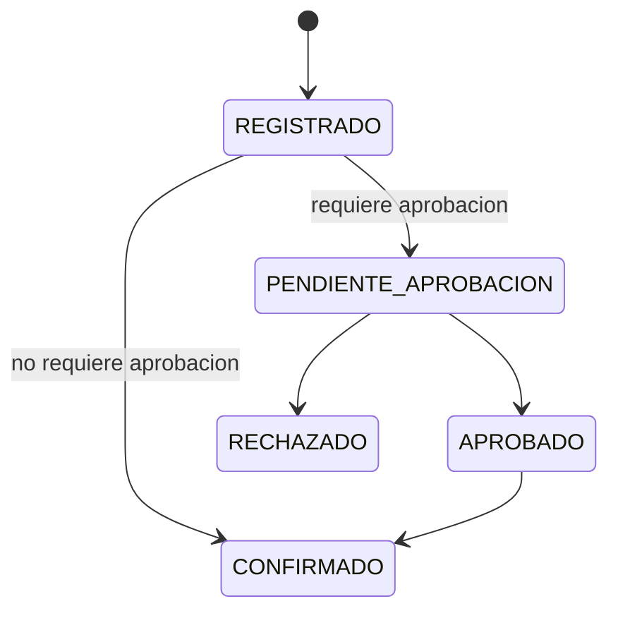
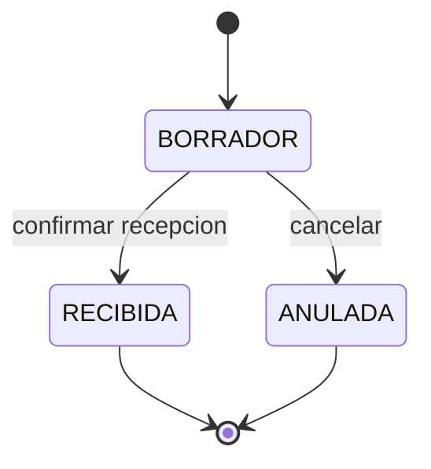
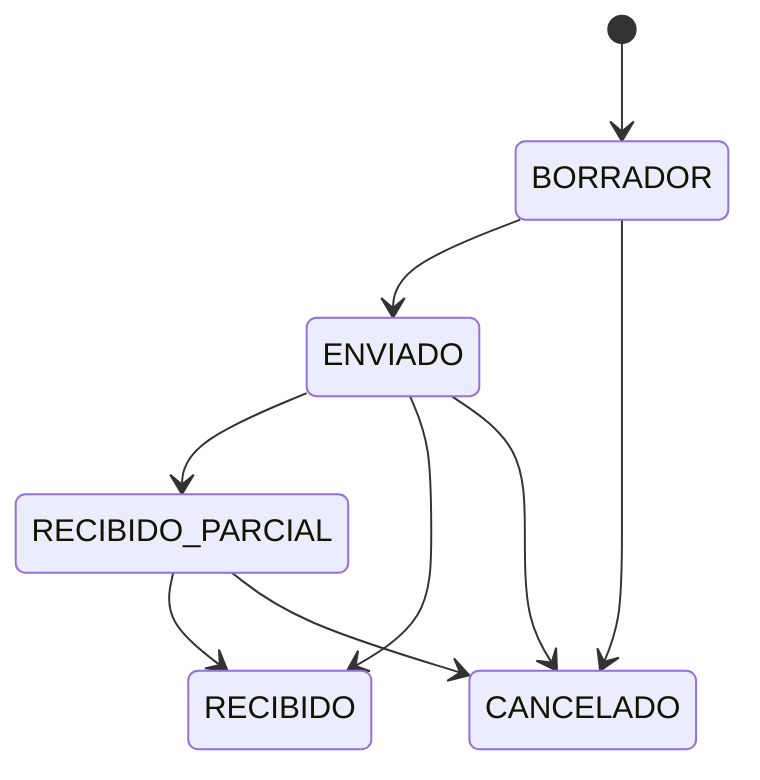
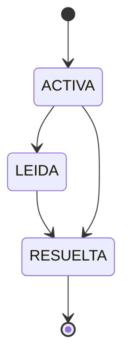

# Estados y ciclos de vida

## Venta

Reglas: una venta solo impacta stock y caja al confirmarse. La anulacion no elimina la venta.

## Lista de precios

Reglas: una lista no modifica costos ni precios sin revision y aprobacion.

## Item de lista

## Oferta temporal

## Turno de caja

## Consumo interno

Regla: un consumo rechazado no descuenta stock.

## Compra simple

Regla: `BORRADOR` representa lo esperado y no impacta stock. Al controlar la recepcion se cargan cantidades recibidas reales, vencimientos/lotes opcionales y diferencias. Solo `RECIBIDA` genera movimientos de stock. No representa una factura fiscal ni un pago a proveedor.

## Pedido a proveedor

## Alerta operativa

