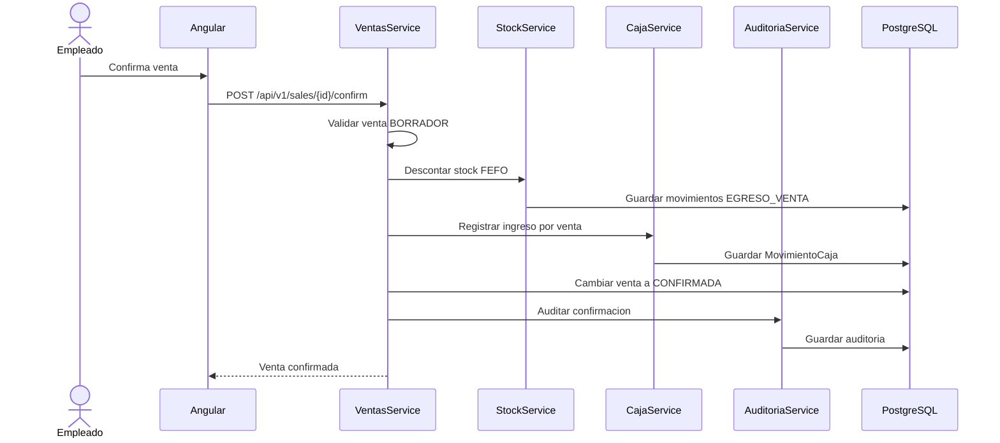
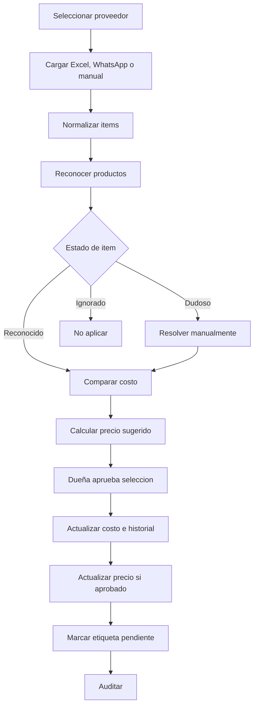
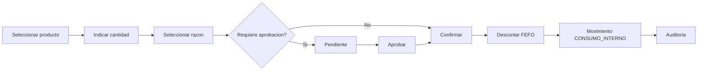
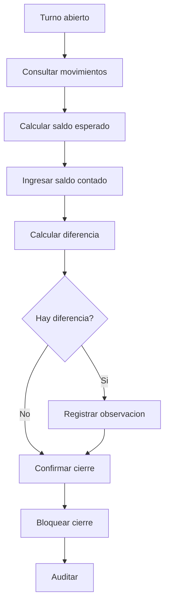
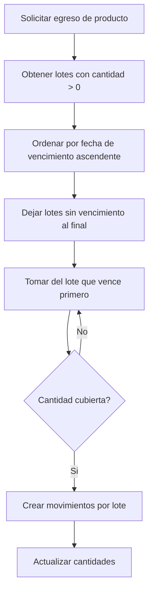
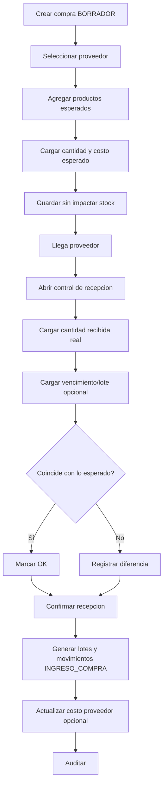

# Flujos criticos

## Venta mostrador

## Aplicacion de lista de precios

## Consumo interno

## Cierre de caja

## FEFO

## Compra simple a proveedor

> [!important]
> Regla central: el stock ingresado se calcula con la cantidad recibida real, no con la cantidad esperada.
