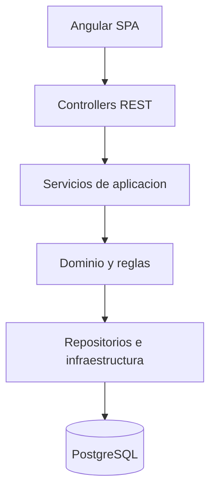

# Decision arquitectonica

## Decision

Implementar Lembas como **monolito modularizado** con frontend Angular, backend Spring Boot y base de datos PostgreSQL.

## Justificacion

| Criterio | Argumento |
|---|---|
| Alcance | Una sola sucursal y un equipo de desarrollo acotado no justifican microservicios. |
| Consistencia | Venta, stock y caja requieren transacciones coordinadas. |
| Desarrollo academico | Permite demostrar capas, modulos, reglas, pruebas y despliegue sin complejidad operacional excesiva. |
| Evolucion | Los modulos quedan separados para extraer componentes en el futuro si fuera necesario. |

## Vista de capas

## Modulos coherentes

| Modulo | Responsabilidad |
|---|---|
| security | Autenticacion, autorizacion, roles y permisos. |
| products | Catalogo, categorias, marcas, presentaciones y codigos de barras. |
| stock | Lotes, movimientos, FEFO, mermas, vencimientos e inventario. |
| sales | Venta mostrador, detalle, confirmacion y anulacion. |
| cash | Caja, turnos, movimientos y cierres. |
| suppliers | Proveedores y ProductoProveedor. |
| purchases | Compras simples a proveedor e ingreso de stock. |
| price-lists | Carga, normalizacion y revision de listas. |
| pricing | Reglas de margen, redondeo e historial de precios. |
| offers | Ofertas temporales. |
| consumption | Consumo interno. |
| labels | Etiquetas y listados imprimibles. |
| reports | Reportes y consultas agregadas. |
| alerts | Alertas operativas. |
| audit | Auditoria transversal. |
| shared | Utilidades, errores, DTOs comunes y paginacion. |

## Riesgos mitigados

| Riesgo | Mitigacion |
|---|---|
| Monolito desordenado | Separacion por modulos y capas. |
| Reglas duplicadas en frontend | Validaciones definitivas en backend. |
| Inconsistencia entre venta, stock y caja | Transacciones de aplicacion. |
| Dificultad para probar | Servicios de dominio y casos de uso testeables. |
| Exposicion de informacion sensible | Autorizacion por endpoint y vistas por rol. |

## Alternativas descartadas

| Alternativa | Motivo de descarte |
|---|---|
| Microservicios | Aumentan complejidad de despliegue, comunicacion y consistencia. |
| Aplicacion solo frontend/local | No garantiza persistencia centralizada ni trazabilidad. |
| POS fiscal comercial | Cambia el objetivo del TFI y agrega obligaciones externas. |
