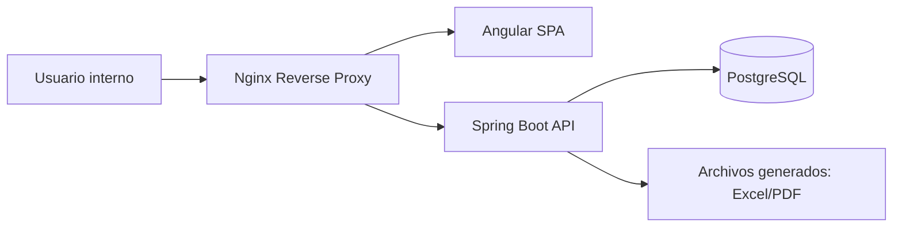

# Despliegue

## Modelo propuesto



## Componentes

| Componente | Responsabilidad |
|---|---|
| Angular build | Archivos estaticos de frontend. |
| Nginx | Servir SPA, redirigir `/api`, TLS, compresion y headers. |
| Spring Boot | API REST y reglas de negocio. |
| PostgreSQL | Persistencia. |
| Docker Compose | Entorno local reproducible y base de despliegue. |

## Variables de entorno

- `SPRING_DATASOURCE_URL`
- `SPRING_DATASOURCE_USERNAME`
- `SPRING_DATASOURCE_PASSWORD`
- `JWT_SECRET` o clave de sesion
- `CORS_ALLOWED_ORIGINS`
- `APP_PROFILE`

## Consideraciones

- La API no queda oculta por Nginx; el navegador debe consumirla. Nginx reduce exposicion directa y ordena el ingreso.
- La configuracion sensible no debe versionarse.
- Debe existir procedimiento de backup de PostgreSQL para una version real.
- El despliegue del TFI puede ser demostrativo, pero debe documentar como levantarlo.

## Entregable Git

El repositorio debe ignorar carpetas locales de herramientas:

```gitignore
.obsidian/
.pi/
```
