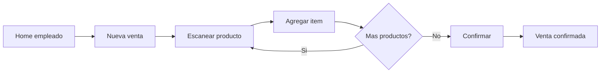
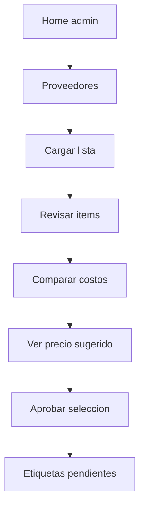
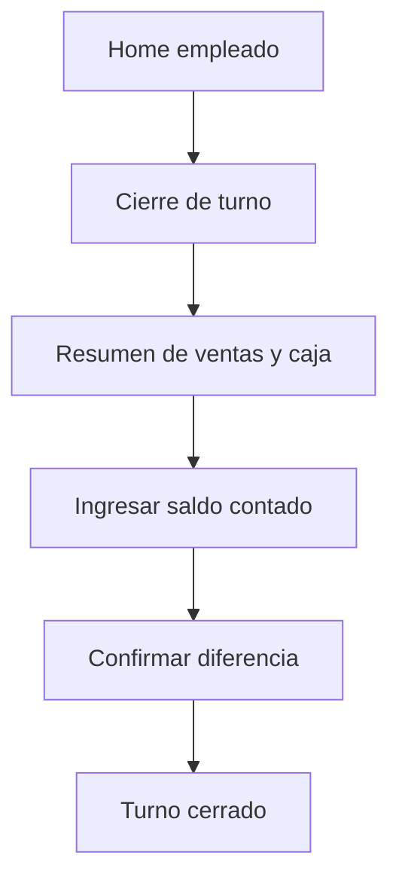
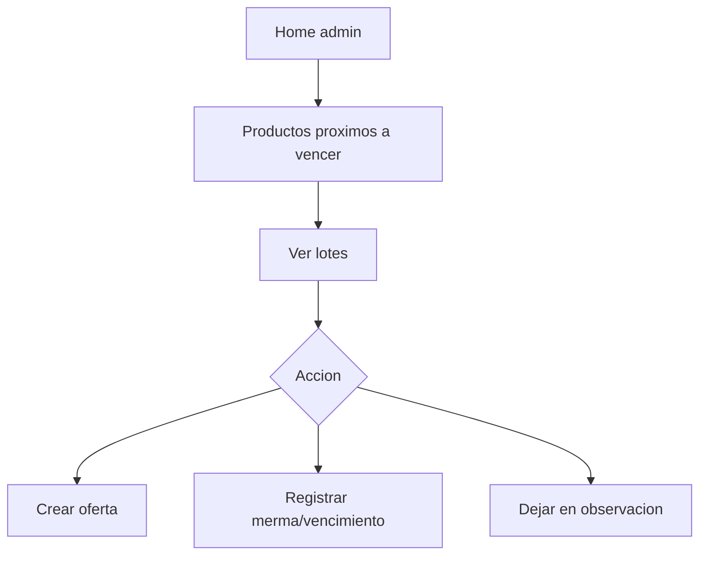
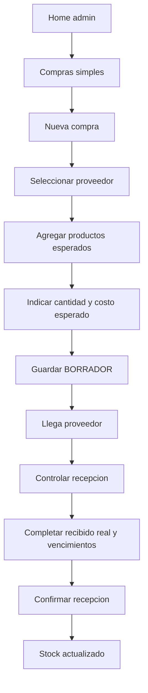

# Flujos de usuario

## Empleado: venta rapida

## Administradora: actualizar precios desde lista

## Empleado: cierre de turno

## Administradora: control de vencimientos

## Administradora: registrar y recibir compra simple

