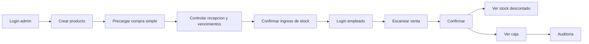

# MVP

## MVP obligatorio

| Modulo | Funcionalidades |
|---|---|
| Seguridad | Login, roles administradora/empleado, permisos basicos. |
| Productos | CRUD, baja logica, categorias, marcas, codigo de barras opcional. |
| Stock | Lotes, vencimientos, ingresos, ajustes, mermas, FEFO. |
| Ventas | Venta borrador, scanner, busqueda manual, cantidad editable, confirmacion. |
| Caja | Ingreso automatico por venta, movimientos manuales, cierre basico. |
| Consumo interno | Registro con razon, descuento stock, sin caja. |
| Reportes | Stock, vencimientos, ventas, caja. |
| Auditoria | Acciones criticas. |

## MVP diferencial

| Modulo | Funcionalidades |
|---|---|
| Proveedores | ProductoProveedor, proveedor habitual y alternativos. |
| Compras simples | Precarga de compra esperada, control de recepcion e ingreso de stock por cantidad recibida. |
| Listas de precios | Excel, texto WhatsApp, carga manual y revision. |
| Pricing | Comparacion costo anterior/nuevo, precio sugerido, aprobacion. |
| Ofertas | Promociones temporales simples. |
| Etiquetas | Pendientes e imprimibles. |
| Alertas | Stock bajo, vencimiento, lista pendiente, cierre pendiente. |
| Reposicion | Sugerencia simple: stock ideal - stock actual. |

## Futuras mejoras

- Pedidos a proveedores completos y recepcion parcial avanzada.
- Pagos, deuda y cuenta corriente de proveedores.
- Inventario fisico completo.
- Reportes de rotacion.
- Integraciones externas de notificacion.
- App movil nativa.
- Camara como lector de barras.
- E-commerce.
- Mercado Pago o medios de pago.

## Fuera de alcance

- AFIP y facturacion fiscal.
- Facturas de compra, impuestos y registracion contable.
- POS fiscal completo.
- Contabilidad avanzada.
- Multi-sucursal.
- OCR, PDF, imagenes, audio y lectura de catalogos web.
- IA generativa como parte del MVP.

## Demo minima esperada

