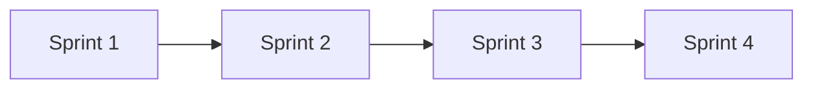

# Plan de sprints

## Resumen

| Sprint | Duracion | Objetivo | Entregable |
|---|---:|---|---|
| 1 | 2 semanas | Base tecnica y seguridad | Login, roles, homes y arquitectura base. |
| 2 | 2 semanas | Catalogo, proveedores, compras simples y stock | Productos, ProductoProveedor, compras simples, lotes y movimientos. |
| 3 | 2 semanas | Venta, caja, consumo, ofertas y pricing | Venta FEFO, caja, consumo interno y lista aplicada. |
| 4 | 2 semanas | Reportes, etiquetas, QA y despliegue | Sistema integrado, testeado, documentado y desplegable. |

## Sprint 1 - Base tecnica y seguridad

- Inicializar Spring Boot, Angular y PostgreSQL.
- Configurar Docker Compose local.
- Definir modulos y capas.
- Implementar login, roles y permisos.
- Crear home admin y home empleado.
- Documentar levantamiento local.

**Definition of Done:** backend y frontend levantan, login funciona, rutas protegidas y migracion inicial ejecutable.

## Sprint 2 - Catalogo, proveedores y stock

- CRUD de productos, categorias y marcas.
- Codigo de barras y busqueda.
- Proveedores y ProductoProveedor.
- Compras simples a proveedor en borrador/recibida/anulada.
- Precarga de productos esperados y control de cantidades recibidas reales.
- Carga manual opcional de vencimiento/lote al recibir.
- Ingreso de stock por compra confirmada o carga directa con lote/vencimiento.
- Movimientos de stock.
- Mermas y vencimientos.
- Alertas basicas de stock bajo/vencimiento.

**Definition of Done:** productos consultables, stock trazable y FEFO preparado.

## Sprint 3 - Venta, caja y pricing

- Venta mostrador con scanner y busqueda manual.
- Cantidad editable y precio modificable con permiso/motivo.
- Confirmacion transaccional venta-stock-caja.
- Ofertas temporales.
- Consumo interno.
- Caja y cierre basico.
- Listas de precios por Excel/WhatsApp/manual.
- Actualizacion asistida de costos/precios.

**Definition of Done:** demo de venta completa y lista aplicada con etiqueta pendiente.

## Sprint 4 - Consolidacion

- Reportes operativos.
- Etiquetas imprimibles.
- Auditoria consultable.
- Pruebas unitarias e integracion sobre procesos criticos.
- Manejo centralizado de errores.
- Despliegue con Docker/Nginx.
- Documentacion final.

**Definition of Done:** demo punta a punta, tests criticos, API documentada y documentacion consistente.

## Dependencias

## Guion de demo

1. Iniciar sesion como administradora.
2. Crear producto con codigo, precio, stock minimo y proveedor.
3. Precargar compra simple a proveedor con cantidades y costos esperados.
4. Controlar recepcion cargando cantidad recibida real y vencimiento/lote opcional.
5. Confirmar la compra y verificar ingreso de stock.
6. Crear oferta temporal.
7. Iniciar sesion como empleado.
8. Escanear producto en nueva venta.
9. Modificar cantidad.
10. Confirmar venta.
11. Ver stock descontado y caja actualizada.
12. Cargar lista de proveedor.
13. Revisar costo nuevo y aplicar precio aprobado.
14. Ver etiqueta pendiente.
15. Registrar consumo interno.
16. Cerrar turno.
17. Consultar reporte y auditoria.
