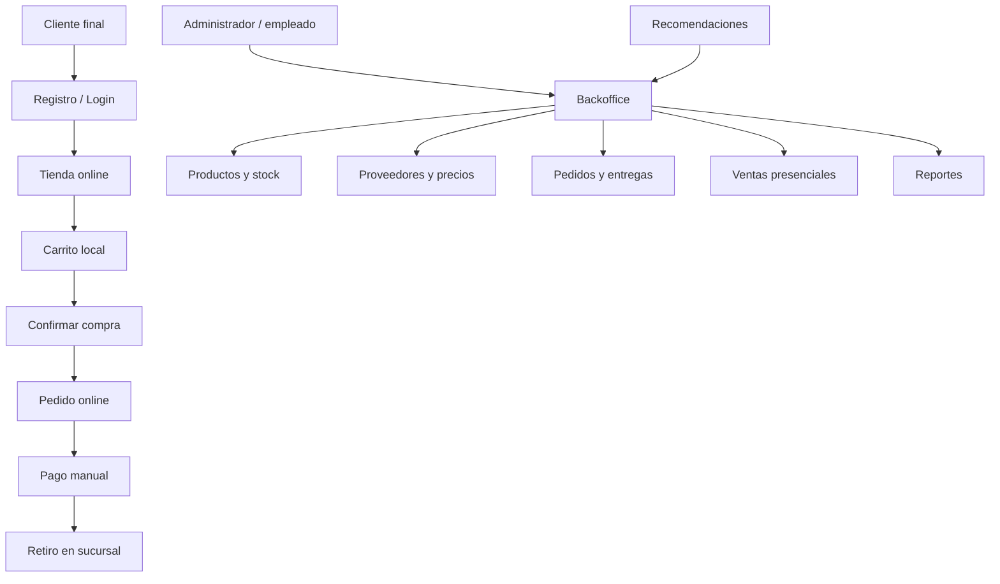

# Propuesta de Solucion

## Solucion general

Se propone desarrollar una plataforma web compuesta por **tres grandes areas**:

1. **Backoffice / ERP comercial acotado** -- para administrar la operacion interna
2. **Modulo e-commerce** -- para clientes finales, integrado al stock y precios reales
3. **Modulo inteligente** -- para recomendaciones y sugerencias comerciales

> [!important] Logica central
> La logica central del negocio vive en el backoffice. La tienda online funciona como un canal de venta que consume esa informacion.

## Valor diferencial

- E-commerce funcional
- Stock real por sucursal
- Venta presencial integrada
- Gestion de proveedores y precios
- Impresion de etiquetas
- Soporte para lector de codigo de barras
- Analytics comercial
- Recomendaciones inteligentes

## Principio de diseno

Cada modulo tiene que estar conectado con procesos reales del negocio.

## Enfoque reformulado

| Enfoque anterior | Enfoque actualizado |
|---|---|
| Sistema interno para gestion de stock, ventas, proveedores | Sistema integral de gestion comercial con modulo e-commerce integrado |
| Centro: administrar datos internos | Centro: operar ventas presenciales y online desde una misma base |
| Puede derivar en ABMs aislados | Cada modulo participa en un flujo comercial |

## Frase guia del proyecto

> El sistema se plantea como una plataforma de gestion comercial para una dietetica real, con funcionalidades de ERP acotado mas un modulo e-commerce integrado que permite vender online utilizando la misma informacion operativa del negocio.

---

> [!seealso] Volver a [[_Index]]
