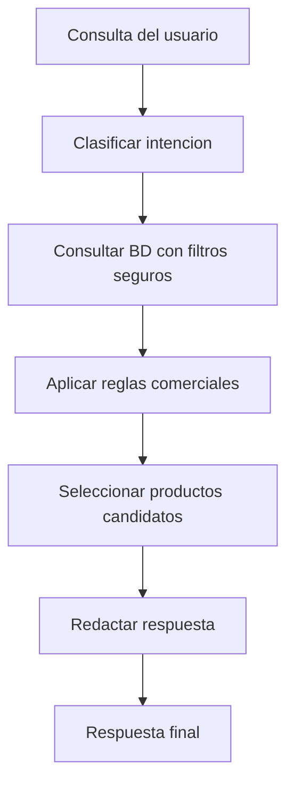

# Modulo Asistente Inteligente

> [!info] Proposito: aportar una capa diferencial que ayude al cliente a comprar mejor y al administrador a tomar decisiones comerciales.
>
> **Aclaracion para el MVP:** el asistente no utiliza IA generativa ni LLM. Se trata de un recomendador basado en reglas que filtra productos por etiquetas, stock disponible y categoria. Se denomina "inteligente" por su capacidad de interpretar texto libre y mapearlo a filtros del sistema, pero todo el procesamiento es determinista sobre datos reales de la base de datos.

## Principio tecnico

> [!important] La IA no debe inventar productos ni recomendar productos inexistentes. Trabaja sobre informacion real del sistema.

```text
Consulta del usuario -> Filtro BD (stock, categoria, tags, sucursal)
                     -> Ranking / reglas comerciales
                     -> Respuesta con productos reales y disponibles
```

## Flujo de recomendaciones



## Dos tipos de asistente

### Para cliente

Ej: "Quiero algo dulce sin azucar", "Busco productos sin TACC". Responde con productos disponibles en la sucursal seleccionada.

### Para administrador

Ej: "Que productos reponer?", "Que promocionar?". Sugiere reposicion y promociones basadas en datos reales.

## Reglas de seguridad

- No inventar productos
- No recomendar sin stock
- No hacer diagnosticos medicos
- No exponer datos internos (costos, margenes)
- No afirmar beneficios de salud no registrados

## Prompt base interno

> Sos un asistente de compra para una dietetica. Recomenda productos solo de la lista provista por el sistema. No inventes. No recomiendes sin stock. No hagas diagnosticos. Responde breve y claro.

## Requisitos funcionales

RF-120 a RF-126 en [[05 - Requisitos/Funcionales]].

---

> [!seealso] Volver a [[_Index]]
