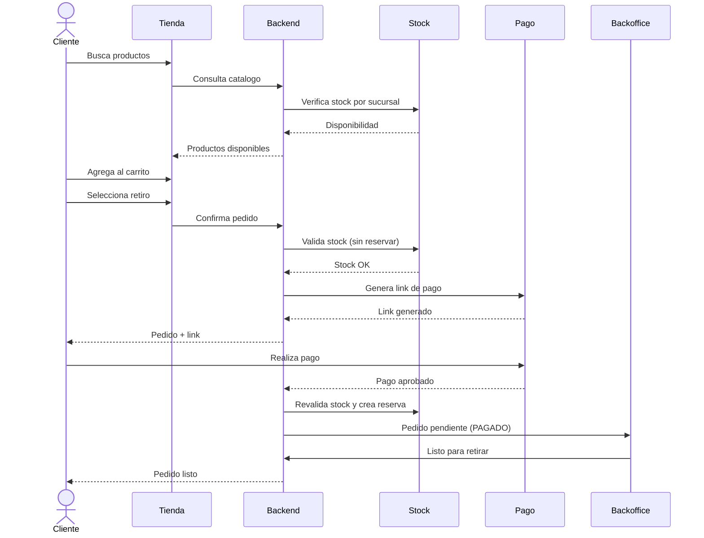

# Modulo Tienda Online

> [!info] Proposito: permitir que un cliente pueda consultar productos, verificar disponibilidad, comprar online y seguir su pedido.

## Funcionalidades

- Catalogo publico de productos con imagenes
- Busqueda por nombre y filtros
- Detalle de producto con galeria de imagenes
- Carrito con validacion de stock
- Checkout con seleccion de sucursal
- Retiro o envio
- Pedido con numero de seguimiento
- Link de pago integrado
- Seguimiento del estado del pedido
- Recomendaciones inteligentes

## Flujo de compra online con retiro

## Stock y disponibilidad

Antes de elegir sucursal: informacion general. Despues de elegir sucursal: stock real, precio efectivo y promociones de esa sucursal.

## Requisitos funcionales asociados

RF-001 a RF-012 en [[05 - Requisitos/Funcionales]].

---

> [!seealso] Volver a [[_Index]]
