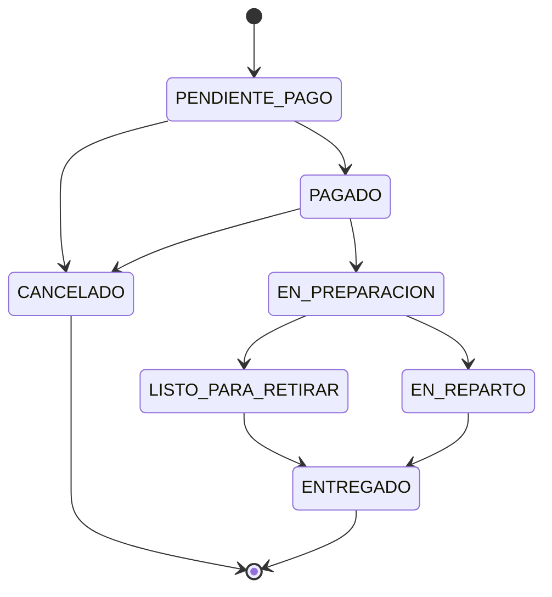
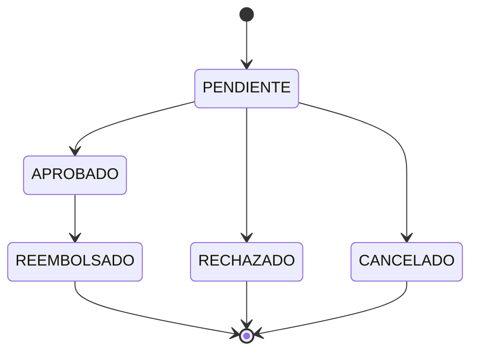
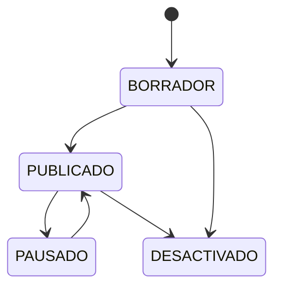
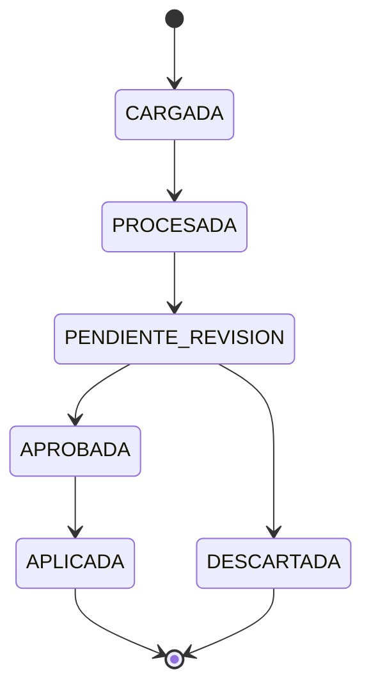
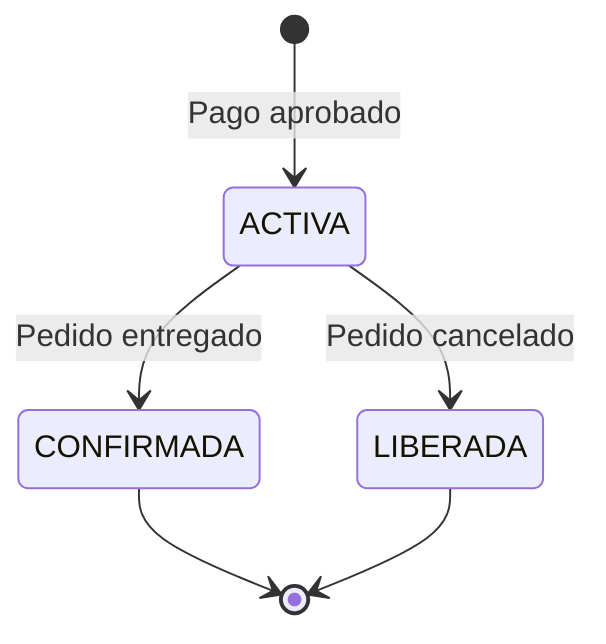

# Maquina de Estados del Sistema

> [!info] Diagramas de estados para las entidades principales del sistema.

## Estado de pedido

> Para el MVP el pedido se crea directamente en PENDIENTE_PAGO. Se elimina RECIBIDO porque no aporta valor distinguir entre "pedido creado" y "pendiente de pago".

### Estados de pedido

| Estado | Descripcion |
|---|---|
| PENDIENTE_PAGO | Pedido creado, esperando confirmacion de pago |
| PAGADO | Pago confirmado, pendiente de preparacion |
| EN_PREPARACION | Empleado preparando productos |
| LISTO_PARA_RETIRAR | Listo para retiro del cliente (solo retiro) |
| EN_REPARTO | En camino al domicilio (solo envio) |
| ENTREGADO | Pedido completado |
| CANCELADO | Pedido cancelado (libera stock si habia reserva) |

## Estado de pago

Para MVP: PENDIENTE, APROBADO, RECHAZADO, CANCELADO.

## Estado de producto en tienda

| Estado | Descripcion |
|---|---|
| BORRADOR | Creado pero no visible |
| PUBLICADO | Visible en tienda online |
| PAUSADO | Temporalmente no visible |
| DESACTIVADO | Dado de baja |

## Estado de lista de precios (post-MVP)

> Este diagrama corresponde a la importacion automatica de listas de precios, que queda fuera del MVP.
> En el MVP el costo se ingresa manualmente por producto-proveedor sin estados intermedios.

| Estado | Descripcion |
|---|---|
| CARGADA | Lista recibida |
| PROCESADA | Items identificados y comparados |
| PENDIENTE_REVISION | Cambios listos para revision |
| APROBADA | Admin aprobo |
| APLICADA | Cambios aplicados |
| DESCARTADA | Lista descartada |

## Estado de reserva de stock

> En el MVP la reserva se crea despues de que el pago fue aprobado, por lo tanto no tiene sentido que "venza". La reserva permanece ACTIVA hasta que el pedido se entrega (CONFIRMADA) o se cancela (LIBERADA). El vencimiento de reservas es aplicable solo si se reservara antes del pago, lo cual queda fuera del MVP.

| Estado | Descripcion |
|---|---|
| ACTIVA | Stock reservado, esperando entrega o cancelacion |
| CONFIRMADA | Pedido entregado, stock descontado definitivamente |
| LIBERADA | Pedido cancelado, stock liberado |

---

> [!seealso] Notas relacionadas
> - [[Modelo de Datos]]
> - [[Reglas de Pedidos]]
> - [[Reglas de Stock]]
> - Volver a [[_Index]]
