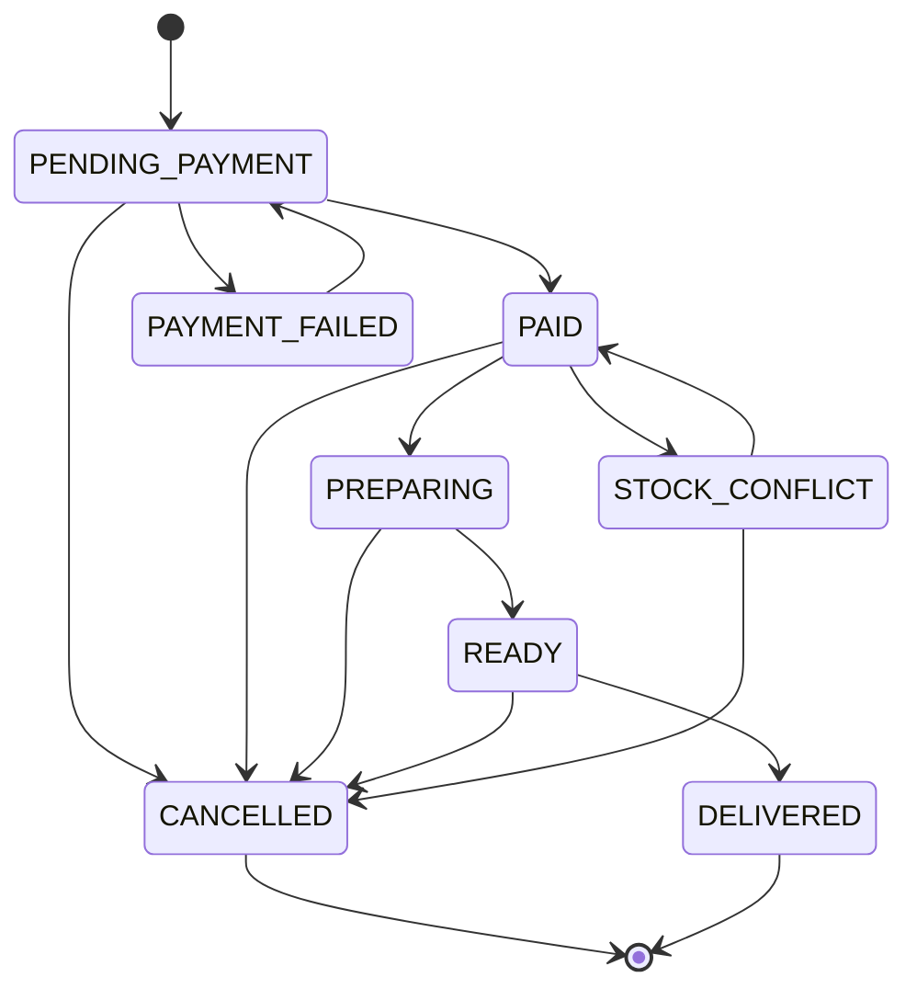
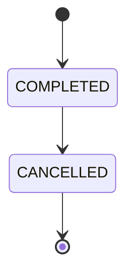
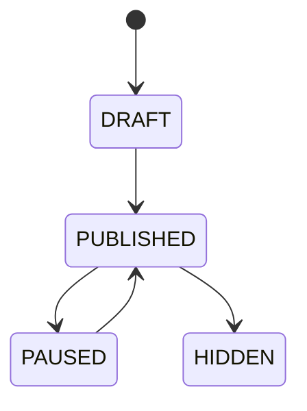

# Maquina de Estados (MVP)

---

## Estados de orden

### ONLINE (e-commerce)

### POS (venta presencial)

### Tabla de estados

| Estado | Descripcion | Aplica a |
|---|---|---|
| PENDING_PAYMENT | Orden creada, esperando pago MP | ONLINE |
| PAID | Pago confirmado, pendiente de preparacion | ONLINE |
| PREPARING | Empleado preparando productos | ONLINE |
| READY | Listo para retiro | ONLINE |
| DELIVERED | Orden completada | ONLINE / POS |
| CANCELLED | Orden cancelada | ONLINE / POS |
| PAYMENT_FAILED | Pago rechazado por MP | ONLINE |
| STOCK_CONFLICT | Pago aprobado pero sin stock suficiente | ONLINE |
| COMPLETED | Venta presencial completada | POS |

---

## Estados de pago

| Estado | Descripcion |
|---|---|
| PENDING | Pago creado, pendiente de confirmacion |
| APPROVED | Pago confirmado |
| REJECTED | Pago rechazado por el proveedor |
| CANCELLED | Pago cancelado |
| REFUNDED | Reembolsado |
| EXPIRED | Expirado sin completarse |
| IN_PROCESS | En proceso (MP) |

---

## Estados de caja

| Estado | Descripcion |
|---|---|
| OPEN | Caja abierta, acepta ventas y movimientos |
| CLOSED | Caja cerrada, no acepta operaciones |

---

## Estado de producto en tienda

| Estado | Descripcion |
|---|---|
| DRAFT | Creado, no visible |
| PUBLISHED | Visible en tienda |
| PAUSED | Temporalmente oculto |
| HIDDEN | Dado de baja |

---

> [!seealso] Notas relacionadas
> - [[Modelo de Datos]]
> - [[Reglas de Pedidos]]
> - [[Reglas de Stock]]
> - Volver a [[_Index]]
