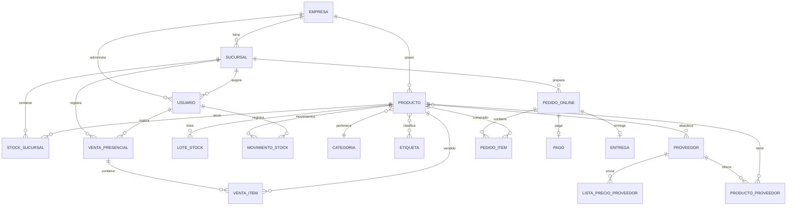
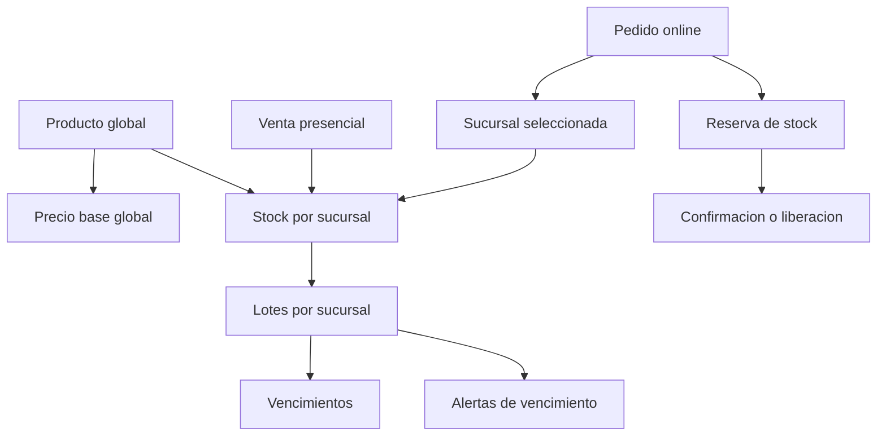

# Modelo de Datos

> [!info] Modelo conceptual del dominio del sistema.
> La entidad `LISTA_PRECIO_PROVEEDOR` corresponde al flujo de importacion automatica (post-MVP). En el MVP el costo se ingresa manualmente por producto-proveedor.

## Separacion global vs sucursal

```text
Empresa
├── Catalogo global
│   ├── productos, categorias, marcas, etiquetas
│   └── precio base
└── Sucursales
    ├── stock fisico, reservado, lotes, vencimientos
    ├── ventas presenciales
    └── preparacion de pedidos
```

## Diagrama entidad-relacion



## Entidades principales

### Empresa
Negocio dueno de la plataforma. Tiene sucursales, usuarios y productos.

### Sucursal
Ubicacion fisica. Tiene stock, empleados, ventas y prepara pedidos.

### Usuario
Persona que usa el sistema. Tiene rol (ADMIN, ENCARGADO, EMPLEADO, CLIENTE).

### Producto
Producto comercializable. Tiene categoria, marca, etiquetas, imagenes, stock por sucursal, lotes, proveedores y precio.

### PrecioProducto
Precio base global con historial. El cambio de precio impacta en sucursales y e-commerce.

### StockSucursal
Stock agregado por producto y sucursal. `stock_disponible = stock_fisico - stock_reservado`.

### LoteStock
Stock con vencimiento por sucursal. Permite FEFO, alertas y promociones por vencimiento.

### MovimientoStock
Trazabilidad de cualquier cambio de stock (INGRESO, VENTA, AJUSTE, MERMA, etc.).

### ReservaStock
Unidades apartadas para un pedido online. Estados: ACTIVA, CONFIRMADA, LIBERADA. No se implementa VENCIDA en el MVP porque la reserva se crea despues del pago aprobado.

### Promocion
Descuento global o por sucursal. En el MVP, las promociones por vencimiento se configuran manualmente a partir de alertas de lotes proximos a vencer y se aplican via `PromocionAplicacion`.

### PedidoOnline / VentaPresencial
Ordenes de compra online y ventas en sucursal. Cada una con sus items.

## Diagrama de stock y pedidos



---

> [!seealso] Notas relacionadas
> - [[Reglas de Stock]]
> - [[Reglas de Precios]]
> - [[Reglas de Pedidos]]
> - [[03 - Dominio/Maquina de Estados]]
> - Volver a [[_Index]]
