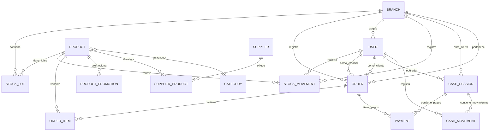

# Modelo de Datos

> [!info] Modelo conceptual del dominio del sistema. Un negocio unico (Dietetica Lembas) con sucursales, catalogo global y stock por sucursal.

## Estructura general

```text
Dietetica Lembas
├── Catalogo global
│   ├── productos, categorias
│   └── precio de venta (en el producto)
├── Sucursales
│   ├── stock por lotes con vencimiento
│   ├── movimientos de stock
│   ├── ventas presenciales (orders POS)
│   └── preparacion de pedidos online (orders ONLINE)
└── Pagos unificados
    ├── pagos online (Mercado Pago Checkout Pro)
    └── pagos presenciales (asociados a caja)
```

## Diagrama entidad-relacion



## Entidades principales

### Sucursal (Branch)
Ubicacion fisica del negocio. Tiene stock, empleados, cajas y prepara pedidos.
El MVP opera con una unica sucursal real, pero se mantiene la entidad para expansion futura.

### Usuario (User)
Persona que usa el sistema. Roles fijos: `ADMIN`, `MANAGER`, `EMPLOYEE`, `CUSTOMER`.
- CUSTOMER: branch_id = null (no pertenece a sucursal interna).
- MANAGER/EMPLOYEE: branch_id obligatorio (sucursal asignada).
- ADMIN: branch_id opcional (acceso global).

No existe tabla customers separada.

### Categoria (Category)
Clasificacion de productos.

### Producto (Product)
Producto comercializable. Tiene categoria, precio (`sale_price`), marca texto (`brand_name`), imagen unica (`image_url`), estado online (`online_status`).

### Proveedor (Supplier)
Empresa que abastece productos.

### ProductoProveedor (SupplierProduct)
Relacion producto-proveedor con costo actual.

### StockLote (StockLot)
Unidad de stock con vencimiento asociado a una sucursal. Fuente de verdad del stock.

```text
stock_disponible = SUM(stock_lots.quantity_available)
WHERE product_id = ? AND branch_id = ?
```

Permite FEFO, alertas de vencimiento y trazabilidad.

### MovimientoStock (StockMovement)
Trazabilidad de cambios de stock: ingreso, venta, ajuste, cancelacion, merma, consumo interno.

### Orden (Order)
Entidad unificada para compras online y ventas presenciales. `type` distingue origen: `ONLINE` o `POS`.

Campos clave:
- `customer_user_id`: usuario CUSTOMER que realiza la compra online. Obligatorio para ONLINE.
- `created_by_user_id`: usuario interno que registro la venta presencial. Obligatorio para POS.
- Snapshots del cliente: `customer_name_snapshot`, `customer_email_snapshot`, `customer_phone_snapshot`.
- `fulfillment_type`: solo `PICKUP` en MVP.

### OrdenItem (OrderItem)
Producto vendido dentro de una orden. Guarda snapshot completo del producto al momento de la venta.

### Pago (Payment) -- entidad nueva unificada
Tabla comun para todos los pagos del sistema, tanto online como presenciales.

Campos clave:
- `order_id`: orden asociada.
- `cash_session_id`: nullable. Obligatorio para pagos presenciales, null para online.
- `provider`: `MERCADO_PAGO`, `MANUAL`, `BANK`, `CARD_TERMINAL`, etc.
- `method`: `CHECKOUT_PRO`, `CASH`, `QR`, `TRANSFER`, `DEBIT_CARD`, `CREDIT_CARD`, etc.
- `status`: `PENDING`, `APPROVED`, `REJECTED`, `CANCELLED`, `REFUNDED`, `EXPIRED`, `IN_PROCESS`.
- `amount`, `currency`.
- `provider_payment_id`: ID del pago en MP.
- `provider_preference_id`: ID de la preferencia en MP.
- `external_reference`: referencia para tracking con MP.
- `approved_at`: fecha de aprobacion.

Reglas:
- Toda orden debe tener al menos un payment asociado.
- Pagos online (MP): `cash_session_id = null`.
- Pagos presenciales: `cash_session_id` obligatorio (caja abierta).
- No almacenar datos sensibles de tarjetas.

### Caja (CashSession) -- entidad recuperada
Sesion operativa de venta presencial. Representa un turno de caja en una sucursal.

Campos clave:
- `branch_id`, `opened_by_user_id`, `closed_by_user_id`.
- `opening_cash_amount`: efectivo inicial.
- `expected_cash_amount`: calculado al cierre.
- `counted_cash_amount`: efectivo contado fisicamente.
- `cash_difference_amount`: diferencia.
- `cash_difference_reason`: explicacion obligatoria si hay diferencia.
- `status`: `OPEN`, `CLOSED`.

Reglas:
- Solo una caja abierta por sucursal.
- Toda venta presencial requiere caja abierta.
- Al cerrar: muestra totales por medio de pago, pero arqueo solo sobre efectivo.
- Si efectivo esperado != efectivo contado, se exige explicacion.

### MovimientoCaja (CashMovement) -- entidad recuperada
Movimientos manuales de caja que no son ventas: ingresos, egresos, ajustes.

Campos clave:
- `cash_session_id`, `type`, `method`, `amount`, `reason`, `created_by_user_id`.
- Types: `CASH_IN`, `CASH_OUT`, `ADJUSTMENT`.
- Methods: `CASH`, `TRANSFER`, `OTHER`.

### PromocionProducto (ProductPromotion) -- opcional
Descuento temporal simple por producto.

### Auditoria (AuditLog)
Registro de acciones criticas: cambios de precio, ajustes de stock, cancelaciones.

## Resumen de entidades

El modelo del MVP tiene **14 entidades**:

### Entidades obligatorias

| # | Tabla | Dominio | Proposito |
|---|---|---|---|
| 1 | `branches` | Core | Sucursales (1 en MVP) |
| 2 | `users` | Core | Usuarios con rol directo |
| 3 | `categories` | Catalogo | Categorias de producto |
| 4 | `products` | Catalogo | Productos del catalogo |
| 5 | `suppliers` | Proveedores | Proveedores |
| 6 | `supplier_products` | Proveedores | Producto por proveedor con costo |
| 7 | `stock_lots` | Inventario | Lotes con vencimiento (fuente de verdad del stock) |
| 8 | `stock_movements` | Inventario | Trazabilidad de movimientos de stock |
| 9 | `orders` | Ventas/Pedidos | Ordenes unificadas (POS y ONLINE) |
| 10 | `order_items` | Ventas/Pedidos | Items de orden con snapshot |
| 11 | `payments` | Pagos | Pagos unificados (online MP y presenciales) |
| 12 | `cash_sessions` | Caja | Sesiones de caja presencial |
| 13 | `cash_movements` | Caja | Movimientos manuales de caja |
| 14 | `audit_logs` | Auditoria | Auditoria de acciones criticas |

### Opcional

| # | Tabla | Dominio | Proposito |
|---|---|---|---|
| 15 | `product_promotions` | Promociones | Promociones simples (opcional) |

### Postergadas para post-MVP

| Entidad | Motivo |
|---|---|
| `customer_addresses` | Solo retiro en sucursal |
| `carts`, `cart_items` | Carrito en frontend (localStorage) |
| `branch_product_stock` | stock_lots es suficiente |
| `stock_reservations` | Sin reserva de stock |
| `stock_transfers` | Post-MVP |
| `brands` | brand_name como texto |
| `product_images` | image_url directa |
| `tags`, `product_tags` | Opcional |
| `roles`, `user_roles` | Rol directo en users |
| `companies` | Unico negocio |
| `coupons` | Post-MVP |

---

> [!seealso] Notas relacionadas
> - [[Reglas de Stock]]
> - [[Reglas de Precios]]
> - [[Reglas de Pedidos]]
> - [[Maquina de Estados]]
> - Volver a [[_Index]]
