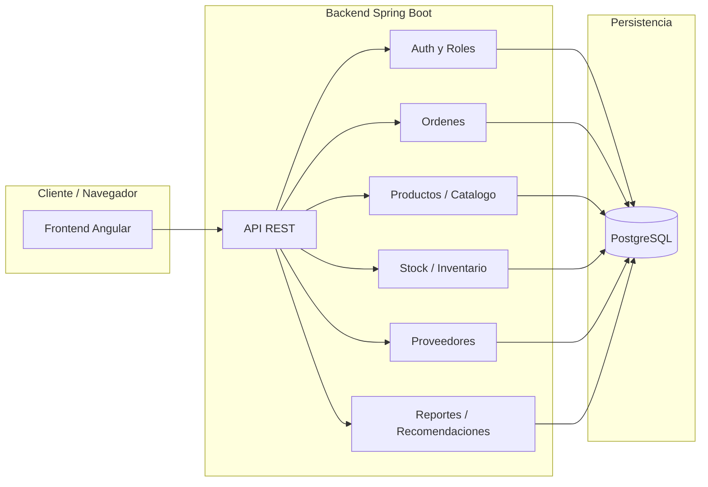

# Vision General de Arquitectura (MVP Simplificado)

> [!info] Monolito modular con separacion por features.

---

## Estilo arquitectonico

```text
Frontend Angular (tienda + backoffice)
    ↓ HTTP REST
Backend Spring Boot (modulos por feature)
    ↓ JPA/Hibernate
PostgreSQL
```

## Diagrama de arquitectura



## Stack tecnologico

**Backend**: Java 21, Spring Boot, JPA/Hibernate, Flyway, JUnit + Testcontainers.
**Frontend**: Angular, Signals, Tailwind/CSS, lazy loading.
**Infra**: PostgreSQL, Docker Compose, Nginx.

---

> [!seealso] Volver a [[_Index]]
