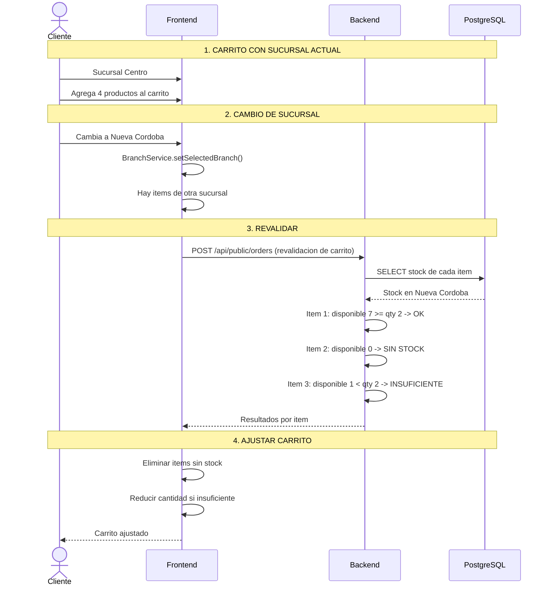

# Proceso: Cambio de Sucursal Durante la Compra

> [!info] Si el cliente cambia la sucursal con productos en el carrito, se revalida todo contra el stock de la nueva.

## Diagrama de secuencia

---

## Reglas de revalidacion

| Situacion | Accion |
|---|---|
| Stock suficiente | Se mantiene igual |
| Sin stock | Se elimina con aviso |
| Stock insuficiente | Se reduce al maximo disponible |
| Carrito vacio | No hay nada que revalidar |

---

> [!seealso] Volver a [[08 - Procesos/_Index]]
