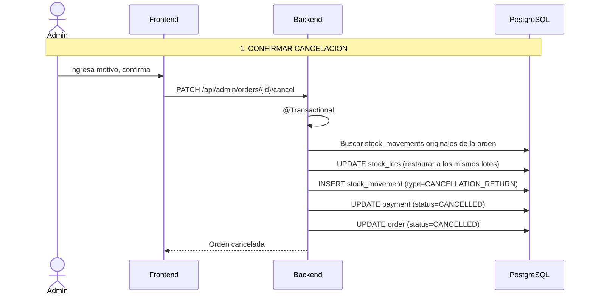

# Proceso: Cancelacion de Pedido y Reversion de Stock

> [!info] Al cancelar una orden pagada, el stock se revierte y el payment se actualiza.

---

## Diagrama de secuencia

## Reglas de cancelacion

| Estado actual | Se puede cancelar? | Accion sobre stock | Accion sobre payment |
|---|---|---|---|
| PENDING_PAYMENT | Si | No hay stock descontado | CANCELLED |
| PAID | Si | Revertir stock | CANCELLED |
| PREPARING | Si | Revertir stock | CANCELLED |
| READY | Si (admin) | Revertir stock | CANCELLED |
| DELIVERED | No | -- | -- |
| CANCELLED | No | -- | -- |
| STOCK_CONFLICT | Si | No hay stock descontado | CANCELLED |
| PAYMENT_FAILED | Si | No hay stock descontado | CANCELLED |

---

> [!seealso] Notas relacionadas
> - [[03 - Dominio/Reglas de Stock]]
> - [[03 - Dominio/Maquina de Estados]]
> - Volver a [[08 - Procesos/_Index]]
