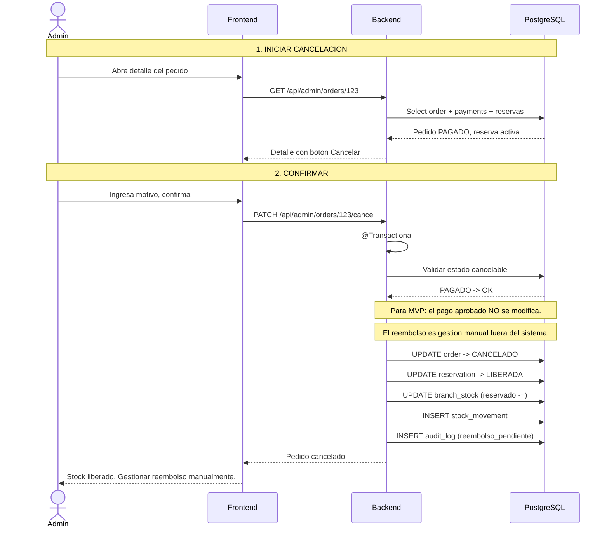

# Proceso: Cancelacion de Pedido y Liberacion de Stock

> [!info] Cuando un pedido se cancela, el stock reservado se libera automaticamente.
>
> Para el MVP: si el pedido ya fue pagado, el pago permanece como APROBADO. El sistema no ejecuta reembolsos automaticos. Se registra una accion administrativa pendiente para que el administrador gestione el reintegro manualmente.

## Diagrama de secuencia

---

## Reglas de cancelacion

| Estado actual | Se puede cancelar? | Accion sobre stock |
|---|---|---|
| PENDIENTE_PAGO | Si | No hay reserva |
| PAGADO | Si | Liberar reserva |
| EN_PREPARACION | Si | Liberar reserva |
| LISTO_PARA_RETIRAR | Solo admin | Liberar reserva |
| EN_REPARTO | Solo admin | Liberar reserva |
| ENTREGADO | No | Stock ya descontado |
| CANCELADO | No | Ya lo esta |

---

> [!seealso] Notas relacionadas
> - [[03 - Dominio/Reglas de Stock]]
> - [[03 - Dominio/Maquina de Estados]]
> - Volver a [[08 - Procesos/_Index]]
