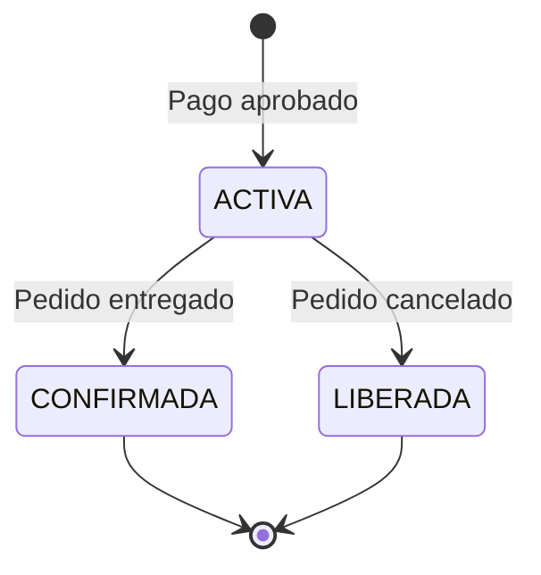
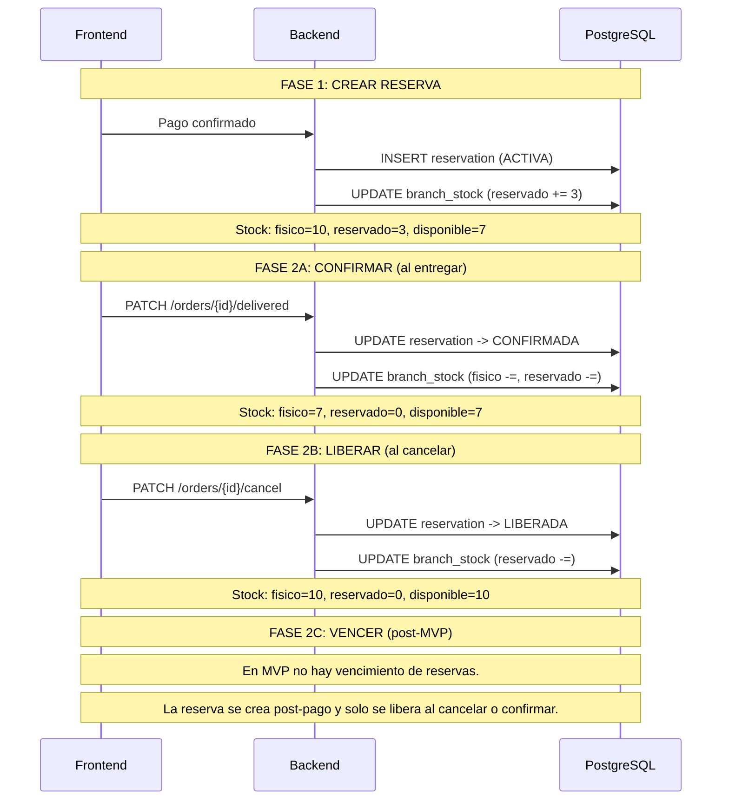

# Proceso: Ciclo de Vida de la Reserva de Stock

> [!info] Mecanismo que evita la sobreventa. La reserva pasa por ACTIVA, CONFIRMADA o LIBERADA. No se implementa VENCIDA porque en el MVP la reserva se crea despues del pago aprobado.

## Maquina de estados

## Diagrama de secuencia

---

## Tabla de estado del stock

| Momento | stock_fisico | stock_reservado | stock_disponible |
|---|---|---|---|
| Sin reserva | 10 | 0 | 10 |
| Reserva ACTIVA | 10 | 3 | 7 |
| CONFIRMADA (entregado) | 7 | 0 | 7 |
| LIBERADA (cancelado) | 10 | 0 | 10 |

---

> [!seealso] Notas relacionadas
> - [[03 - Dominio/Reglas de Stock]]
> - [[Cancelacion Pedido]]
> - [[Compra Online Retiro]]
> - Volver a [[08 - Procesos/_Index]]
