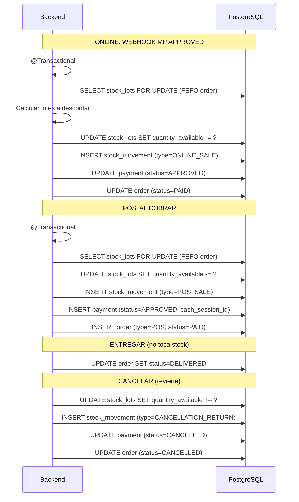

# Proceso: Descuento FEFO al Confirmar Pago

> [!info] Sin reservas. El stock se descuenta cuando el pago queda APPROVED (online via MP webhook o POS al cobrar).

---

## Flujo

## Tabla de estado del stock

| Momento | Lote A | Lote B | Total |
|---|---|---|---|
| Sin orden | 10 | 5 | 15 |
| Pago aprobado (descuento 3 de A) | 7 | 5 | 12 |
| Entregado | 7 | 5 | 12 |
| Cancelado (reversion a A) | 10 | 5 | 15 |

## Reglas

| Regla | Descripcion |
|---|---|
| Stock se descuenta al aprobar pago | No al crear orden ni al entregar |
| Descuento sigue FEFO | Lote que vence primero se descuenta primero |
| Cancelacion revierte a los mismos lotes | stock_movements originales como referencia |
| Si al aprobar pago no hay stock | Order a STOCK_CONFLICT, revision manual |

---

> [!seealso] Notas relacionadas
> - [[03 - Dominio/Reglas de Stock]]
> - [[Cancelacion Pedido]]
> - Volver a [[08 - Procesos/_Index]]
