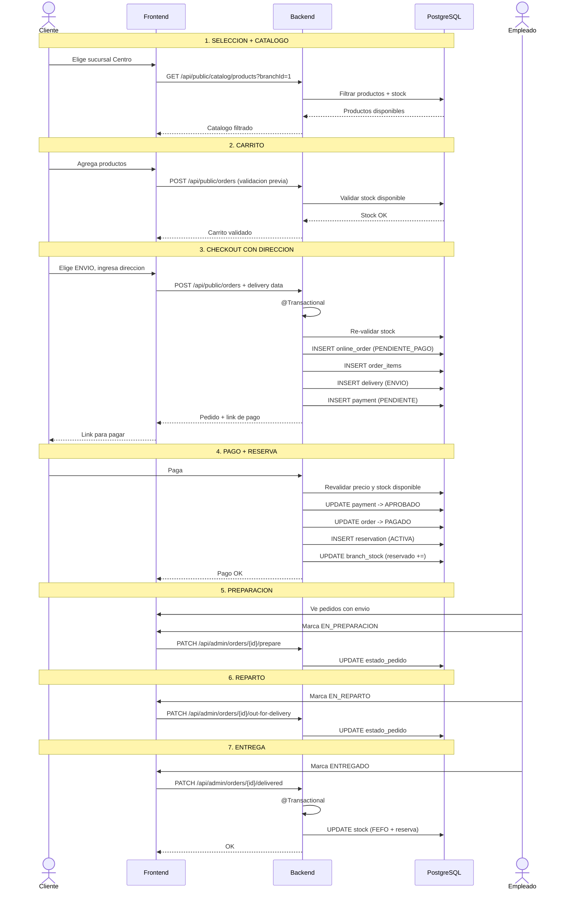

# Proceso: Compra Online con Envio a Domicilio

> [!info] Similar al flujo de retiro, pero con direccion de entrega y estado EN_REPARTO.

## Diagrama de secuencia

---

## Diferencias con retiro

| Aspecto | Retiro | Envio |
|---|---|---|
| Estado intermedio | `LISTO_PARA_RETIRAR` | `EN_REPARTO` |
| Datos de entrega | Solo sucursal | Direccion + telefono |
| Quien finaliza | Cliente retira | Empleado marca entregado |

---

> [!seealso] Volver a [[08 - Procesos/_Index]]
