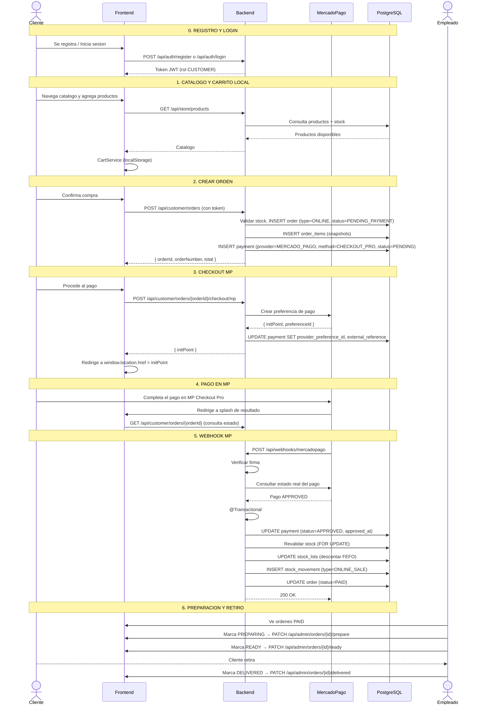

# Proceso: Compra Online con Mercado Pago Checkout Pro

> [!info] Cliente registrado, carrito local, pago con MP, retiro en sucursal.

---

## Diagrama de secuencia

## Reglas de negocio

| Regla | Paso |
|---|---|
| Cliente debe estar registrado (rol CUSTOMER) | 0 |
| Carrito es local (localStorage) | 1 |
| Orden se crea PENDING_PAYMENT, sin descontar stock | 2 |
| Payment se crea junto con la orden (PENDING) | 2 |
| Checkout MP crea preferencia (endpoint separado) | 3 |
| Webhook verifica firma y estado real en MP | 5 |
| Si pago APPROVED: actualiza payment, descuenta FEFO, order a PAID | 5 |
| Si pago REJECTED: actualiza payment, order a PAYMENT_FAILED | 5 |
| Si pago aprobado pero sin stock: order a STOCK_CONFLICT | 5 |
| DELIVERED solo cambia estado, no descuenta stock | 6 |

---

> [!seealso] Notas relacionadas
> - [[02 - Modulos/Tienda Online]]
> - [[03 - Dominio/Reglas de Stock]]
> - [[Cancelacion Pedido]]
> - Volver a [[08 - Procesos/_Index]]
