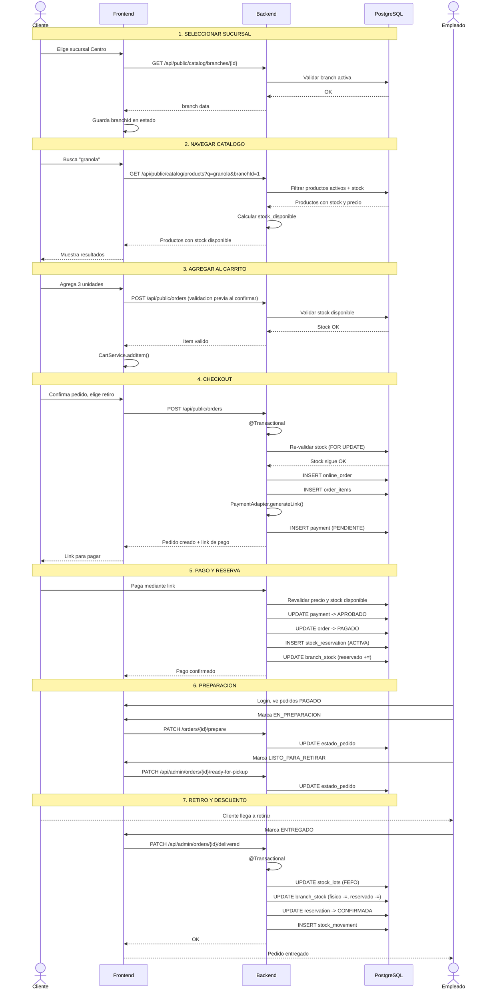

# Proceso: Compra Online con Retiro en Sucursal

> [!info] Flujo desde que el cliente entra a la tienda hasta que retira el pedido.

## Diagrama de secuencia



---

## Reglas de negocio

| Regla | Paso |
|---|---|
| Cliente debe elegir sucursal antes de agregar al carrito | 1 |
| Stock disponible = stock_fisico - stock_reservado | 2 |
| Se re-valida con lock al crear pedido | 4 |
| Reserva se crea al pagar, no al crear pedido | 5 |
| Descuento definitivo se hace al entregar | 7 |
| Descuento sigue FEFO | 7 |

---

## Estados de pedido

```
PENDIENTE_PAGO -> PAGADO -> EN_PREPARACION -> LISTO_PARA_RETIRAR -> ENTREGADO
```

---

> [!seealso] Notas relacionadas
> - [[02 - Modulos/Tienda Online]]
> - [[03 - Dominio/Reglas de Stock]]
> - [[Ciclo Reserva Stock]]
> - Volver a [[08 - Procesos/_Index]]
