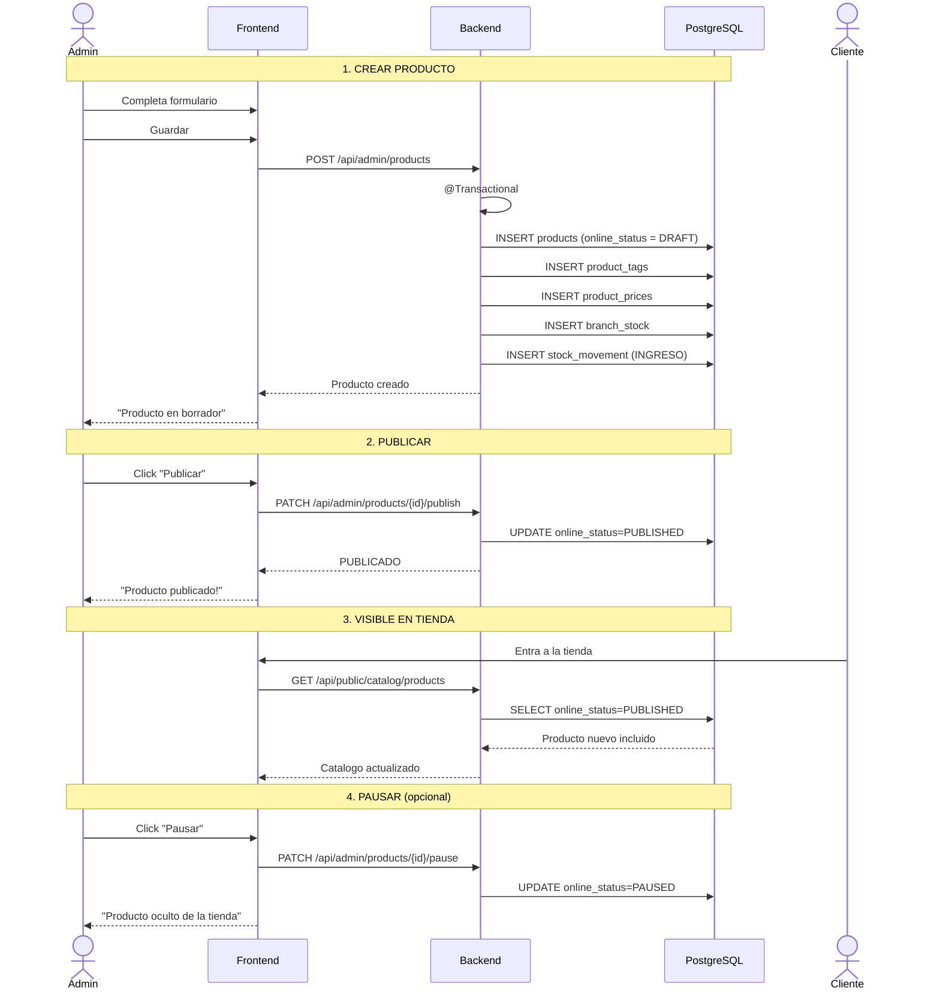

# Proceso: Creacion y Publicacion de Producto

> [!info] Desde que el admin crea el producto hasta que esta disponible en el catalogo online.

## Diagrama de secuencia



---

## Estados del producto

```text
BORRADOR -> PUBLICADO -> PAUSADO -> PUBLICADO (republicar)
                       -> DESACTIVADO
```

---

## Reglas

| Regla | Detalle |
|---|---|
| Producto puede existir sin stock | Stock inicial es opcional |
| Precio inicial requiere usuario | Queda registrado |
| BORRADOR no aparece en tienda | `online_status = DRAFT` |
| Solo admin puede publicar/pausar | Controlado por roles |

---

> [!seealso] Volver a [[08 - Procesos/_Index]]
