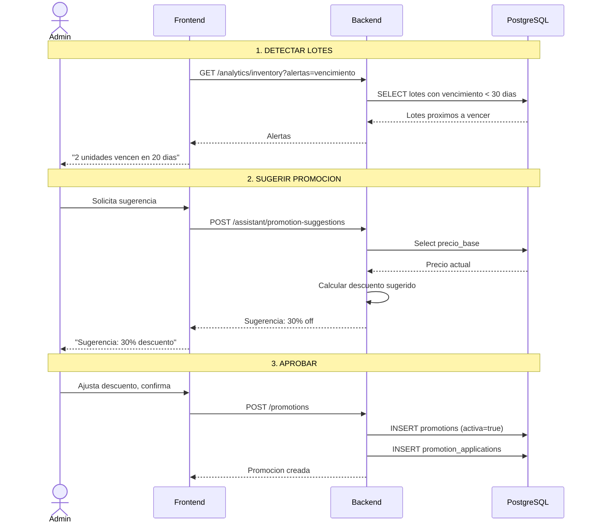
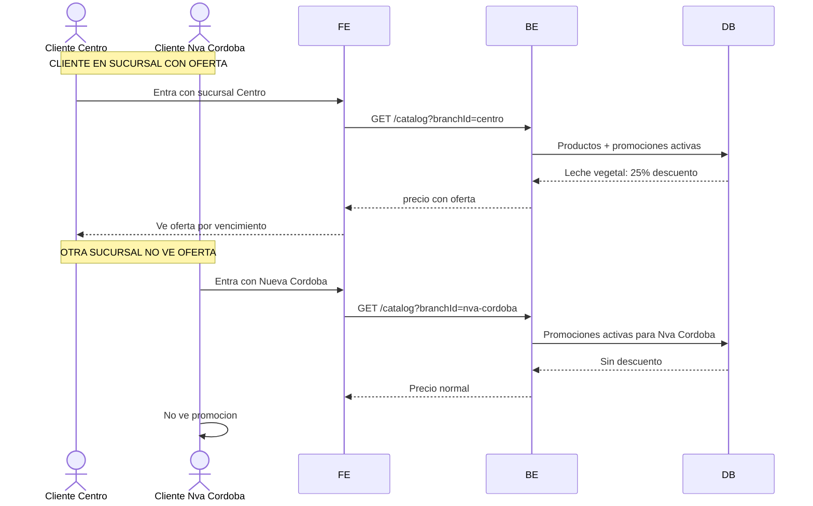

# Proceso: Promocion por Vencimiento

> [!info] El sistema detecta lotes proximos a vencer, sugiere promocion, el admin aprueba y se muestra solo en esa sucursal.

## Diagrama: creacion de promocion



## Diagrama: impacto en e-commerce



---

## Logica de descuento sugerido

```text
dias < 7  -> 50% off
dias < 15 -> 30% off
dias < 30 -> 20% off
sino      -> alerta temprana
```

---

> [!seealso] Volver a [[08 - Procesos/_Index]]
