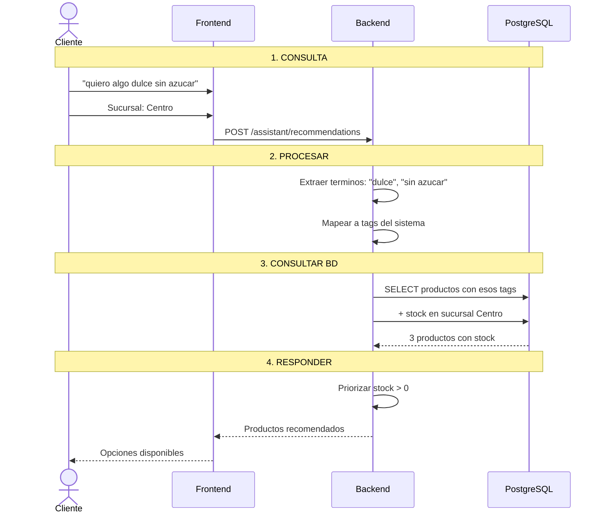
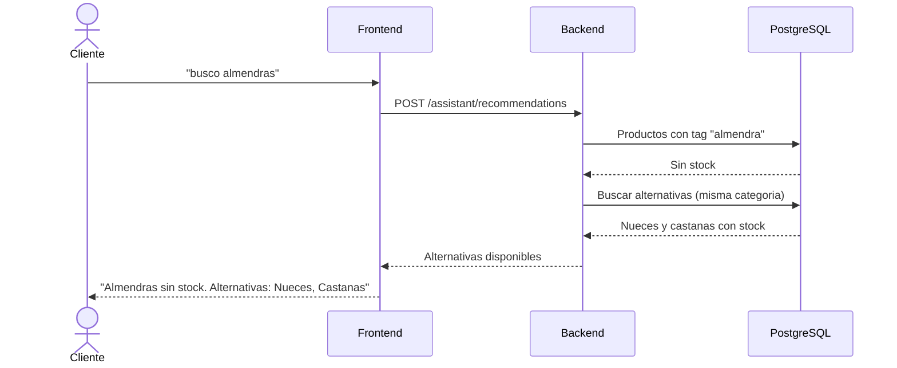

# Proceso: Recomendaciones del Asistente Inteligente

> [!info] Desde la consulta del cliente hasta la recomendacion de productos reales y disponibles.

## Diagrama: consulta con resultados

## Diagrama: cuando no hay stock

---

## Logica del asistente

1. Parsear texto -> extraer terminos clave
2. Mapear terminos a filtros del sistema
3. Consultar BD con filtros + branchId
4. Si hay resultados -> ranking por stock/precio
5. Si no -> alternativas en misma categoria

---

## Reglas de seguridad

| Regla | Implementacion |
|---|---|
| No inventar productos | Solo responde con datos de la BD |
| No recomendar sin stock | Filtra stock_disponible > 0 |
| No hacer diagnosticos | No hay LLM libre, solo reglas |
| No exponer datos internos | No devuelve costos ni margenes |

---

> [!seealso] Volver a [[08 - Procesos/_Index]]
