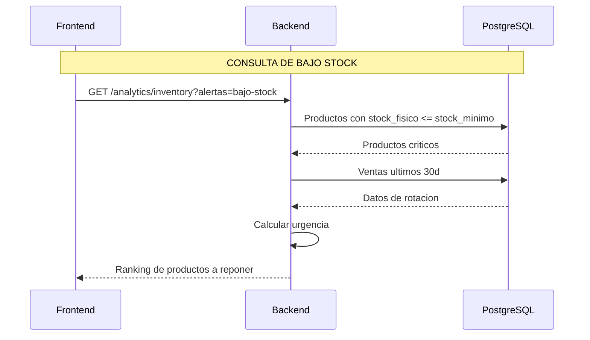
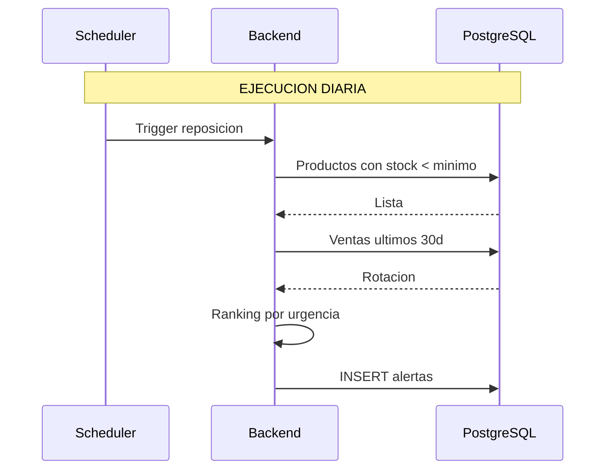

# Proceso: Reposicion Sugerida (Bajo Stock)

> [!info] El sistema detecta productos con bajo stock y sugiere al admin que reponer.

## Diagrama: consulta de stock bajo



## Diagrama: proceso automatico



---

## Logica de ranking

```text
urgencia = (minimo - actual) * (ventas_30d / 30)
```

---

> [!seealso] Volver a [[08 - Procesos/_Index]]
