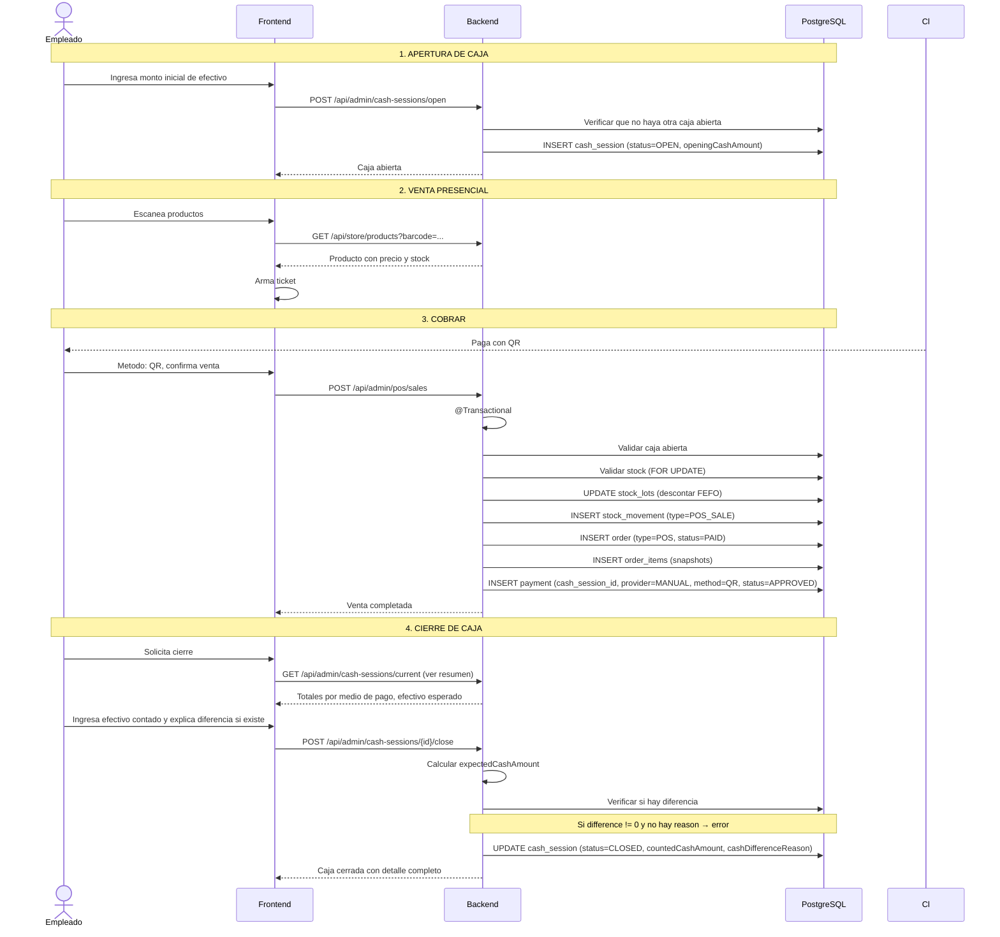

# Proceso: Venta Presencial con Caja Operativa

> [!info] Empleado abre caja, registra ventas con distintos medios de pago, cierra caja con arqueo de efectivo.

---

## Diagrama de secuencia



## Logica de cierre de caja

```text
expectedCashAmount = openingCashAmount
                   + SUM(payments WHERE method=CASH AND status=APPROVED)
                   + SUM(cash_movements WHERE type=CASH_IN AND method=CASH)
                   - SUM(cash_movements WHERE type=CASH_OUT AND method=CASH)

cashDifference = countedCashAmount - expectedCashAmount

Si cashDifference != 0:
  → cash_difference_reason es OBLIGATORIO
  → La caja se cierra igual, la diferencia queda auditada
```

## Totales informativos del cierre (por metodo de pago)

```text
- CASH:        $X (afecta efectivo esperado)
- QR:          $Y (no afecta efectivo, solo informativo)
- TRANSFER:    $Z (no afecta efectivo)
- DEBIT_CARD:  $W (no afecta efectivo)
- CREDIT_CARD: $V (no afecta efectivo)
```

---

> [!seealso] Notas relacionadas
> - [[02 - Modulos/Backoffice]]
> - [[03 - Dominio/Reglas de Stock]]
> - Volver a [[08 - Procesos/_Index]]
