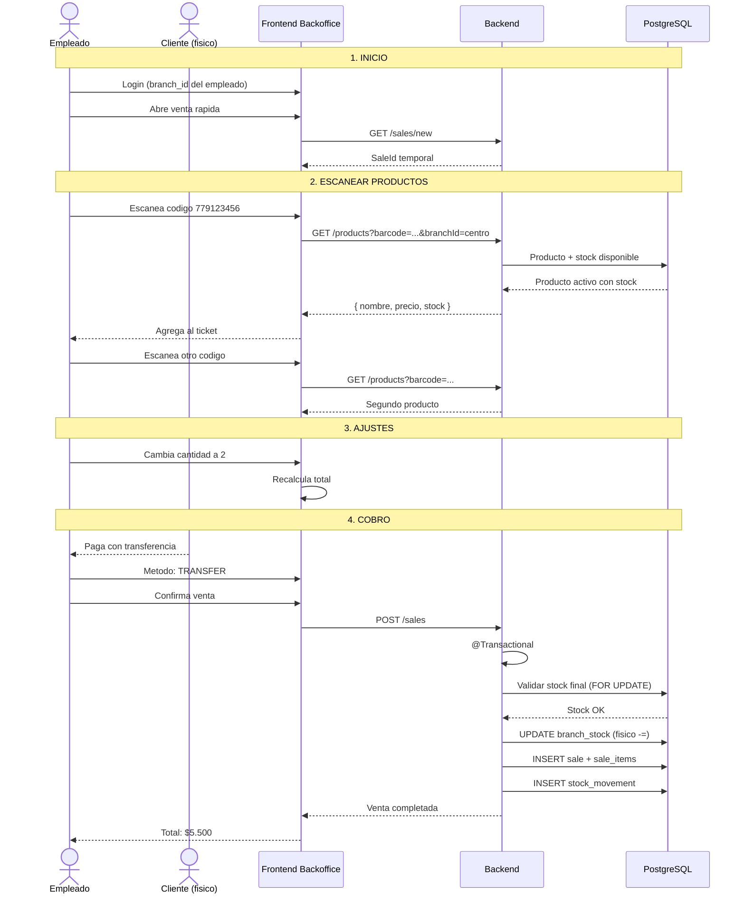

# Proceso: Venta Presencial en Sucursal

> [!info] Venta en mostrador: empleado escanea productos, cobra y descuenta stock al instante.

## Diagrama de secuencia

---

## Diferencias con compra online

| Aspecto | Online | Presencial |
|---|---|---|
| Sucursal | Cliente elige | Del empleado logueado |
| Reserva | Se reserva al pagar | No hay reserva |
| Descuento | Al entregar (diferido) | Al instante |
| Pago | Link de pago | En el momento |
| Estados | PENDIENTE_PAGO -> ... -> ENTREGADO | COMPLETADA directo |

---

> [!seealso] Volver a [[08 - Procesos/_Index]]
