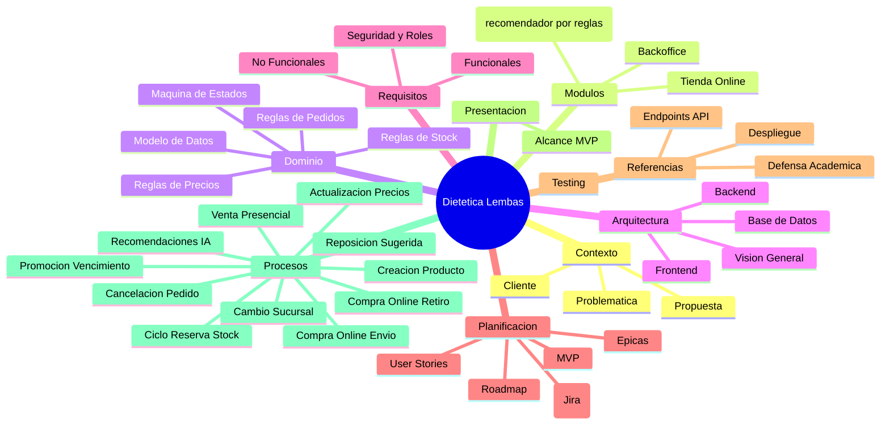

# Sistema Integral de Gestion Comercial con E-commerce

> [!info] Proposito del vault
> Este vault de Obsidian contiene toda la documentacion del sistema de gestion comercial con modulo e-commerce integrado para **Dietetica Lembas**.

---

## Mapa del vault



---

## Navegacion rapida

| Area | Nota principal | Descripcion |
|---|---|---|
| [[01 - Contexto/Cliente\|Cliente]] | [[01 - Contexto/Cliente]] | Contexto real de Dietetica Lembas |
| [[01 - Contexto/Problematica\|Problematica]] | [[01 - Contexto/Problematica]] | Problemas que resuelve el sistema |
| [[01 - Contexto/Propuesta\|Propuesta]] | [[01 - Contexto/Propuesta]] | Solucion propuesta |
| [[02 - Modulos/Tienda Online\|Tienda Online]] | [[02 - Modulos/Tienda Online]] | Modulo e-commerce para clientes registrados (rol CUSTOMER) |
| [[02 - Modulos/Backoffice\|Backoffice]] | [[02 - Modulos/Backoffice]] | Modulo de administracion interna |
| [[02 - Modulos/Asistente Inteligente\|Recomendaciones]] | [[02 - Modulos/Asistente Inteligente]] | Modulo de recomendaciones basado en reglas |
| [[03 - Dominio/Modelo de Datos\|Modelo de Datos]] | [[03 - Dominio/Modelo de Datos]] | Entidades y relaciones del dominio |
| [[03 - Dominio/Reglas de Stock\|Reglas de Stock]] | [[03 - Dominio/Reglas de Stock]] | Reglas de stock multisucursal |
| [[03 - Dominio/Reglas de Precios\|Reglas de Precios]] | [[03 - Dominio/Reglas de Precios]] | Reglas de precios y promociones |
| [[03 - Dominio/Reglas de Pedidos\|Reglas de Pedidos]] | [[03 - Dominio/Reglas de Pedidos]] | Reglas de pedidos y entregas |
| [[03 - Dominio/Maquina de Estados\|Maquina de Estados]] | [[03 - Dominio/Maquina de Estados]] | Estados del sistema |
| [[04 - Arquitectura/Vision General\|Vision General]] | [[04 - Arquitectura/Vision General]] | Arquitectura general del sistema |
| [[04 - Arquitectura/Backend\|Backend]] | [[04 - Arquitectura/Backend]] | Diseno backend Spring Boot |
| [[04 - Arquitectura/Frontend\|Frontend]] | [[04 - Arquitectura/Frontend]] | Diseno frontend Angular |
| [[04 - Arquitectura/Base de Datos\|Base de Datos]] | [[04 - Arquitectura/Base de Datos]] | Diseno de base de datos PostgreSQL |
| [[05 - Requisitos/Funcionales\|Funcionales]] | [[05 - Requisitos/Funcionales]] | Requisitos funcionales del sistema |
| [[05 - Requisitos/No Funcionales\|No Funcionales]] | [[05 - Requisitos/No Funcionales]] | Requisitos no funcionales |
| [[05 - Requisitos/Seguridad y Roles\|Seguridad y Roles]] | [[05 - Requisitos/Seguridad y Roles]] | Seguridad, autenticacion y permisos |
| [[06 - Planificacion/MVP\|MVP]] | [[06 - Planificacion/MVP]] | Version minima viable |
| [[06 - Planificacion/Epicas\|Epicas]] | [[06 - Planificacion/Epicas]] | Epicas del proyecto |
| [[06 - Planificacion/User Stories\|User Stories]] | [[06 - Planificacion/User Stories]] | Historias de usuario |
| [[06 - Planificacion/Roadmap\|Roadmap]] | [[06 - Planificacion/Roadmap]] | 4 sprints, roadmap y futuro |
| [[06 - Planificacion/plan_scrum_dietetica_lembas_jira\|Plan Scrum]] | [[06 - Planificacion/plan_scrum_dietetica_lembas_jira]] | Plan detallado para carga en Jira |
| [[07 - Referencias/Endpoints API\|Endpoints API]] | [[07 - Referencias/Endpoints API]] | Endpoints de la API REST |
| [[07 - Referencias/Testing\|Testing]] | [[07 - Referencias/Testing]] | Estrategia de testing |
| [[07 - Referencias/Despliegue\|Despliegue]] | [[07 - Referencias/Despliegue]] | Estrategia de despliegue |
| [[07 - Referencias/Defensa Academica\|Defensa Academica]] | [[07 - Referencias/Defensa Academica]] | Argumento de defensa |
| [[08 - Procesos/_Index\|Procesos Criticos]] | [[08 - Procesos/_Index]] | Diagramas de secuencia detallados |
| [[09 - Presentacion/Alcance MVP\|Alcance MVP]] | [[09 - Presentacion/Alcance MVP]] | Lo que entra y lo que no en el MVP, para la entrevista con el tutor |

---

## Principio central

> [!important] ERP + E-commerce integrado
> No se construyen dos sistemas separados. Se construye una **unica plataforma** con un **core comercial compartido** que alimenta tanto la venta presencial como la venta online.

---

## Flujo conceptual

```text
Backoffice / ERP comercial
    ↓
Productos, precios, stock, sucursales, proveedores y promociones
    ↓
Canales de venta
    ├── Venta presencial en sucursal
    └── E-commerce
    ↓
Pedidos, pagos, entregas y movimientos de stock
    ↓
Analytics, reposicion, etiquetas y recomendaciones inteligentes
```

---

## Referencias

- [[_Meta/Glosario|Glosario]]
- [[_Meta/Decisiones Arquitectonicas|Decisiones Arquitectonicas]]
