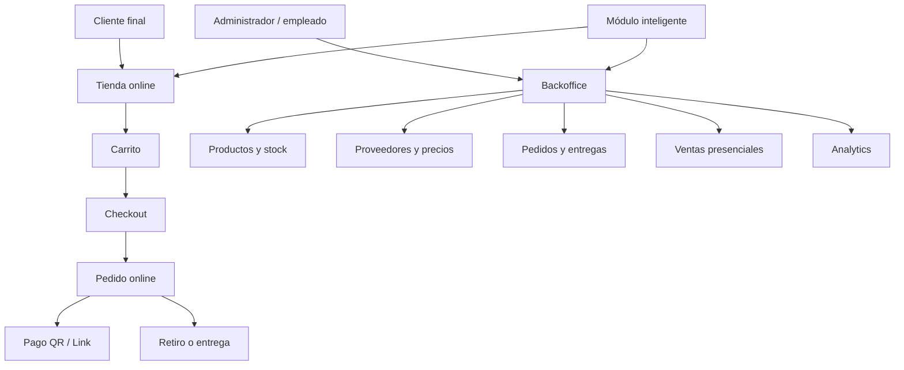
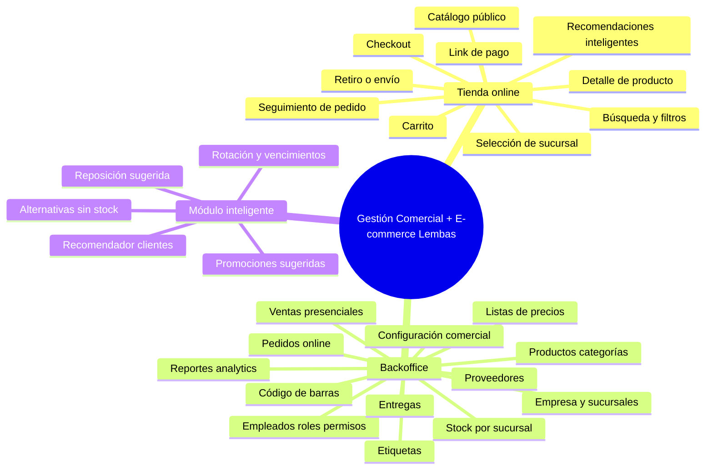
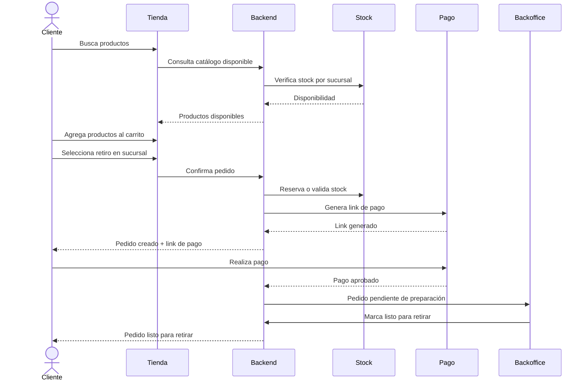
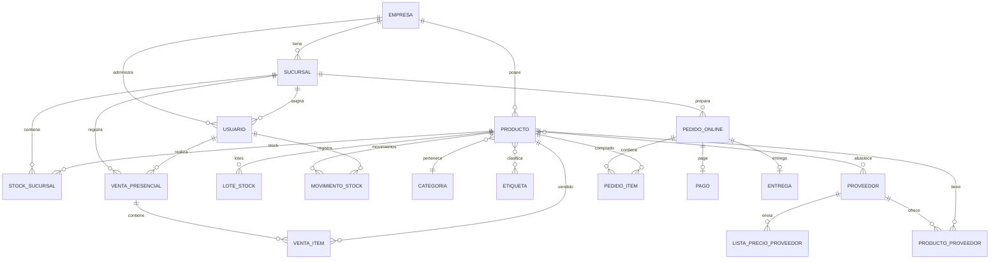
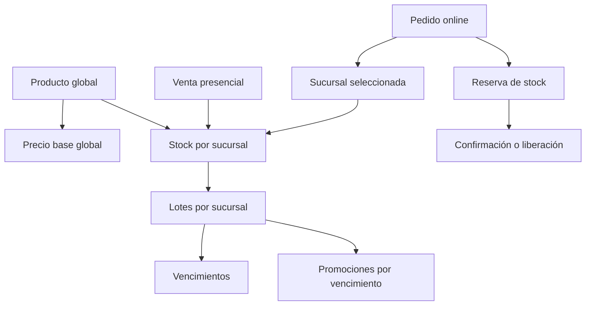
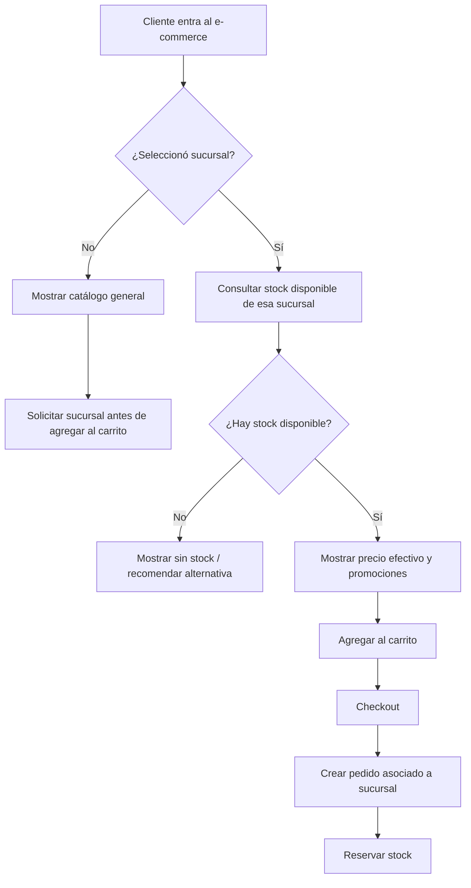
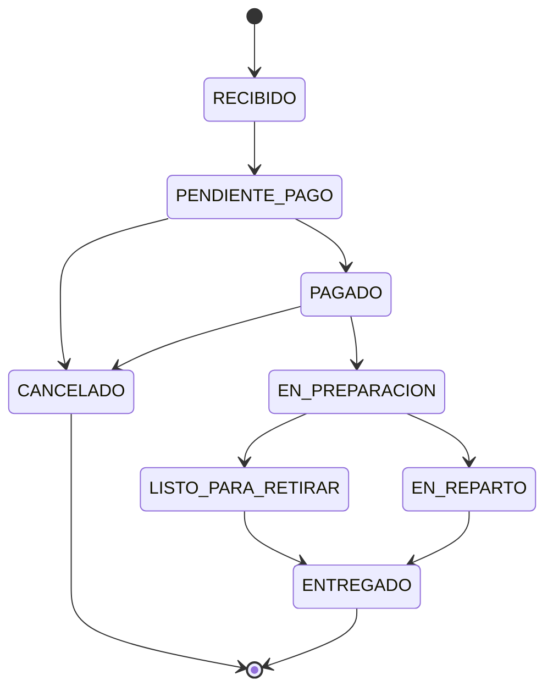
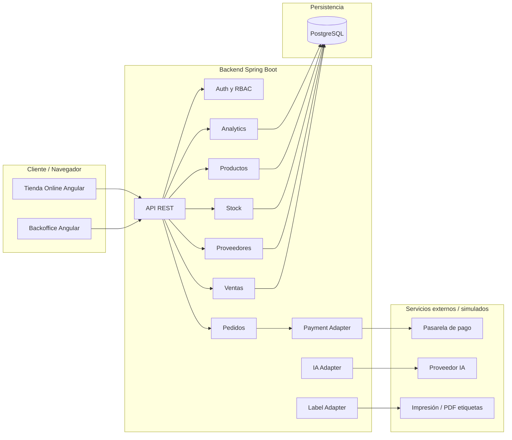
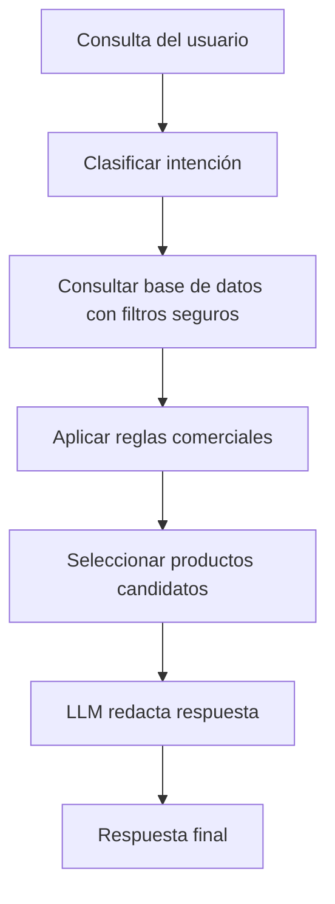

# Sistema Integral de Gestión Comercial con E-commerce para Dietética Lembas

> [!info] Propósito del documento
> Este documento funciona como base integral para seguir iterando la tesis/TPF. La idea es dejar asentado el enfoque actualizado: el proyecto **sigue siendo un sistema de gestión comercial / ERP acotado**, porque necesita administrar productos, stock, precios, proveedores, sucursales, empleados, pedidos y ventas presenciales, pero incorpora un **módulo e-commerce integrado** como canal de venta online. El e-commerce no se plantea como una tienda aislada: consume el mismo catálogo, los mismos precios y el stock real de las sucursales.

---

## Índice

- [[#1. Resumen ejecutivo]]
- [[#2. Cambio de enfoque del proyecto]]
- [[#3. Contexto del cliente real]]
- [[#4. Problemática que resuelve]]
- [[#5. Propuesta de solución]]
- [[#6. Objetivos del proyecto]]
- [[#7. Alcance general]]
- [[#7.3. Principio central ERP + e-commerce integrado]]
- [[#7.4. Diseño de stock, precios y ofertas multisucursal]]
- [[#8. Alcance incluido]]
- [[#9. Alcance excluido y justificación]]
- [[#10. Módulos definitivos]]
- [[#11. Actores y roles]]
- [[#12. Flujos principales del sistema]]
- [[#13. Requisitos funcionales]]
- [[#14. Requisitos no funcionales]]
- [[#15. Reglas de negocio]]
- [[#15.7. Reglas de stock multisucursal y e-commerce]]
- [[#15.8. Reglas de precios y promociones por vencimiento]]
- [[#16. Modelo conceptual del dominio]]
- [[#16.3. Modelo específico para stock multisucursal, lotes, reservas y promociones]]
- [[#17. Estados principales del sistema]]
- [[#18. Arquitectura propuesta]]
- [[#19. Diseño backend]]
- [[#20. Diseño frontend]]
- [[#21. Base de datos]]
- [[#22. Seguridad y permisos]]
- [[#23. Integraciones externas y adaptadores]]
- [[#24. Módulo inteligente / IA]]
- [[#25. Analytics y reportes]]
- [[#26. Estrategia de testing]]
- [[#27. Estrategia de despliegue]]
- [[#28. MVP, iteraciones y roadmap]]
- [[#29. Riesgos y mitigaciones]]
- [[#30. Argumento de defensa académica]]
- [[#31. Glosario]]
- [[#32. Próximos pasos]]

---

# 1. Resumen ejecutivo

El proyecto consiste en el desarrollo de un **sistema integral de gestión comercial con módulo e-commerce integrado para Dietética Lembas**, una dietética real que necesita digitalizar su operación diaria y habilitar un canal de venta online conectado con el stock real del negocio.

La propuesta no debe presentarse como un ERP empresarial gigante ni como un e-commerce aislado. El enfoque correcto es un **ERP comercial acotado**, orientado a productos, stock, precios, sucursales, proveedores, ventas presenciales, pedidos y analytics, con una tienda online integrada que utiliza esa misma información operativa.

La idea central es:

```text
Backoffice / ERP comercial
    ↓
Productos, precios, stock, sucursales, proveedores y promociones
    ↓
Canales de venta
    ├── Venta presencial en sucursal
    └── E-commerce
    ↓
Pedidos, pagos, entregas y movimientos de stock
    ↓
Analytics, reposición, etiquetas y recomendaciones inteligentes
```

El e-commerce no tendrá un stock separado. Cada compra online deberá asociarse a una sucursal responsable de preparar el pedido, y la disponibilidad se calculará a partir del stock real de esa sucursal. De esta forma, si una venta presencial reduce stock, la tienda online refleja el cambio; si una compra online reserva unidades, la sucursal ve esa reserva; si se cambia el precio base del producto, ese precio impacta en sucursales y e-commerce.

El sistema estará diseñado inicialmente para Dietética Lembas, pero con una estructura suficientemente general como para adaptarse a otros comercios minoristas con necesidades similares.

---

# 2. Cambio de enfoque del proyecto

## 2.1. Enfoque anterior

El enfoque inicial podía interpretarse como:

```text
Sistema interno para gestión de stock, ventas, proveedores y reportes de una dietética.
```

Ese planteo tiene valor real para el negocio, pero académicamente puede ser percibido como un sistema de gestión tradicional, con riesgo de parecer demasiado cercano a un CRUD ampliado.

## 2.2. Enfoque reformulado

El enfoque actualizado debe presentarse como:

```text
Sistema integral de gestión comercial para una dietética real, con un módulo e-commerce integrado al stock, precios, pedidos, pagos, entregas, sucursales, proveedores, analytics y recomendaciones inteligentes.
```

La corrección importante es que el sistema **puede seguir siendo un ERP**, pero no un ERP genérico y enorme. Debe ser un **ERP comercial acotado**, pensado para sostener la operación real de una dietética y para alimentar un canal online.

## 2.3. Diferencia clave

| Enfoque ERP genérico | Enfoque ERP comercial con e-commerce integrado |
|---|---|
| El centro es administrar datos internos. | El centro es operar ventas presenciales y online desde una misma base comercial. |
| Puede derivar en ABMs aislados. | Cada módulo participa en un flujo comercial concreto. |
| Stock, productos y proveedores se ven como módulos administrativos. | Stock, productos y proveedores alimentan catálogo, ventas, reposición y analytics. |
| El e-commerce puede quedar como agregado artificial. | El e-commerce es un canal de venta más, conectado al core de gestión. |
| Puede sonar a sistema de stock clásico. | Se defiende como plataforma omnicanal para un cliente real. |

## 2.4. Frase guía del proyecto

> El sistema se plantea como una plataforma de gestión comercial para una dietética real, manteniendo funcionalidades propias de un ERP acotado, como stock, productos, proveedores, empleados y reportes, pero incorporando un módulo e-commerce integrado que permite vender online utilizando la misma información operativa del negocio.

## 2.5. Idea conceptual central

```text
No se construyen dos sistemas separados:

ERP interno        E-commerce externo
    X                    X

Se construye una única plataforma:

Core comercial compartido
    ├── Venta presencial
    └── Venta online
```

El e-commerce es la vidriera y el canal de compra. El backoffice / ERP comercial es el motor que mantiene actualizados productos, stock, precios, sucursales, ofertas, pedidos, etiquetas y reportes.

---

# 3. Contexto del cliente real

## 3.1. Cliente

**Dietética Lembas** es el comercio tomado como caso real para validar el sistema. El negocio comercializa productos típicos de dietética, alimentos saludables, productos naturales, suplementos alimenticios no farmacológicos, productos sin TACC, productos sin azúcar, productos a granel, snacks, cereales, frutos secos, harinas, infusiones y otros productos relacionados.

> [!note] Importante
> El sistema se diseña tomando a Dietética Lembas como cliente real, pero no debe quedar limitado exclusivamente a ese comercio. La arquitectura y el dominio deben permitir adaptarlo a otros comercios minoristas.

## 3.2. Situación actual esperada

El negocio necesita resolver problemas frecuentes en comercios minoristas:

- Administración manual o semi-manual de stock.
- Uso de planillas Excel para productos, precios o proveedores.
- Dificultad para mantener precios actualizados.
- Proveedores con formatos heterogéneos de listas de precios.
- Falta de trazabilidad completa de movimientos de stock.
- Dificultad para saber qué productos reponer.
- Posibles diferencias entre stock real y stock registrado.
- Falta de canal online integrado con el stock real.
- Necesidad de imprimir etiquetas o actualizar precios en góndola.
- Necesidad de separar permisos entre dueña, administradores y empleados.
- Falta de métricas comerciales claras.

## 3.3. Oportunidad

La oportunidad es transformar un sistema interno de gestión en una plataforma comercial más completa:

- Venta online.
- Catálogo público.
- Stock sincronizado por sucursal.
- Pedidos con retiro o envío.
- Pagos digitales.
- Backoffice para operación diaria.
- Analytics para decisiones comerciales.
- IA para recomendaciones y sugerencias.

---

# 4. Problemática que resuelve

## 4.1. Problema principal

Los comercios minoristas como una dietética suelen tener dificultades para integrar en un único flujo la venta online, el control de stock, la actualización de precios, la gestión de proveedores y el seguimiento de pedidos. Esto genera trabajo manual, errores operativos, pérdida de tiempo, falta de información confiable y baja capacidad para escalar hacia nuevos canales de venta.

## 4.2. Problemas específicos

### 4.2.1. Falta de canal online integrado

Un e-commerce aislado puede vender productos que no están realmente disponibles. Si el stock online no está conectado con el stock de sucursal, aparecen problemas como:

- Venta de productos sin stock.
- Cancelación de pedidos.
- Mala experiencia del cliente.
- Trabajo manual para confirmar disponibilidad.
- Necesidad de revisar producto por producto antes de aceptar un pedido.

### 4.2.2. Stock poco confiable

El stock puede verse afectado por ventas presenciales, pedidos online, consumos internos, pérdidas, vencimientos, ajustes manuales y reposiciones. Si esos movimientos no se registran correctamente, el negocio pierde visibilidad.

### 4.2.3. Precios difíciles de mantener

Los proveedores pueden enviar listas de precios por distintos medios o formatos. Esto complica:

- Detectar aumentos.
- Actualizar precios de venta.
- Mantener márgenes.
- Comparar proveedores.
- Imprimir nuevas etiquetas.

### 4.2.4. Entregas y retiros sin trazabilidad

Cuando se vende online, el pedido debe pasar por estados claros:

- recibido;
- pagado;
- en preparación;
- listo para retirar;
- en reparto;
- entregado;
- cancelado.

Sin trazabilidad, se vuelve difícil saber qué pedidos están pendientes y quién debe prepararlos.

### 4.2.5. Falta de información para decisiones comerciales

El negocio necesita responder preguntas como:

- ¿Qué productos se venden más?
- ¿Qué productos conviene reponer?
- ¿Qué productos tienen bajo stock?
- ¿Qué productos están próximos a vencer?
- ¿Qué categorías generan mayor facturación?
- ¿Qué sucursal vende más?
- ¿Qué productos se compran juntos?
- ¿Qué productos conviene promocionar?

### 4.2.6. E-commerce poco diferenciado

Muchos e-commerce ofrecen catálogo, carrito y checkout. Para diferenciar la propuesta, se agrega un módulo inteligente capaz de recomendar productos en función del stock real, categorías, restricciones alimentarias, ofertas y comportamiento comercial.

---

# 5. Propuesta de solución

## 5.1. Solución general

Se propone desarrollar una plataforma web compuesta por tres grandes áreas:

1. **Backoffice / ERP comercial acotado** para administrar la operación interna.
2. **Módulo e-commerce** para clientes finales, integrado al stock y precios reales.
3. **Módulo inteligente** para recomendaciones y sugerencias comerciales.

La lógica central del negocio vive en el backoffice/core comercial. La tienda online funciona como un canal de venta que consume esa información.



## 5.2. Valor diferencial

La solución se diferencia por combinar:

- E-commerce funcional.
- Stock real por sucursal.
- Venta presencial integrada.
- Gestión de proveedores y precios.
- Impresión de etiquetas.
- Soporte para lector de código de barras.
- Analytics comercial.
- Recomendaciones inteligentes basadas en disponibilidad real.

## 5.3. Principio de diseño

El sistema debe evitar convertirse en una suma de ABMs. Cada módulo tiene que estar conectado con procesos reales del negocio.

Ejemplo:

```text
Proveedor actualiza precio
    ↓
Sistema detecta cambio de costo
    ↓
Sugiere nuevo precio de venta
    ↓
Administrador aprueba
    ↓
Se actualiza catálogo online
    ↓
Se imprimen nuevas etiquetas
```

---

# 6. Objetivos del proyecto

## 6.1. Objetivo general

Desarrollar un sistema integral de gestión comercial para Dietética Lembas, con módulo e-commerce integrado, que permita administrar productos, stock multisucursal, precios, proveedores, ventas presenciales, pedidos online, pagos, entregas, etiquetas, reportes y recomendaciones inteligentes desde una misma plataforma.

## 6.2. Objetivos específicos

- Implementar una tienda online con catálogo, búsqueda, filtros, detalle de producto, carrito y checkout.
- Permitir pedidos online con retiro en sucursal o envío a domicilio.
- Registrar pagos mediante QR o link de pago, con estados de pago asociados al pedido.
- Administrar empresa, sucursales, empleados, roles y permisos.
- Gestionar productos, categorías, marcas, etiquetas comerciales y restricciones alimentarias.
- Controlar stock por sucursal, incluyendo movimientos, ajustes, vencimientos, mermas y consumo interno.
- Gestionar proveedores y listas de precios de reposición.
- Permitir actualización asistida de precios de venta en base al costo y margen.
- Registrar ventas presenciales con búsqueda rápida y lector de código de barras.
- Generar e imprimir etiquetas de precios o identificación interna.
- Proveer dashboards y reportes comerciales básicos.
- Incorporar un asistente inteligente para recomendaciones de productos y sugerencias operativas.
- Diseñar una arquitectura modular, mantenible y extensible.

---

# 7. Alcance general

## 7.1. Alcance narrativo

El sistema abarcará el ciclo comercial completo de una dietética:

```text
Publicación de productos
    ↓
Consulta por clientes
    ↓
Carrito y checkout
    ↓
Pedido online
    ↓
Pago
    ↓
Preparación
    ↓
Retiro o entrega
    ↓
Descuento de stock
    ↓
Análisis comercial
    ↓
Reposición / actualización de precios
```

También contemplará la venta presencial:

```text
Cliente compra en sucursal
    ↓
Empleado escanea o busca productos
    ↓
Sistema calcula total
    ↓
Cliente paga con efectivo/transferencia/QR
    ↓
Se registra venta
    ↓
Se descuenta stock
    ↓
La información alimenta reportes
```

## 7.2. Alcance técnico

La plataforma será una aplicación web con:

- Frontend web para clientes.
- Frontend/backoffice para empleados y administradores.
- Backend API REST.
- Base de datos relacional.
- Autenticación y autorización por roles.
- Arquitectura modular.
- Despliegue mediante contenedores.
- Integraciones externas simuladas o encapsuladas mediante adaptadores.


## 7.3. Principio central ERP + e-commerce integrado

La decisión de mantener funcionalidades de ERP/backoffice se justifica porque el e-commerce depende directamente de ellas. La tienda online no debe manejar datos duplicados ni stock propio; debe consultar el mismo catálogo, los mismos precios y el stock real administrado por el sistema de gestión.

```text
Productos globales
    ↓
Precio base global
    ↓
Stock por sucursal
    ↓
Lotes y vencimientos por sucursal
    ↓
Ofertas globales o por sucursal
    ↓
Venta presencial y e-commerce consumen la misma información
```

Esto permite que los cambios operativos impacten automáticamente en todos los canales:

| Cambio realizado en backoffice/sucursal | Impacto en el sistema |
|---|---|
| Se actualiza el precio base de un producto | Cambia en venta presencial, e-commerce, etiquetas y reportes |
| Se vende un producto en sucursal | Baja el stock disponible para esa sucursal y para el e-commerce asociado |
| Se reserva stock por pedido online | Baja el stock disponible de la sucursal responsable |
| Se cancela un pedido online | Se libera la reserva de stock |
| Se detecta un lote próximo a vencer | Puede generarse una oferta específica para esa sucursal/lote |
| Se desactiva un producto | Deja de venderse presencialmente y deja de mostrarse online |

> [!important] Regla conceptual
> El e-commerce es un canal de venta, no una fuente de datos separada. El core comercial centraliza productos, precios, sucursales, stock, promociones y movimientos.

## 7.4. Diseño de stock, precios y ofertas multisucursal

La separación más importante del dominio es distinguir entre información **global de la empresa** e información **específica de cada sucursal**.

| Elemento | Nivel recomendado | Justificación |
|---|---|---|
| Producto | Global empresa | El producto es el mismo para todas las sucursales y para el e-commerce |
| Categoría | Global empresa | Permite organizar catálogo, filtros y reportes |
| Marca | Global empresa | No depende de la sucursal |
| Etiquetas comerciales/alimentarias | Global empresa | Permiten búsquedas y recomendaciones consistentes |
| Precio base | Global empresa | Si se cambia el precio, impacta en sucursales y tienda online |
| Stock | Por sucursal | Cada local tiene cantidades físicas distintas |
| Lotes | Por sucursal | Cada local puede recibir mercadería en fechas diferentes |
| Vencimientos | Por sucursal/lote | El vencimiento depende de las unidades físicas disponibles |
| Oferta general | Global o por sucursal | Puede ser una estrategia general o local |
| Oferta por vencimiento | Por lote/sucursal | Debe aplicarse solo sobre unidades concretas próximas a vencer |
| Pedido online | Por sucursal | Una sucursal debe preparar o entregar el pedido |
| Stock e-commerce | No existe como stock separado | Se calcula desde el stock disponible de la sucursal seleccionada |

### 7.4.1. Precio base global

El precio base del producto pertenece a la empresa. Si la administración modifica el precio de un producto, el cambio se refleja en todas las sucursales y en el e-commerce.

```text
Producto: Granola 500g
Precio base anterior: $4.500
Precio base nuevo: $4.900

Impacta en:
- venta presencial;
- catálogo online;
- etiquetas de precios;
- reportes;
- cálculo de márgenes.
```

Este criterio evita inconsistencias entre locales y reduce trabajo manual.

### 7.4.2. Excepciones al precio base

El sistema puede permitir excepciones controladas mediante promociones, no mediante duplicación desordenada de precios.

Ejemplo:

```text
Precio base global: $4.900

Sucursal Centro:
- precio efectivo: $4.900

Sucursal Nueva Córdoba:
- oferta por vencimiento: $4.200
- stock promocional: 3 unidades
```

En este caso no se cambió el precio base del producto. Se aplicó una promoción puntual sobre una sucursal o lote.

### 7.4.3. Stock por sucursal

El stock debe registrarse por sucursal porque la disponibilidad física no es la misma en todos los locales.

```text
Producto: Almendras 1kg

Sucursal Centro: 8 unidades
Sucursal Nueva Córdoba: 3 unidades
Sucursal General Paz: 0 unidades
```

El e-commerce no debería mostrar simplemente “11 unidades disponibles” como stock global, porque eso obligaría a dividir pedidos entre sucursales, coordinar traslados internos y mezclar vencimientos/ofertas.

### 7.4.4. Estrategia recomendada para e-commerce

Para el MVP, el e-commerce debe operar sobre una **sucursal seleccionada**.

Flujo recomendado:

```text
Cliente entra a la tienda
    ↓
Selecciona sucursal o zona de retiro/envío
    ↓
El sistema muestra disponibilidad, precios efectivos y ofertas de esa sucursal
    ↓
El cliente arma el carrito
    ↓
El pedido queda asociado a esa sucursal
    ↓
La sucursal prepara el pedido
```

Regla recomendada:

> Un pedido online debe ser preparado por una única sucursal.

Esto evita la complejidad de pedidos partidos entre varias sucursales.

### 7.4.5. Qué se muestra antes de elegir sucursal

Antes de seleccionar sucursal, el catálogo puede mostrar información general sin comprometer disponibilidad exacta.

```text
Granola 500g
Precio base: $4.900
Disponibilidad según sucursal
```

Al entrar al detalle:

```text
Disponibilidad:
- Sucursal Centro: 8 unidades
- Sucursal Nueva Córdoba: 3 unidades
- Sucursal General Paz: sin stock
```

Antes de agregar al carrito, el sistema debe pedir una sucursal o modalidad de entrega.

### 7.4.6. Stock físico, reservado y disponible

Para evitar sobreventa, el stock debe distinguir al menos tres conceptos:

```text
stock_disponible = stock_fisico - stock_reservado
```

| Concepto | Descripción |
|---|---|
| Stock físico | Cantidad real registrada en la sucursal |
| Stock reservado | Cantidad apartada por pedidos online pendientes o pagados |
| Stock disponible | Cantidad que se puede vender en mostrador o por e-commerce |

Ejemplo:

```text
Producto: Granola 500g
Sucursal Centro

Stock físico: 10
Stock reservado por pedidos online: 3
Stock disponible: 7
```

### 7.4.7. Lotes y vencimientos

Para productos con fecha de vencimiento, el stock debe poder dividirse en lotes.

```text
Producto: Leche vegetal
Sucursal Centro

Lote A:
- cantidad: 2
- vencimiento: 2026-05-20

Lote B:
- cantidad: 10
- vencimiento: 2026-07-10
```

Esto permite:

- alertas de vencimiento;
- descuentos por vencimiento cercano;
- trazabilidad de pérdidas;
- criterio FEFO: primero vender/descontar lo que vence antes.

### 7.4.8. Ofertas por vencimiento

Las ofertas por vencimiento no deberían ser globales, porque dependen del stock físico de cada sucursal.

```text
Producto: Leche vegetal
Precio base: $2.000

Sucursal Centro:
- Lote A próximo a vencer: 2 unidades con 20% off
- Lote B normal: 10 unidades sin descuento

Sucursal Nueva Córdoba:
- Sin lote próximo a vencer
```

En el e-commerce, si el cliente eligió Sucursal Centro, puede ver:

```text
Leche vegetal
Precio normal: $2.000
Oferta por vencimiento: $1.600
Stock promocional: 2 unidades
```

Si el cliente eligió Sucursal Nueva Córdoba, no ve esa oferta.

### 7.4.9. Criterio FEFO

Para productos con vencimiento, el sistema debe priorizar las unidades que vencen primero.

```text
FEFO = First Expired, First Out
```

Aplicación práctica:

```text
Si hay varios lotes disponibles, el sistema descuenta primero del lote con vencimiento más próximo.
```

Para el MVP, si implementar descuentos mixtos en un mismo ítem complica demasiado el checkout, se puede simplificar mostrando las ofertas por vencimiento como **stock promocional limitado**.

### 7.4.10. Opción descartada: stock global para e-commerce

No se recomienda que el e-commerce use stock total consolidado de todas las sucursales.

Ejemplo problemático:

```text
Sucursal Centro: 5 unidades
Sucursal Nueva Córdoba: 3 unidades
Sucursal General Paz: 2 unidades

E-commerce muestra: 10 unidades
```

Si el cliente compra 8 unidades, el sistema tendría que decidir de qué sucursales salen, dividir preparación, coordinar traslados internos y manejar diferentes vencimientos/precios promocionales.

Por eso, para el MVP se descarta el modelo de stock global online y se adopta el modelo de **pedido asociado a una única sucursal**.

---

# 8. Alcance incluido

## 8.1. Tabla general de alcance incluido

| Área | Incluye | Motivo |
|---|---|---|
| Tienda online | Catálogo, filtros, detalle, carrito, checkout | Es el núcleo del nuevo enfoque e-commerce. |
| Pedidos online | Creación, estados, retiro/envío | Permite cerrar el ciclo comercial online. |
| Pagos | QR presencial y link de pago online | Necesario para un e-commerce realista. |
| Sucursales | Stock y ventas por sucursal | Permite escalar a varias sucursales/franquicias simples. |
| Usuarios y roles | Administrador, encargado, empleado | Necesario para seguridad y operación interna. |
| Productos | ABM, categorías, marcas, etiquetas, restricciones | Base del catálogo y del stock. |
| Stock | Stock por sucursal, movimientos, vencimientos | Necesario para vender con disponibilidad real. |
| Proveedores | Registro, productos asociados, listas de precios | Permite mantener costos y precios actualizados. |
| Ventas presenciales | Venta rápida, scanner, descuento de stock | Integra canal físico con canal online. |
| Entregas | Retiro, envío, estados, responsable | Necesario para operación e-commerce. |
| Etiquetas | Impresión de precios/códigos internos | Necesario para góndola y actualización de precios. |
| Código de barras | Lectura de códigos existentes | Agiliza carga y venta presencial. |
| Analytics | Dashboards de ventas, stock, pedidos, productos | Aporta valor de negocio. |
| IA | Recomendaciones y sugerencias acotadas | Diferencia el proyecto de e-commerce común. |

---

## 8.2. Alcance funcional incluido en detalle

### 8.2.1. E-commerce básico funcional

Incluye:

- Página pública de productos.
- Búsqueda por nombre.
- Filtros por categoría, marca, etiquetas y disponibilidad.
- Detalle de producto.
- Carrito de compras.
- Checkout.
- Selección de sucursal.
- Elección de retiro o envío.
- Generación de pedido.
- Seguimiento del pedido.

Justificación:

> Es el corazón del nuevo enfoque. Sin esto, el proyecto volvería a parecer un ERP.

### 8.2.2. Productos con stock real

Incluye:

- Productos publicados o no publicados en tienda.
- Stock por sucursal.
- Disponibilidad visible para el cliente.
- Descuento de stock por venta online o presencial.
- Control de bajo stock.
- Registro de movimientos.

Justificación:

> Un e-commerce sin stock integrado puede vender productos no disponibles. La integración con stock real es una parte fuerte del proyecto.

### 8.2.3. Carrito y pedidos

Incluye:

- Agregar/quitar productos.
- Modificar cantidades.
- Validar stock antes de confirmar.
- Crear pedido.
- Cambiar estado del pedido.
- Registrar historial de estado.

Justificación:

> Permite cerrar el flujo comercial online y conectar la tienda con la operación interna.

### 8.2.4. Retiro y envío

Incluye:

- Retiro en sucursal.
- Envío a domicilio gestionado manualmente por el comercio.
- Datos de entrega.
- Observaciones.
- Estado de preparación y entrega.

Justificación:

> Todo e-commerce necesita definir cómo llega el producto al cliente. No se integran correos externos en el MVP para evitar complejidad innecesaria.

### 8.2.5. Pago simulado o integración mínima

Incluye:

- Método de pago asociado al pedido o venta.
- QR para pago presencial.
- Link de pago para compra online.
- Estados de pago.
- Registro de referencia externa.

Justificación:

> Se contempla el flujo real de pago sin convertir el proyecto en una integración financiera compleja.

### 8.2.6. Backoffice de productos, stock y proveedores

Incluye:

- Gestión de productos.
- Gestión de categorías.
- Gestión de proveedores.
- Asociación producto-proveedor.
- Costos de reposición.
- Listas de precios.
- Actualización asistida de precios.

Justificación:

> El backoffice sostiene el e-commerce. Permite operar el negocio real y mantener el catálogo actualizado.

### 8.2.7. Sucursales

Incluye:

- Gestión de empresa.
- Gestión de sucursales.
- Stock separado por sucursal.
- Ventas/pedidos asociados a sucursal.
- Empleados asignados a sucursal.

Justificación:

> Permite que el sistema sea adaptable a negocios con más de una ubicación, sin llegar a un marketplace multiempresa.

### 8.2.8. Empleados y roles

Incluye:

- Administrador general.
- Encargado de sucursal.
- Empleado.
- Cliente.
- Permisos por módulo.

Justificación:

> El sistema maneja información sensible: precios, stock, ventas, pedidos, empleados y configuración comercial. Necesita control de acceso.

### 8.2.9. Analytics básico

Incluye:

- Ventas por período.
- Ventas por sucursal.
- Productos más vendidos.
- Productos con bajo stock.
- Productos próximos a vencer.
- Pedidos por estado.
- Métodos de entrega.
- Margen estimado por producto/categoría.

Justificación:

> Permite demostrar valor comercial más allá del CRUD.

### 8.2.10. Lector de código de barras

Incluye:

- Lectura de códigos existentes.
- Búsqueda de producto por código.
- Uso en venta presencial.
- Uso en carga/edición de productos.

Justificación:

> Mejora la velocidad operativa en sucursal. Se implementa aprovechando que muchos lectores funcionan como entrada de teclado.

### 8.2.11. Impresión de etiquetas

Incluye:

- Etiqueta de precio.
- Etiqueta de identificación interna.
- Nombre del producto.
- Precio.
- Código de barras si corresponde.
- Fecha de actualización.
- Oferta temporal si corresponde.

Justificación:

> Conecta la gestión de precios con la operación física del comercio.

### 8.2.12. Bot IA acotado

Incluye:

- Recomendaciones de productos disponibles.
- Alternativas si un producto está sin stock.
- Sugerencias de combos.
- Sugerencias de reposición.
- Sugerencias de promociones por vencimiento o baja rotación.

Justificación:

> Diferencia el proyecto de un e-commerce tradicional, pero se mantiene acotado para evitar complejidad excesiva.

---

# 9. Alcance excluido y justificación

## 9.1. Tabla de alcance excluido

| Funcionalidad excluida | Motivo de exclusión | Posible mejora futura |
|---|---|---|
| Marketplace multiempresa | Aumenta mucho la complejidad de usuarios, comisiones, catálogos y pagos. | Convertir la plataforma en SaaS multiempresa. |
| Franquicias complejas | Requiere reglas avanzadas de permisos, contratos, precios y administración. | Modelo avanzado de franquicias. |
| Facturación fiscal | Implica normativa, integración fiscal y responsabilidad legal. | Integración con facturación electrónica. |
| Integración completa con correo/logística externa | Requiere APIs externas, costos, reglas por zona y tracking externo. | Integración con OCA, Andreani u otros servicios. |
| WhatsApp automático | Requiere API oficial, plantillas aprobadas y gestión de conversaciones. | Notificaciones automáticas por WhatsApp. |
| OCR de facturas/listas | Es complejo, propenso a errores y no central al e-commerce. | OCR asistido para listas de proveedores. |
| App mobile nativa | Duplica esfuerzo de frontend. | App móvil para clientes o empleados. |
| IA avanzada con historial individual | Implica personalización, privacidad y mayor complejidad. | Recomendador personalizado por historial de compras. |
| Fidelización/puntos/cupones complejos | No es necesario para validar el MVP. | Programa de fidelidad. |
| POS fiscal completo | Excede el objetivo académico y legal. | Integración con sistema de caja/fiscal externo. |
| Gestión contable completa | Transformaría el proyecto en ERP. | Exportación contable o módulo financiero. |
| Compras automáticas a proveedores | Requiere integración con proveedores reales. | Órdenes de compra automatizadas. |
| Inventario con balanzas electrónicas | Requiere hardware específico. | Integración con balanzas para productos a granel. |

## 9.2. Justificación general de exclusiones

Las exclusiones buscan evitar que el proyecto se vuelva inmanejable para una tesis individual. El criterio principal es mantener un equilibrio entre:

- Valor real para el cliente.
- Complejidad técnica defendible.
- Alcance realizable.
- Diferenciación académica.
- Posibilidad de iteración futura.

> [!important] Criterio clave
> El proyecto debe ser suficientemente amplio para no parecer un CRUD, pero suficientemente acotado para poder implementarse y defenderse correctamente.

---

# 10. Módulos definitivos

## 10.1. Vista general



---

## 10.2. Módulo cliente / tienda online

### Funcionalidades

- Catálogo público.
- Búsqueda y filtros.
- Detalle de producto.
- Carrito.
- Checkout.
- Selección de sucursal.
- Retiro o envío.
- Link de pago.
- Seguimiento de pedido.
- Recomendaciones inteligentes.

### Objetivo

Permitir que un cliente pueda consultar productos, verificar disponibilidad, comprar online y seguir el estado de su pedido sin intervención manual del comercio.

### Consideraciones UX

- Interfaz clara y rápida.
- Mobile-first.
- Búsqueda visible.
- Filtros simples.
- Estado de stock fácil de entender.
- Checkout corto.
- Información clara de retiro/envío.
- Seguimiento simple del pedido.

---

## 10.3. Módulo administrador / backoffice

### Funcionalidades

- Empresa y sucursales.
- Empleados, roles y permisos.
- Productos y categorías.
- Stock por sucursal.
- Proveedores.
- Listas de precios.
- Ventas presenciales.
- Pedidos online.
- Entregas.
- Impresión de etiquetas.
- Códigos de barras.
- Reportes y analytics.
- Configuración comercial.

### Objetivo

Brindar al negocio una herramienta centralizada para operar el e-commerce, la venta presencial y la administración comercial diaria.

### Consideraciones UX

- Panel principal con tareas pendientes.
- Alertas de bajo stock.
- Alertas de vencimiento.
- Pedidos pendientes visibles.
- Venta rápida optimizada para mostrador.
- Acciones masivas para precios/etiquetas.
- Interfaces distintas según rol.

---

## 10.4. Módulo inteligente

### Funcionalidades

- Recomendador para clientes.
- Sugerencias de reposición.
- Sugerencias de promociones.
- Productos alternativos sin stock.
- Análisis básico de rotación y vencimientos.

### Objetivo

Aportar una capa diferencial que ayude al cliente a comprar mejor y al administrador a tomar decisiones comerciales.

### Principio técnico

La IA no debe inventar productos ni recomendar productos inexistentes. Debe trabajar sobre información real del sistema.

```text
Consulta del usuario
    ↓
Filtro por base de datos: stock, categoría, etiquetas, precio, sucursal
    ↓
Ranking / reglas comerciales
    ↓
IA redacta respuesta natural
    ↓
Respuesta con productos reales y disponibles
```

---

# 11. Actores y roles

## 11.1. Actores principales

| Actor | Descripción |
|---|---|
| Cliente final | Persona que compra o consulta productos desde la tienda online. |
| Administrador general | Persona con acceso total al sistema y configuración del negocio. |
| Encargado de sucursal | Usuario que administra operación de una sucursal específica. |
| Empleado | Usuario que opera ventas, pedidos, stock básico y tareas asignadas. |
| Sistema de pagos | Servicio externo o simulado que registra pagos. |
| Módulo inteligente | Servicio interno/externo que genera recomendaciones. |

## 11.2. Roles internos

### Administrador general

Permisos:

- Gestionar empresa.
- Gestionar sucursales.
- Gestionar usuarios.
- Gestionar productos.
- Gestionar proveedores.
- Ver todas las ventas.
- Ver reportes globales.
- Configurar márgenes y reglas comerciales.
- Aprobar cambios masivos de precio.
- Ver analytics.

### Encargado de sucursal

Permisos:

- Ver stock de su sucursal.
- Gestionar ventas de su sucursal.
- Gestionar pedidos asignados a su sucursal.
- Preparar entregas/retiros.
- Registrar ajustes de stock justificados.
- Ver reportes de su sucursal.
- Imprimir etiquetas.

### Empleado

Permisos:

- Realizar ventas presenciales.
- Buscar productos.
- Escanear códigos de barras.
- Preparar pedidos.
- Registrar consumo interno si está permitido.
- Reportar mermas o problemas.
- Consultar stock básico.

### Cliente

Permisos:

- Ver catálogo.
- Buscar productos.
- Agregar al carrito.
- Realizar pedido.
- Pagar mediante link.
- Consultar estado del pedido.
- Recibir recomendaciones.

---

# 12. Flujos principales del sistema

## 12.1. Flujo de compra online con retiro en sucursal



## 12.2. Flujo de compra online con envío

```text
Cliente consulta catálogo
    ↓
Selecciona productos
    ↓
Indica dirección de entrega
    ↓
Sistema valida stock
    ↓
Sistema genera pedido
    ↓
Cliente paga mediante link
    ↓
Pedido pasa a EN_PREPARACION
    ↓
Empleado prepara pedido
    ↓
Pedido pasa a EN_REPARTO
    ↓
Pedido pasa a ENTREGADO
    ↓
Sistema descuenta o confirma descuento de stock
```

## 12.3. Flujo de venta presencial

```text
Cliente compra en sucursal
    ↓
Empleado abre venta rápida
    ↓
Escanea código de barras o busca producto
    ↓
Sistema agrega producto al ticket
    ↓
Empleado ajusta cantidad si corresponde
    ↓
Cliente paga efectivo/transferencia/QR
    ↓
Sistema registra venta
    ↓
Sistema descuenta stock de la sucursal
    ↓
Venta impacta en analytics
```

## 12.4. Flujo de actualización de precios desde proveedor

```text
Administrador carga lista de precios
    ↓
Sistema identifica productos/proveedor
    ↓
Sistema compara costo anterior vs nuevo costo
    ↓
Sistema calcula variación porcentual
    ↓
Sistema sugiere nuevo precio de venta según margen
    ↓
Administrador revisa cambios
    ↓
Administrador aprueba cambios
    ↓
Sistema actualiza precios
    ↓
Sistema permite imprimir etiquetas actualizadas
```

## 12.5. Flujo de reposición sugerida

```text
Sistema analiza ventas y stock
    ↓
Detecta productos con bajo stock o alta rotación
    ↓
Cruza información con proveedor habitual
    ↓
Sugiere productos a reponer
    ↓
Administrador revisa sugerencias
    ↓
Administrador genera pedido de reposición o tarea interna
```

## 12.6. Flujo de recomendaciones inteligentes para cliente

```text
Cliente escribe: "quiero algo dulce sin azúcar"
    ↓
Sistema interpreta intención
    ↓
Filtra productos con etiquetas relacionadas
    ↓
Filtra productos con stock disponible
    ↓
Prioriza ofertas, productos populares o próximos a vencer
    ↓
IA redacta respuesta amigable
    ↓
Cliente recibe opciones reales y disponibles
```

## 12.7. Flujo de productos próximos a vencer

```text
Sistema consulta lotes con vencimiento cercano
    ↓
Calcula días restantes
    ↓
Marca productos en alerta
    ↓
Sugiere promoción o destaque
    ↓
Administrador aprueba oferta temporal
    ↓
Oferta aparece en tienda online y etiquetas
```

---

# 13. Requisitos funcionales

## 13.1. Tienda online

| ID | Requisito |
|---|---|
| RF-001 | El sistema debe mostrar un catálogo público de productos activos. |
| RF-002 | El sistema debe permitir buscar productos por nombre. |
| RF-003 | El sistema debe permitir filtrar productos por categoría, marca, etiquetas y disponibilidad. |
| RF-004 | El sistema debe mostrar el detalle de un producto. |
| RF-005 | El sistema debe indicar disponibilidad según sucursal seleccionada. |
| RF-006 | El sistema debe permitir agregar productos al carrito. |
| RF-007 | El sistema debe permitir modificar cantidades en el carrito. |
| RF-008 | El sistema debe validar stock antes de confirmar un pedido. |
| RF-009 | El sistema debe permitir seleccionar retiro en sucursal o envío a domicilio. |
| RF-010 | El sistema debe generar un pedido online. |
| RF-011 | El sistema debe permitir consultar el estado de un pedido. |
| RF-012 | El sistema debe mostrar recomendaciones de productos relacionados o alternativos. |

## 13.2. Pedidos y entregas

| ID | Requisito |
|---|---|
| RF-020 | El sistema debe registrar pedidos online con sus productos, cantidades y precios. |
| RF-021 | El sistema debe manejar estados de pedido. |
| RF-022 | El sistema debe registrar datos de retiro o entrega. |
| RF-023 | El sistema debe permitir asignar un responsable de preparación. |
| RF-024 | El sistema debe permitir marcar un pedido como listo para retirar. |
| RF-025 | El sistema debe permitir marcar un pedido como en reparto. |
| RF-026 | El sistema debe permitir marcar un pedido como entregado. |
| RF-027 | El sistema debe permitir cancelar un pedido según reglas definidas. |

## 13.3. Pagos

| ID | Requisito |
|---|---|
| RF-030 | El sistema debe registrar el método de pago de una venta o pedido. |
| RF-031 | El sistema debe generar un link de pago para pedidos online. |
| RF-032 | El sistema debe generar o registrar QR de pago para ventas presenciales. |
| RF-033 | El sistema debe manejar estados de pago. |
| RF-034 | El sistema debe asociar una referencia externa al pago. |
| RF-035 | El sistema debe permitir simular confirmación de pago en ambiente de prueba. |

## 13.4. Empresa y sucursales

| ID | Requisito |
|---|---|
| RF-040 | El sistema debe permitir registrar datos de la empresa. |
| RF-041 | El sistema debe permitir crear, editar y desactivar sucursales. |
| RF-042 | El sistema debe asociar empleados a sucursales. |
| RF-043 | El sistema debe asociar ventas y pedidos a una sucursal. |
| RF-044 | El sistema debe mantener stock separado por sucursal. |

## 13.5. Usuarios y roles

| ID | Requisito |
|---|---|
| RF-050 | El sistema debe permitir iniciar sesión. |
| RF-051 | El sistema debe permitir administrar usuarios internos. |
| RF-052 | El sistema debe permitir asignar roles. |
| RF-053 | El sistema debe restringir acciones según permisos. |
| RF-054 | El sistema debe registrar auditoría de acciones críticas. |

## 13.6. Productos y catálogo

| ID | Requisito |
|---|---|
| RF-060 | El sistema debe permitir crear, editar y desactivar productos. |
| RF-061 | El sistema debe permitir asignar categoría y marca. |
| RF-062 | El sistema debe permitir asignar etiquetas comerciales. |
| RF-063 | El sistema debe permitir registrar código de barras. |
| RF-064 | El sistema debe permitir definir si un producto aparece en la tienda online. |
| RF-065 | El sistema debe permitir definir precio de venta. |
| RF-066 | El sistema debe permitir registrar imágenes o datos descriptivos del producto. |
| RF-067 | El sistema debe permitir definir ofertas temporales. |

## 13.7. Stock

| ID | Requisito |
|---|---|
| RF-070 | El sistema debe registrar stock por producto y sucursal. |
| RF-071 | El sistema debe registrar movimientos de stock. |
| RF-072 | El sistema debe descontar stock por venta presencial. |
| RF-073 | El sistema debe descontar o reservar stock por pedido online. |
| RF-074 | El sistema debe registrar ingresos de stock. |
| RF-075 | El sistema debe registrar ajustes manuales con motivo. |
| RF-076 | El sistema debe registrar consumo interno de empleados. |
| RF-077 | El sistema debe registrar merma, pérdida o vencimiento. |
| RF-078 | El sistema debe alertar por bajo stock. |
| RF-079 | El sistema debe alertar por productos próximos a vencer. |

## 13.8. Proveedores y precios

| ID | Requisito |
|---|---|
| RF-080 | El sistema debe permitir registrar proveedores. |
| RF-081 | El sistema debe asociar productos con proveedores. |
| RF-082 | El sistema debe registrar costo de reposición por proveedor. |
| RF-083 | El sistema debe importar o cargar listas de precios. |
| RF-084 | El sistema debe comparar precios anteriores y nuevos. |
| RF-085 | El sistema debe sugerir precios de venta según margen. |
| RF-086 | El sistema debe requerir aprobación antes de aplicar cambios masivos. |
| RF-087 | El sistema debe guardar historial de cambios de precio. |

## 13.9. Ventas presenciales

| ID | Requisito |
|---|---|
| RF-090 | El sistema debe permitir crear una venta presencial. |
| RF-091 | El sistema debe permitir buscar productos por nombre o código de barras. |
| RF-092 | El sistema debe permitir modificar cantidades. |
| RF-093 | El sistema debe permitir modificar precio en casos autorizados. |
| RF-094 | El sistema debe calcular total. |
| RF-095 | El sistema debe registrar método de pago. |
| RF-096 | El sistema debe descontar stock automáticamente. |
| RF-097 | El sistema debe registrar la venta asociada al empleado y sucursal. |

## 13.10. Etiquetas y código de barras

| ID | Requisito |
|---|---|
| RF-100 | El sistema debe permitir buscar productos mediante lector de código de barras. |
| RF-101 | El sistema debe permitir imprimir etiquetas de precio. |
| RF-102 | El sistema debe permitir imprimir etiquetas internas. |
| RF-103 | El sistema debe permitir seleccionar productos para impresión masiva. |
| RF-104 | El sistema debe mostrar fecha de actualización de precio en la etiqueta. |

## 13.11. Analytics

| ID | Requisito |
|---|---|
| RF-110 | El sistema debe mostrar ventas por período. |
| RF-111 | El sistema debe mostrar ventas por sucursal. |
| RF-112 | El sistema debe mostrar productos más vendidos. |
| RF-113 | El sistema debe mostrar productos con bajo stock. |
| RF-114 | El sistema debe mostrar productos próximos a vencer. |
| RF-115 | El sistema debe mostrar pedidos por estado. |
| RF-116 | El sistema debe mostrar margen estimado. |
| RF-117 | El sistema debe mostrar sugerencias de reposición. |

## 13.12. Módulo inteligente

| ID | Requisito |
|---|---|
| RF-120 | El sistema debe recomendar productos en base al stock disponible. |
| RF-121 | El sistema debe sugerir alternativas cuando un producto no tenga stock. |
| RF-122 | El sistema debe recomendar combos o productos relacionados. |
| RF-123 | El sistema debe sugerir reposición de productos con bajo stock. |
| RF-124 | El sistema debe sugerir promociones para productos próximos a vencer. |
| RF-125 | El sistema debe evitar recomendar productos inexistentes o sin stock. |
| RF-126 | El sistema debe evitar realizar afirmaciones médicas o nutricionales no validadas. |

---

# 14. Requisitos no funcionales

## 14.1. Rendimiento

| ID | Requisito |
|---|---|
| RNF-001 | Las búsquedas de productos en venta rápida deben responder idealmente en menos de 200 ms en condiciones normales. |
| RNF-002 | La carga inicial del backoffice debe ser rápida y no bloquear tareas críticas. |
| RNF-003 | Las tablas grandes deben usar paginación o virtualización. |
| RNF-004 | Las operaciones críticas de venta no deben depender de pantallas pesadas. |
| RNF-005 | El frontend debe minimizar recargas completas y aprovechar lazy loading por módulo. |

## 14.2. Seguridad

| ID | Requisito |
|---|---|
| RNF-010 | El sistema debe requerir autenticación para acceder al backoffice. |
| RNF-011 | El sistema debe aplicar autorización por rol/permisos. |
| RNF-012 | Las contraseñas deben almacenarse con hashing seguro. |
| RNF-013 | Las acciones críticas deben quedar auditadas. |
| RNF-014 | Los datos de pago no deben almacenar información sensible de tarjetas. |

## 14.3. Mantenibilidad

| ID | Requisito |
|---|---|
| RNF-020 | El backend debe organizarse en módulos funcionales. |
| RNF-021 | El frontend debe organizarse por features. |
| RNF-022 | La lógica de negocio debe separarse de controladores y componentes visuales. |
| RNF-023 | Las integraciones externas deben encapsularse mediante adaptadores. |
| RNF-024 | El sistema debe contar con documentación de arquitectura y decisiones técnicas. |

## 14.4. Usabilidad

| ID | Requisito |
|---|---|
| RNF-030 | El sistema debe ser usable en pantallas móviles para tareas frecuentes. |
| RNF-031 | La venta rápida debe requerir la menor cantidad de pasos posible. |
| RNF-032 | Las alertas importantes deben ser visibles en el panel principal. |
| RNF-033 | El checkout debe ser claro y breve. |
| RNF-034 | Las interfaces deben adaptarse al rol del usuario. |

## 14.5. Escalabilidad moderada

| ID | Requisito |
|---|---|
| RNF-040 | El sistema debe permitir agregar nuevas sucursales sin rediseñar el dominio. |
| RNF-041 | El sistema debe permitir agregar nuevos módulos sin romper los existentes. |
| RNF-042 | El sistema debe poder migrar integraciones simuladas a integraciones reales. |

## 14.6. Trazabilidad

| ID | Requisito |
|---|---|
| RNF-050 | Los movimientos de stock deben ser auditables. |
| RNF-051 | Los cambios de precio deben conservar historial. |
| RNF-052 | Los cambios de estado de pedidos deben conservar fecha, usuario y motivo si aplica. |

---

# 15. Reglas de negocio

## 15.1. Reglas de stock

- Un producto puede existir en el catálogo sin stock.
- El stock se maneja por sucursal.
- Una venta presencial descuenta stock de la sucursal donde se realizó.
- Un pedido online descuenta o reserva stock de la sucursal seleccionada.
- Todo ajuste manual de stock debe tener motivo.
- El consumo interno de empleados descuenta stock y debe registrar razón.
- Las mermas y vencimientos descuentan stock con trazabilidad.
- Los productos con vencimiento cercano deben aparecer en alertas.
- Los productos con stock menor al mínimo definido deben aparecer en alertas.

## 15.2. Reglas de pedidos

- Un pedido online debe tener al menos un producto.
- Un pedido debe estar asociado a una sucursal.
- Un pedido puede ser de retiro o envío.
- Un pedido no puede pasar a “listo para retirar” si no fue preparado.
- Un pedido no puede marcarse como entregado si no fue pagado, salvo configuración explícita.
- Un pedido cancelado debe liberar stock reservado si corresponde.

## 15.3. Reglas de pagos

- Un pedido puede tener pago pendiente, aprobado, rechazado o cancelado.
- El sistema no almacena datos sensibles de tarjetas.
- El link de pago puede estar simulado o integrado mediante adaptador.
- Una venta presencial puede registrar QR, efectivo, transferencia u otro método configurado.

## 15.4. Reglas de precios

- El precio de venta puede calcularse a partir de costo + margen sugerido.
- El administrador debe aprobar cambios masivos de precios.
- Los cambios de precio deben guardar historial.
- Las ofertas temporales deben tener fecha de inicio y fin.
- Una oferta vencida no debe mostrarse como activa.

## 15.5. Reglas de proveedores

- Un producto puede tener varios proveedores.
- Un proveedor puede tener varios productos.
- Puede existir un proveedor preferido por producto.
- Una lista de precios importada no debe modificar precios automáticamente sin revisión humana.
- El sistema debe permitir comparar costo anterior contra costo nuevo.

## 15.6. Reglas de recomendaciones IA

- La IA solo puede recomendar productos existentes.
- La IA debe priorizar productos con stock disponible.
- La IA debe respetar la sucursal seleccionada por el cliente.
- La IA no debe hacer diagnósticos médicos.
- La IA no debe prometer beneficios de salud no cargados en el sistema.
- La IA debe explicar si no encuentra productos adecuados.


## 15.7. Reglas de stock multisucursal y e-commerce

- El e-commerce no tiene stock propio.
- El e-commerce consulta stock disponible de una sucursal concreta.
- El stock se administra siempre por producto y sucursal.
- Un pedido online debe estar asociado a una única sucursal responsable.
- Todos los ítems de un pedido online deben validarse contra el stock disponible de esa sucursal.
- Si el cliente cambia de sucursal durante la compra, el carrito debe revalidarse.
- Si un producto no tiene stock disponible en la sucursal seleccionada, no puede agregarse al carrito.
- La disponibilidad online se calcula como `stock_fisico - stock_reservado`.
- Una venta presencial reduce el stock físico de la sucursal donde se realizó.
- Un pedido online puede reservar stock antes de descontarlo definitivamente.
- Si un pedido online se cancela, el stock reservado debe liberarse.
- Si un pedido online se entrega o retira, la reserva se convierte en salida definitiva de stock.
- Las reservas deben tener trazabilidad y estar asociadas al pedido que las originó.
- No se permite vender más unidades que el stock disponible.
- El sistema debe evitar condiciones de carrera mediante transacciones al confirmar ventas o reservas.

## 15.8. Reglas de precios y promociones por vencimiento

- El precio base del producto es global para la empresa.
- Un cambio de precio base impacta en sucursales, venta presencial, e-commerce, etiquetas y reportes.
- Las promociones pueden ser globales, por sucursal o por lote.
- Las promociones por vencimiento deben asociarse a lotes concretos de una sucursal.
- Una promoción por vencimiento no debe mostrarse en sucursales que no tengan ese lote próximo a vencer.
- El precio final se calcula a partir del precio base y las promociones aplicables.
- Una promoción vencida no debe aplicarse ni mostrarse como activa.
- Si existen unidades promocionales limitadas por vencimiento, el sistema debe informar el stock promocional disponible.
- Para productos con vencimiento, el sistema debe priorizar el criterio FEFO cuando descuenta stock.
- Los cambios de precio y promociones deben registrar fecha, usuario responsable y motivo.

## 15.9. Reglas de catálogo online según sucursal

- Antes de elegir sucursal, el catálogo puede mostrar productos publicados y precio base.
- Antes de agregar al carrito, el cliente debe seleccionar una sucursal, zona o modalidad que permita determinar disponibilidad.
- Después de seleccionar sucursal, el catálogo debe mostrar stock y promociones aplicables a esa sucursal.
- El detalle del producto puede mostrar disponibilidad por sucursal si el cliente todavía no seleccionó una.
- El catálogo online debe ocultar productos inactivos o no publicados.
- El catálogo online debe poder mostrar “disponibilidad según sucursal” cuando no exista una sucursal seleccionada.

---

# 16. Modelo conceptual del dominio

## 16.1. Entidades principales

### Empresa

Representa al negocio dueño de la plataforma.

Atributos sugeridos:

- id
- nombre
- CUIT opcional
- email
- teléfono
- configuración comercial
- estado

Relaciones:

- Una empresa tiene muchas sucursales.
- Una empresa tiene muchos usuarios.
- Una empresa tiene muchos productos.

### Sucursal

Representa una ubicación física del negocio.

Atributos sugeridos:

- id
- empresa_id
- nombre
- dirección
- teléfono
- activa

Relaciones:

- Una sucursal tiene stock.
- Una sucursal tiene empleados.
- Una sucursal tiene ventas.
- Una sucursal prepara pedidos.

### Usuario

Representa una persona que usa el sistema.

Atributos sugeridos:

- id
- nombre
- email
- password_hash
- rol
- sucursal_id opcional
- activo

Relaciones:

- Un usuario puede pertenecer a una sucursal.
- Un usuario puede registrar ventas, movimientos o cambios.

### Producto

Representa un producto comercializable.

Atributos sugeridos:

- id
- nombre
- descripción
- categoría_id
- marca_id
- código_barras
- publicado_online
- activo

> [!note] Precio del producto
> El precio base no conviene modelarlo como un campo simple si se quiere conservar historial. Es preferible usar una entidad `PrecioProducto` o `HistorialPrecioProducto`, aunque en una primera versión técnica podría existir un `precio_actual` denormalizado para lectura rápida.

Relaciones:

- Un producto pertenece a una categoría.
- Un producto puede tener marca.
- Un producto tiene stock por sucursal.
- Un producto puede tener varios proveedores.
- Un producto puede tener etiquetas.
- Un producto puede tener historial de precios.
- Un producto puede tener promociones globales, por sucursal o por lote.


### PrecioProducto

Representa el precio base global de un producto y su historial de cambios.

Atributos sugeridos:

- id
- producto_id
- precio_base
- fecha_desde
- fecha_hasta opcional
- usuario_id
- motivo
- activo

Reglas:

- El precio base pertenece a la empresa, no a una sucursal.
- Cambiar el precio base impacta en venta presencial, e-commerce, etiquetas y reportes.
- El historial permite auditar cambios y analizar márgenes.

### Promocion

Representa una promoción comercial aplicable sobre productos, sucursales o lotes.

Atributos sugeridos:

- id
- nombre
- tipo
- porcentaje_descuento opcional
- monto_descuento opcional
- fecha_inicio
- fecha_fin
- canal_aplicacion
- motivo
- activa

Tipos posibles:

- GLOBAL
- POR_SUCURSAL
- POR_LOTE_VENCIMIENTO
- ONLINE
- PRESENCIAL

### PromocionAplicacion

Representa el alcance concreto de una promoción.

Atributos sugeridos:

- id
- promocion_id
- producto_id opcional
- categoria_id opcional
- sucursal_id opcional
- lote_stock_id opcional

Ejemplos:

```text
Promoción global:
- producto_id = null
- categoria_id = FRUTOS_SECOS
- sucursal_id = null
- lote_stock_id = null

Promoción por vencimiento:
- producto_id = LECHE_VEGETAL
- sucursal_id = CENTRO
- lote_stock_id = LOTE_A
```

### ReservaStock

Representa unidades apartadas temporalmente para un pedido online.

Atributos sugeridos:

- id
- pedido_id
- producto_id
- sucursal_id
- lote_stock_id opcional
- cantidad
- estado
- fecha_creacion
- fecha_liberacion opcional

Estados posibles:

- ACTIVA
- CONFIRMADA
- LIBERADA
- VENCIDA

Uso:

- evitar sobreventa;
- liberar stock ante cancelaciones;
- convertir reserva en salida definitiva cuando se entrega o retira el pedido.

### Categoría

Agrupa productos.

Ejemplos:

- Cereales.
- Frutos secos.
- Sin TACC.
- Sin azúcar.
- Infusiones.
- Snacks saludables.

### Etiqueta

Permite clasificar productos por criterios comerciales o alimentarios.

Ejemplos:

- sin azúcar;
- sin TACC;
- vegano;
- orgánico;
- alto en fibra;
- oferta;
- recomendado;
- nuevo.

### StockSucursal

Representa el stock agregado de un producto en una sucursal.

Atributos sugeridos:

- id
- producto_id
- sucursal_id
- stock_fisico
- stock_reservado
- stock_disponible calculado o derivado
- stock_minimo
- actualizado_en

Regla:

```text
stock_disponible = stock_fisico - stock_reservado
```

Esta entidad sirve para consultas rápidas, alertas y validaciones generales. Cuando el producto maneja vencimientos, el detalle fino debe estar en `LoteStock`.

### LoteStock

Representa stock físico con fecha de vencimiento dentro de una sucursal.

Atributos sugeridos:

- id
- producto_id
- sucursal_id
- cantidad_fisica
- cantidad_reservada
- cantidad_disponible calculada o derivada
- fecha_vencimiento
- fecha_ingreso
- proveedor_id opcional
- estado

Uso:

- controlar productos próximos a vencer;
- aplicar ofertas por vencimiento;
- descontar stock con criterio FEFO;
- registrar mermas o vencimientos reales.

### MovimientoStock

Representa cualquier cambio en stock.

Atributos sugeridos:

- id
- producto_id
- sucursal_id
- tipo_movimiento
- cantidad
- motivo
- referencia_tipo
- referencia_id
- usuario_id
- fecha

Tipos posibles:

- INGRESO
- VENTA_PRESENCIAL
- PEDIDO_ONLINE
- RESERVA_PEDIDO
- CANCELACION_PEDIDO
- AJUSTE_MANUAL
- CONSUMO_INTERNO
- MERMA
- VENCIMIENTO
- DEVOLUCION

### Proveedor

Representa una empresa o persona que abastece productos.

Atributos sugeridos:

- id
- nombre
- teléfono
- email
- observaciones
- activo

### ProductoProveedor

Relación entre producto y proveedor.

Atributos sugeridos:

- id
- producto_id
- proveedor_id
- código_producto_proveedor
- costo_actual
- proveedor_preferido
- última_actualización

### ListaPrecioProveedor

Representa una lista de precios recibida de un proveedor.

Atributos sugeridos:

- id
- proveedor_id
- fecha_recepción
- origen
- estado
- observaciones

Estados posibles:

- CARGADA
- PROCESADA
- PENDIENTE_REVISION
- APROBADA
- APLICADA
- DESCARTADA

### VentaPresencial

Representa una venta realizada en sucursal.

Atributos sugeridos:

- id
- sucursal_id
- usuario_id
- fecha
- total
- método_pago
- estado

### VentaPresencialItem

Atributos sugeridos:

- id
- venta_id
- producto_id
- cantidad
- precio_unitario
- subtotal

### PedidoOnline

Representa una compra realizada desde la tienda.

Atributos sugeridos:

- id
- número_pedido
- cliente_nombre
- cliente_email
- cliente_teléfono
- sucursal_id
- tipo_entrega
- estado_pedido
- estado_pago
- total
- fecha_creación

### PedidoOnlineItem

Atributos sugeridos:

- id
- pedido_id
- producto_id
- lote_stock_id opcional
- cantidad
- precio_unitario
- descuento_aplicado
- subtotal

Nota:

- `lote_stock_id` puede usarse cuando la venta se asocia a una promoción por vencimiento o cuando se necesita trazabilidad exacta del lote.
- Para simplificar el MVP, el sistema puede resolver internamente el lote al momento de preparar/entregar usando FEFO.

### Pago

Representa el pago asociado a pedido o venta.

Atributos sugeridos:

- id
- referencia_tipo
- referencia_id
- método
- estado
- monto
- link_pago
- qr_data
- referencia_externa
- fecha

### Entrega

Representa los datos logísticos de un pedido.

Atributos sugeridos:

- id
- pedido_id
- tipo
- dirección
- localidad
- teléfono
- observaciones
- estado_entrega
- responsable_id

### EtiquetaPrecio

Representa una etiqueta generada para impresión.

Atributos sugeridos:

- id
- producto_id
- precio
- tipo
- fecha_generación
- usuario_id

### ConsultaIA

Representa una consulta al asistente inteligente.

Atributos sugeridos:

- id
- usuario_tipo
- usuario_id opcional
- consulta
- respuesta
- contexto_usado
- fecha

---

## 16.2. Diagrama conceptual simplificado




## 16.3. Modelo específico para stock multisucursal, lotes, reservas y promociones

Esta sección resume el diseño recomendado para resolver la relación entre ERP, sucursales y e-commerce.

### 16.3.1. Separación global vs sucursal

```text
Empresa
├── Catálogo global
│   ├── productos
│   ├── categorías
│   ├── marcas
│   ├── etiquetas
│   └── precio base
│
└── Sucursales
    ├── stock físico
    ├── stock reservado
    ├── lotes
    ├── vencimientos
    ├── ventas presenciales
    └── preparación de pedidos online
```

### 16.3.2. Diagrama de stock y pedidos



### 16.3.3. Diagrama de decisión para compra online



### 16.3.4. Precio efectivo

El precio que ve el cliente se calcula a partir del precio base y promociones aplicables.

```text
precio_efectivo = precio_base - descuento_aplicable
```

El descuento aplicable depende de:

- sucursal seleccionada;
- fecha actual;
- canal de venta;
- lote próximo a vencer;
- cantidad promocional disponible.

### 16.3.5. Ejemplo completo

```text
Producto: Leche vegetal
Precio base global: $2.000

Sucursal Centro:
- Lote A: 2 unidades, vence pronto, 20% off
- Lote B: 10 unidades, sin oferta

Sucursal Nueva Córdoba:
- Lote C: 5 unidades, sin oferta
```

Resultado en e-commerce:

```text
Cliente eligió Sucursal Centro:
- ve oferta por vencimiento;
- stock promocional: 2 unidades;
- precio promocional: $1.600.

Cliente eligió Sucursal Nueva Córdoba:
- no ve la oferta;
- precio: $2.000.
```

### 16.3.6. Decisión de MVP

Para el MVP se recomienda:

- pedido online asociado a una única sucursal;
- sin split order entre sucursales;
- sin stock online separado;
- stock disponible calculado por sucursal;
- promociones por vencimiento asociadas a lotes;
- FEFO para descuento de stock;
- stock reservado para pedidos online pendientes o pagados.

---

---

# 17. Estados principales del sistema

## 17.1. Estado de pedido



Estados sugeridos:

- RECIBIDO
- PENDIENTE_PAGO
- PAGADO
- EN_PREPARACION
- LISTO_PARA_RETIRAR
- EN_REPARTO
- ENTREGADO
- CANCELADO

## 17.2. Estado de pago

```text
PENDIENTE
APROBADO
RECHAZADO
CANCELADO
REEMBOLSADO
```

Para MVP pueden usarse solo:

```text
PENDIENTE
APROBADO
RECHAZADO
CANCELADO
```

## 17.3. Estado de lista de precios

```text
CARGADA
PROCESADA
PENDIENTE_REVISION
APROBADA
APLICADA
DESCARTADA
```

## 17.4. Estado de producto en tienda

```text
BORRADOR
PUBLICADO
PAUSADO
DESACTIVADO
```

## 17.5. Estado de entrega

```text
PENDIENTE
EN_PREPARACION
LISTO_PARA_RETIRAR
EN_REPARTO
ENTREGADO
CANCELADO
```

---

# 18. Arquitectura propuesta

## 18.1. Recomendación general

Para este proyecto conviene una arquitectura de **monolito modular** con separación por features y criterios de Clean/Hexagonal livianos.

No se recomienda iniciar con microservicios porque:

- El proyecto lo desarrolla una sola persona.
- Aumentaría complejidad de despliegue.
- Complicaría transacciones de stock, pedidos y pagos.
- Agregaría overhead de comunicación entre servicios.
- No es necesario para validar el dominio.

## 18.2. Estilo propuesto

```text
Frontend Angular
    ↓ HTTP REST
Backend Spring Boot modular
    ↓ JPA/Hibernate
PostgreSQL
```

Con adaptadores para:

- Pasarela de pagos.
- IA.
- Generación de etiquetas.
- Importación de listas de precios.

## 18.3. Diagrama de arquitectura



## 18.4. Justificación de arquitectura

| Decisión | Justificación |
|---|---|
| Monolito modular | Reduce complejidad y permite separar dominio por módulos. |
| Spring Boot | Adecuado para backend robusto, seguridad, validación, JPA y APIs REST. |
| Angular | Adecuado para aplicaciones administrativas grandes y frontend estructurado. |
| PostgreSQL | Base relacional sólida para stock, pedidos, ventas y reportes. |
| Docker Compose | Facilita despliegue reproducible. |
| Adaptadores externos | Permite simular pagos/IA hoy e integrar servicios reales después. |
| Arquitectura por features | Evita carpetas gigantes por capas globales. |

---

# 19. Diseño backend

## 19.1. Stack sugerido

- Java 21 o versión LTS disponible.
- Spring Boot.
- Spring Web.
- Spring Security.
- Spring Data JPA.
- Hibernate.
- PostgreSQL.
- Bean Validation.
- Flyway o Liquibase para migraciones.
- OpenAPI/Swagger para documentación de API.
- JUnit + Mockito/Testcontainers para testing.

## 19.2. Organización por módulos

```text
src/main/java/com/lembas/
  LembasApplication.java

  shared/
    domain/
    application/
    infrastructure/
    web/

  auth/
    domain/
    application/
    infrastructure/
    web/

  companies/
    domain/
    application/
    infrastructure/
    web/

  catalog/
    domain/
    application/
    infrastructure/
    web/

  inventory/
    domain/
    application/
    infrastructure/
    web/

  suppliers/
    domain/
    application/
    infrastructure/
    web/

  sales/
    domain/
    application/
    infrastructure/
    web/

  orders/
    domain/
    application/
    infrastructure/
    web/

  payments/
    domain/
    application/
    infrastructure/
    web/

  deliveries/
    domain/
    application/
    infrastructure/
    web/

  labels/
    domain/
    application/
    infrastructure/
    web/

  analytics/
    application/
    infrastructure/
    web/

  assistant/
    domain/
    application/
    infrastructure/
    web/
```

## 19.3. Separación interna por feature

Ejemplo para `inventory`:

```text
inventory/
  domain/
    StockItem.java
    StockMovement.java
    StockMovementType.java
    StockPolicy.java
  application/
    RegisterStockEntryUseCase.java
    AdjustStockUseCase.java
    ReserveStockForOrderUseCase.java
    ReleaseReservedStockUseCase.java
    ConsumeStockUseCase.java
  infrastructure/
    JpaStockRepository.java
    StockMovementJpaEntity.java
  web/
    StockController.java
    StockResponse.java
    AdjustStockRequest.java
```

## 19.4. Criterio Clean/Hexagonal liviano

No hace falta sobrediseñar todo con interfaces para cada repositorio desde el día uno. La regla práctica:

- Usar separación clara entre controller, service/use case, dominio y persistencia.
- Crear puertos/adaptadores cuando haya una integración externa o cuando realmente aporte desacoplamiento.
- No mezclar lógica de negocio en controllers.
- No devolver entidades JPA directamente al frontend.

## 19.5. Casos de uso clave

### Catálogo

- `CreateProductUseCase`
- `UpdateProductUseCase`
- `PublishProductUseCase`
- `SearchCatalogUseCase`
- `GetProductDetailUseCase`

### Stock

- `RegisterStockEntryUseCase`
- `AdjustStockUseCase`
- `ReserveStockForOrderUseCase`
- `ConfirmStockForOrderUseCase`
- `ReleaseStockReservationUseCase`
- `RegisterInternalConsumptionUseCase`
- `RegisterWasteUseCase`

### Pedidos

- `CreateOnlineOrderUseCase`
- `CancelOrderUseCase`
- `MarkOrderAsPaidUseCase`
- `PrepareOrderUseCase`
- `MarkOrderReadyForPickupUseCase`
- `MarkOrderAsDeliveredUseCase`

### Pagos

- `CreatePaymentLinkUseCase`
- `GenerateQrPaymentUseCase`
- `ConfirmPaymentUseCase`
- `RejectPaymentUseCase`

### Proveedores

- `CreateSupplierUseCase`
- `ImportSupplierPriceListUseCase`
- `CompareSupplierPricesUseCase`
- `ApprovePriceUpdatesUseCase`

### IA

- `RecommendProductsForCustomerUseCase`
- `SuggestRestockUseCase`
- `SuggestPromotionsUseCase`

---

# 20. Diseño frontend

## 20.1. Stack sugerido

- Angular.
- Angular Router.
- Reactive Forms.
- Signals para estado local simple.
- RxJS para flujos async.
- Tailwind o CSS propio según preferencia.
- Lazy loading por feature.

## 20.2. Estructura propuesta

```text
src/app/
  core/
    auth/
    interceptors/
    guards/
    layout/
    services/

  shared/
    ui/
      button/
      card/
      modal/
      data-table/
      money-input/
      quantity-input/
      search-input/
      status-badge/
    pipes/
    directives/

  features/
    shop/
      catalog/
      product-detail/
      cart/
      checkout/
      order-tracking/
      assistant-widget/

    admin/
      dashboard/
      products/
      inventory/
      suppliers/
      sales/
      orders/
      deliveries/
      labels/
      analytics/
      users/
      settings/
```

## 20.3. Principios frontend

- No meter lógica de negocio en componentes compartidos.
- `shared` debe contener componentes genéricos, no reglas de Dietética Lembas.
- Cada feature debe tener sus páginas, servicios y modelos propios.
- Usar guards para proteger rutas internas.
- Usar lazy loading para reducir carga inicial.
- Priorizar UX rápida en venta presencial.

## 20.4. Componentes reutilizables recomendados

- `ButtonComponent`
- `CardComponent`
- `ModalComponent`
- `DataTableComponent`
- `PaginationComponent`
- `MoneyInputComponent`
- `QuantityInputComponent`
- `SearchInputComponent`
- `StatusBadgeComponent`
- `ProductSelectorComponent`
- `BranchSelectorComponent`
- `ConfirmDialogComponent`
- `EmptyStateComponent`
- `SkeletonComponent`

## 20.5. Pantallas principales

### Cliente

- Home / catálogo.
- Resultados de búsqueda.
- Detalle de producto.
- Carrito.
- Checkout.
- Confirmación de pedido.
- Seguimiento de pedido.
- Asistente de recomendaciones.

### Backoffice

- Login.
- Dashboard principal.
- Productos.
- Stock.
- Proveedores.
- Listas de precios.
- Venta rápida.
- Pedidos online.
- Entregas.
- Etiquetas.
- Reportes.
- Usuarios y roles.
- Configuración.

---

# 21. Base de datos

## 21.1. Motor recomendado

PostgreSQL.

## 21.2. Motivos

- Soporte relacional sólido.
- Transacciones para stock/pedidos/ventas.
- Buen rendimiento.
- Tipos de datos útiles.
- Índices avanzados.
- Compatible con despliegues comunes.

## 21.3. Tablas principales sugeridas

```text
companies
branches
users
roles
permissions
user_roles
categories
brands
products
tags
product_tags
product_prices
price_history
branch_stock
stock_lots
stock_reservations
stock_movements
promotions
promotion_applications
suppliers
supplier_products
supplier_price_lists
supplier_price_list_items
sales
sale_items
online_orders
online_order_items
payments
deliveries
label_print_jobs
assistant_queries
audit_logs
```

## 21.4. Índices importantes

- `products.name`
- `products.barcode`
- `products.category_id`
- `branch_stock.product_id + branch_stock.branch_id`
- `stock_lots.product_id + stock_lots.branch_id`
- `stock_lots.expiration_date`
- `stock_reservations.order_id`
- `promotions.start_date + promotions.end_date`
- `promotion_applications.product_id + promotion_applications.branch_id`
- `stock_movements.product_id`
- `stock_movements.branch_id`
- `online_orders.status`
- `online_orders.created_at`
- `sales.created_at`
- `supplier_products.product_id`
- `supplier_products.supplier_id`

## 21.5. Consideraciones de consistencia

- Las operaciones de venta y descuento de stock deben ser transaccionales.
- Los cambios de estado de pedidos deben registrar historial.
- Los cambios masivos de precio deben poder revisarse antes de aplicarse.
- Los movimientos de stock no deberían borrarse físicamente; conviene anular/corregir con otro movimiento.
- Las reservas de stock deben crearse y liberarse dentro de transacciones.
- El checkout debe revalidar precio, promoción y stock antes de confirmar el pedido.
- Las promociones por vencimiento deben validar que el lote siga teniendo stock disponible.

---

# 22. Seguridad y permisos

## 22.1. Autenticación

- Login con email y contraseña.
- Password hasheada.
- Tokens JWT o sesiones según diseño final.
- Refresh token opcional.

## 22.2. Autorización

Se recomienda RBAC:

```text
ADMIN_GENERAL
ENCARGADO_SUCURSAL
EMPLEADO
CLIENTE
```

## 22.3. Permisos por módulo

| Módulo | Admin | Encargado | Empleado | Cliente |
|---|---:|---:|---:|---:|
| Catálogo público | Sí | Sí | Sí | Sí |
| Comprar online | No aplica | No aplica | No aplica | Sí |
| Productos | Sí | Parcial | No | No |
| Stock | Sí | Sí | Parcial | No |
| Ventas presenciales | Sí | Sí | Sí | No |
| Pedidos | Sí | Sí | Preparación | Solo propios |
| Proveedores | Sí | Parcial | No | No |
| Precios | Sí | Parcial | No | No |
| Analytics | Sí | Sucursal | No/parcial | No |
| Usuarios | Sí | Parcial | No | No |
| Configuración | Sí | No/parcial | No | No |

## 22.4. Auditoría

Acciones a auditar:

- Cambio de precio.
- Cambio masivo de precios.
- Ajuste manual de stock.
- Cancelación de pedido.
- Cambio de estado de pago.
- Creación/desactivación de usuarios.
- Cambio de permisos.
- Registro de merma/vencimiento.

---

# 23. Integraciones externas y adaptadores

## 23.1. Pasarela de pagos

### MVP

- Simulación funcional.
- Generación de link de pago falso o sandbox.
- QR de pago representativo.
- Confirmación manual o simulada.

### Futuro

- Integración real con Mercado Pago u otra pasarela.
- Webhooks de pago.
- Estados automáticos.

### Diseño técnico

```text
PaymentGatewayPort
    ├── MockPaymentGatewayAdapter
    └── MercadoPagoPaymentGatewayAdapter futuro
```

## 23.2. IA

### MVP

- Filtro por base de datos.
- Reglas simples de ranking.
- LLM opcional para redactar respuesta.

### Futuro

- Personalización por historial.
- Embeddings.
- Recomendaciones más avanzadas.

### Diseño técnico

```text
AssistantPort
    ├── RuleBasedAssistantAdapter
    ├── LlmAssistantAdapter
    └── HybridRecommendationService
```

## 23.3. Impresión de etiquetas

### MVP

- Generación de PDF imprimible o vista de impresión HTML.
- Selección de productos.
- Plantillas simples.

### Futuro

- Integración con impresoras térmicas.
- Formatos configurables.

## 23.4. Lector de código de barras

### MVP

- Usar lector como entrada de teclado.
- Capturar código en input enfocado.
- Buscar producto por código.

### Futuro

- Integraciones específicas con hardware.
- Modo kiosco para caja.

## 23.5. Importación de listas de precios

### MVP

- Carga manual o archivo estructurado.
- Formato CSV/Excel simple.
- Revisión humana.

### Futuro

- Plantillas por proveedor.
- Normalización automática avanzada.
- OCR no incluido en MVP.

---

# 24. Módulo inteligente / IA

## 24.1. Objetivo

El módulo inteligente busca diferenciar la plataforma de un e-commerce tradicional, aportando recomendaciones y sugerencias basadas en datos reales del sistema.

## 24.2. Dos tipos de asistente

### Asistente para cliente

Ejemplos de consultas:

```text
"Quiero algo dulce sin azúcar"
"Busco productos sin TACC"
"Recomendame snacks saludables"
"¿Qué puedo comprar para desayunar?"
"¿Hay alternativas a este producto?"
```

Respuestas esperadas:

- Productos disponibles.
- Precio.
- Sucursal con stock.
- Motivo de recomendación.
- Alternativas.

### Asistente para administrador

Ejemplos de consultas:

```text
"¿Qué productos debería reponer?"
"¿Qué productos próximos a vencer conviene promocionar?"
"¿Qué productos se venden más?"
"¿Qué categorías están bajando en ventas?"
"¿Qué productos sin stock tienen mucha demanda?"
```

Respuestas esperadas:

- Sugerencias de reposición.
- Productos críticos.
- Posibles promociones.
- Información resumida de ventas/stock.

## 24.3. Implementación recomendada

No conviene que la IA consulte libremente la base de datos sin control. Conviene un enfoque híbrido.



## 24.4. Reglas de seguridad del asistente

- No inventar productos.
- No recomendar productos sin stock salvo que aclare que están agotados.
- No hacer diagnósticos médicos.
- No reemplazar asesoramiento profesional.
- No afirmar beneficios de salud no registrados.
- No exponer datos internos al cliente.
- No mostrar márgenes/costos a clientes.

## 24.5. Prompt base interno sugerido

```text
Sos un asistente de compra para una dietética.
Tu tarea es recomendar productos únicamente a partir de la lista provista por el sistema.
No inventes productos.
No recomiendes productos sin stock, salvo que se indiquen como alternativa agotada.
No hagas diagnósticos médicos ni prometas beneficios de salud.
Respondé de forma breve, clara y útil.
Priorizá productos disponibles en la sucursal seleccionada.
Si no hay productos adecuados, explicalo y sugerí ajustar la búsqueda.
```

## 24.6. Ejemplo de respuesta para cliente

```text
Cliente: Quiero algo dulce pero sin azúcar.

Asistente:
Te puedo recomendar estas opciones disponibles:

1. Chocolate amargo sin azúcar — disponible en Sucursal Centro.
2. Galletas de avena sin azúcar — buena opción para merienda.
3. Mermelada dietética — alternativa para desayuno.

También podés filtrar por la categoría "sin azúcar" para ver más opciones.
```

## 24.7. Ejemplo de respuesta para administrador

```text
Administrador: ¿Qué productos debería reponer?

Asistente:
Estos productos tienen bajo stock y buena rotación:

1. Granola 500g — stock actual: 2 unidades, venta semanal promedio: 12.
2. Almendras 1kg — stock actual: 1 unidad, proveedor preferido: Proveedor A.
3. Galletas sin TACC — stock actual: 3 unidades, alta demanda online.

Sugerencia: priorizar reposición de productos con stock menor al mínimo y ventas recientes.
```

---

# 25. Analytics y reportes

## 25.1. Objetivo

El módulo de analytics debe ayudar al negocio a tomar decisiones comerciales. No debe limitarse a reportes genéricos.

## 25.2. Dashboard principal

Indicadores sugeridos:

- Ventas del día.
- Pedidos pendientes.
- Pedidos en preparación.
- Productos con bajo stock.
- Productos próximos a vencer.
- Productos más vendidos.
- Ventas por canal: online vs presencial.
- Ventas por sucursal.

## 25.3. Reportes comerciales

### Ventas

- Ventas por período.
- Ventas por sucursal.
- Ventas por canal.
- Ventas por método de pago.
- Ticket promedio.

### Productos

- Productos más vendidos.
- Productos menos vendidos.
- Productos sin ventas recientes.
- Productos con más consultas.
- Productos con más abandono en carrito, si se implementa.

### Stock

- Bajo stock.
- Stock valorizado.
- Stock por sucursal.
- Movimientos de stock.
- Productos próximos a vencer.

### Proveedores

- Últimos aumentos.
- Comparación de costos.
- Productos por proveedor.
- Proveedor preferido por producto.

### Pedidos

- Pedidos por estado.
- Tiempo promedio de preparación.
- Retiro vs envío.
- Pedidos cancelados.

## 25.4. Métricas que diferencian el proyecto

- Productos con stock bajo y alta rotación.
- Productos próximos a vencer con baja rotación.
- Productos vendidos juntos.
- Productos con margen bajo.
- Categorías con crecimiento/caída.
- Diferencia entre venta online y presencial.

---

# 26. Estrategia de testing

## 26.1. Backend

### Unit tests

Probar:

- Reglas de stock.
- Cálculo de precios sugeridos.
- Cambios de estado de pedidos.
- Validación de stock.
- Recomendaciones básicas.

### Integration tests

Probar:

- Crear pedido y reservar stock.
- Confirmar pago y cambiar estado.
- Venta presencial y descuento de stock.
- Carga de lista de precios.
- Aplicación de cambios aprobados.

### Tests con base real

Usar Testcontainers con PostgreSQL para flujos críticos.

## 26.2. Frontend

Probar:

- Componentes críticos.
- Carrito.
- Checkout.
- Venta rápida.
- Guards de rutas.
- Formularios de producto.

## 26.3. End-to-end

Flujos candidatos:

- Cliente realiza pedido con retiro.
- Cliente realiza pedido con envío.
- Empleado registra venta presencial.
- Administrador actualiza precio e imprime etiqueta.
- Administrador revisa bajo stock.

## 26.4. Casos críticos de prueba

| Caso | Resultado esperado |
|---|---|
| Comprar más unidades que stock disponible | El sistema rechaza la operación. |
| Cancelar pedido con stock reservado | El stock se libera. |
| Aplicar lista de precios sin aprobación | El sistema no actualiza precios definitivos. |
| Empleado intenta ver analytics global | Acceso denegado. |
| IA no encuentra productos disponibles | Responde sin inventar productos. |

---

# 27. Estrategia de despliegue

## 27.1. Ambiente local

Docker Compose con:

- PostgreSQL.
- Backend Spring Boot.
- Frontend Angular.
- Servicio mock de pagos opcional.

## 27.2. Ambiente de demo

Opciones:

- VPS con Docker Compose.
- Railway / Render / Fly.io para backend.
- Vercel/Netlify para frontend si se separa.
- Caddy o Nginx como reverse proxy.

## 27.3. Variables de entorno

Ejemplos:

```text
DATABASE_URL
DATABASE_USER
DATABASE_PASSWORD
JWT_SECRET
PAYMENT_PROVIDER_MODE=mock
AI_PROVIDER_MODE=mock|llm
AI_API_KEY
APP_PUBLIC_URL
```

## 27.4. Observabilidad básica

Para tesis puede incluirse:

- Logs estructurados.
- Health check.
- Métricas básicas con Actuator.
- Documentación de endpoints.

---

# 28. MVP, iteraciones y roadmap

## 28.1. MVP obligatorio

El MVP debe demostrar el flujo principal completo.

Incluye:

- Login y roles básicos.
- Empresa y sucursales.
- Productos y categorías.
- Stock por sucursal.
- Catálogo online.
- Carrito.
- Checkout.
- Pedido online.
- Retiro/envío básico.
- Pago simulado o integración mínima.
- Venta presencial.
- Código de barras como búsqueda.
- Proveedores básicos.
- Listas de precios básicas.
- Analytics básico.
- Impresión simple de etiquetas.
- Recomendador IA acotado.

## 28.2. Iteración 1 — Base operativa

- Autenticación.
- Roles.
- Empresa/sucursal.
- Productos.
- Categorías.
- Stock inicial.

## 28.3. Iteración 2 — Tienda online

- Catálogo.
- Búsqueda.
- Filtros.
- Detalle de producto.
- Carrito.

## 28.4. Iteración 3 — Checkout y pedidos

- Checkout.
- Pedido online.
- Retiro/envío.
- Estados de pedido.
- Validación de stock.

## 28.5. Iteración 4 — Backoffice comercial

- Pedidos internos.
- Venta presencial.
- Scanner.
- Movimientos de stock.
- Consumo interno.
- Mermas.

## 28.6. Iteración 5 — Proveedores y precios

- Proveedores.
- Producto-proveedor.
- Lista de precios.
- Comparación de costos.
- Sugerencia de precio.
- Historial.

## 28.7. Iteración 6 — Etiquetas y analytics

- Impresión de etiquetas.
- Dashboard.
- Reportes.
- Bajo stock.
- Vencimientos.

## 28.8. Iteración 7 — IA

- Recomendaciones para cliente.
- Alternativas sin stock.
- Sugerencias de reposición.
- Sugerencias de promociones.

## 28.9. Roadmap futuro

- Integración real con Mercado Pago.
- Webhooks de pago.
- Integración logística.
- WhatsApp automático.
- OCR de listas/facturas.
- App mobile.
- Programa de fidelización.
- Facturación fiscal.
- SaaS multiempresa.
- Recomendador personalizado.

---

# 29. Riesgos y mitigaciones

## 29.1. Riesgo: alcance demasiado grande

Mitigación:

- Separar MVP de mejoras futuras.
- Implementar pagos/IA de forma acotada.
- Priorizar flujo completo sobre profundidad extrema.

## 29.2. Riesgo: inconsistencias de stock

Mitigación:

- Operaciones transaccionales.
- Movimientos auditables.
- Reservas de stock para pedidos.
- Validaciones antes de confirmar ventas.

## 29.3. Riesgo: importación de precios compleja

Mitigación:

- Empezar con formato estructurado.
- Revisión humana obligatoria.
- No aplicar cambios automáticamente.
- Guardar historial.

## 29.4. Riesgo: integración de pagos consume demasiado tiempo

Mitigación:

- Diseñar adaptador.
- Implementar mock funcional.
- Dejar integración real como mejora o versión avanzada.

## 29.5. Riesgo: IA genera respuestas incorrectas

Mitigación:

- Filtrar productos antes de llamar al modelo.
- No permitir invención de productos.
- Restringir respuesta a datos reales.
- Evitar consejos médicos.

## 29.6. Riesgo: proyecto parece e-commerce común

Mitigación:

- Destacar backoffice operativo integrado.
- Mostrar stock real por sucursal.
- Incluir proveedores/precios.
- Incluir etiquetas/barcode.
- Incluir analytics e IA.

---

# 30. Argumento de defensa académica

## 30.1. Por qué no es un CRUD

El sistema no se limita a ABMs porque implementa procesos completos:

- Compra online con validación de stock.
- Pedido con estados.
- Pago con estado asociado.
- Preparación y entrega.
- Venta presencial con descuento automático.
- Gestión de stock por sucursal.
- Trazabilidad de movimientos.
- Actualización asistida de precios.
- Recomendaciones inteligentes.
- Analytics comercial.

## 30.2. Por qué no es solo un e-commerce

El proyecto supera un e-commerce básico porque integra:

- Backoffice real para operación diaria.
- Gestión de proveedores.
- Control de precios y márgenes.
- Stock por sucursal.
- Ventas presenciales.
- Etiquetas y códigos de barras.
- Reposición sugerida.
- Analytics de negocio.

## 30.3. Por qué tiene valor para cliente real

Porque resuelve problemas concretos:

- Vender online sin perder control de stock.
- Reducir trabajo manual.
- Mejorar visibilidad de pedidos.
- Mantener precios actualizados.
- Evitar vender productos agotados.
- Detectar productos críticos.
- Agilizar venta presencial.
- Mejorar toma de decisiones.

## 30.4. Por qué es técnicamente defendible

Porque involucra:

- Arquitectura modular.
- Seguridad y roles.
- Transacciones.
- Modelado de dominio real.
- Integraciones mediante adaptadores.
- Testing de flujos críticos.
- Diseño frontend por features.
- Analytics.
- IA controlada por datos del sistema.

---

# 31. Glosario

| Término | Definición |
|---|---|
| Backoffice | Área interna del sistema usada por administradores y empleados. |
| Catálogo | Conjunto de productos visibles en la tienda online. |
| Checkout | Proceso final de compra donde se confirma pedido, entrega y pago. |
| Stock reservado | Stock apartado temporalmente para un pedido. |
| Merma | Pérdida de producto por rotura, vencimiento u otra causa. |
| Consumo interno | Producto consumido por empleados o uso interno del negocio. |
| Lista de precios | Documento o carga de precios enviada por un proveedor. |
| Margen | Diferencia entre costo y precio de venta. |
| QR de pago | Código utilizado para iniciar un pago presencial. |
| Link de pago | Enlace para pagar un pedido online. |
| Reposición sugerida | Recomendación de compra de productos basada en stock y ventas. |
| Sucursal | Ubicación física del negocio con stock propio. |
| Lote | Conjunto de unidades de un producto con una misma fecha de ingreso/vencimiento. |
| RBAC | Control de acceso basado en roles. |
| MVP | Versión mínima viable que demuestra el flujo principal. |

---

# 32. Próximos pasos

## 32.1. Para validar con tutor

- Confirmar que el nuevo enfoque e-commerce es aceptado.
- Confirmar que pagos pueden ser simulados o integración mínima.
- Confirmar que IA puede ser acotada a recomendaciones basadas en stock.
- Confirmar que logística externa queda fuera de alcance.
- Confirmar que facturación fiscal queda fuera de alcance.

## 32.2. Para validar con Dietética Lembas

- Qué productos/categorías manejan.
- Cómo reciben listas de precios.
- Qué proveedores son principales.
- Cómo manejan envíos actualmente.
- Qué métodos de pago usan.
- Si tienen o planean tener más sucursales.
- Cómo imprimen etiquetas hoy.
- Qué lector de código de barras usan o podrían usar.
- Qué reportes les servirían realmente.

## 32.3. Para bajar a implementación

- Definir MVP final.
- Crear diagrama de entidades definitivo.
- Crear backlog de épicas/user stories.
- Definir endpoints principales.
- Diseñar pantallas principales.
- Preparar seed de datos.
- Armar Docker Compose inicial.
- Implementar autenticación.
- Implementar productos/stock.
- Implementar catálogo/carrito/pedidos.

---

# Anexo A — Épicas sugeridas

## EP-01 — Gestión de usuarios y roles

Como administrador, quiero gestionar usuarios y permisos para controlar qué puede hacer cada persona dentro del sistema.

## EP-02 — Gestión de empresa y sucursales

Como administrador, quiero gestionar las sucursales para separar stock, ventas y empleados por ubicación.

## EP-03 — Gestión de catálogo

Como administrador, quiero gestionar productos, categorías y etiquetas para mantener actualizado el catálogo online.

## EP-04 — Tienda online

Como cliente, quiero consultar productos, filtrar, agregarlos al carrito y realizar pedidos online.

## EP-05 — Pedidos y entregas

Como empleado, quiero gestionar pedidos online para prepararlos y entregarlos correctamente.

## EP-06 — Pagos

Como cliente, quiero pagar mediante link o QR para completar mi compra de manera simple.

## EP-07 — Stock

Como administrador, quiero controlar stock por sucursal y registrar movimientos para evitar inconsistencias.

## EP-08 — Venta presencial

Como empleado, quiero registrar ventas rápidamente usando búsqueda o código de barras.

## EP-09 — Proveedores y precios

Como administrador, quiero actualizar costos y precios desde listas de proveedores para mantener márgenes adecuados.

## EP-10 — Etiquetas

Como empleado, quiero imprimir etiquetas de precios para actualizar la góndola.

## EP-11 — Analytics

Como administrador, quiero ver métricas comerciales para tomar mejores decisiones.

## EP-12 — Asistente inteligente

Como cliente o administrador, quiero recibir recomendaciones basadas en stock y ventas para comprar o gestionar mejor.

---

# Anexo B — User stories iniciales

## Cliente

- Como cliente, quiero ver el catálogo online para conocer los productos disponibles.
- Como cliente, quiero filtrar productos por categoría para encontrar más rápido lo que necesito.
- Como cliente, quiero saber si un producto tiene stock en una sucursal antes de comprarlo.
- Como cliente, quiero agregar productos al carrito para preparar mi compra.
- Como cliente, quiero elegir retiro o envío para recibir mi pedido de la forma más conveniente.
- Como cliente, quiero pagar mediante link para confirmar mi pedido.
- Como cliente, quiero consultar el estado de mi pedido para saber cuándo retirarlo o recibirlo.
- Como cliente, quiero recibir recomendaciones para encontrar productos adecuados a mi búsqueda.

## Administrador

- Como administrador, quiero crear productos para mantener actualizado el catálogo.
- Como administrador, quiero administrar sucursales para organizar stock y ventas.
- Como administrador, quiero cargar listas de precios de proveedores para actualizar costos.
- Como administrador, quiero aprobar cambios de precio antes de aplicarlos.
- Como administrador, quiero ver productos con bajo stock para planificar reposición.
- Como administrador, quiero ver productos próximos a vencer para decidir promociones.
- Como administrador, quiero ver ventas por sucursal para comparar rendimiento.

## Empleado

- Como empleado, quiero escanear productos para registrar ventas rápidamente.
- Como empleado, quiero preparar pedidos online para que estén listos para retiro o envío.
- Como empleado, quiero registrar consumo interno para mantener stock correcto.
- Como empleado, quiero imprimir etiquetas para actualizar precios en góndola.

---

# Anexo C — Endpoints iniciales sugeridos

> [!warning] Nota
> Esta lista es orientativa. La API final puede cambiar durante el diseño detallado.

## Auth

```text
POST /api/auth/login
POST /api/auth/refresh
POST /api/auth/logout
GET  /api/auth/me
```

## Catálogo público

```text
GET /api/public/catalog/products
GET /api/public/catalog/products/{id}
GET /api/public/catalog/categories
GET /api/public/catalog/products/{id}/recommendations
```

## Carrito / pedidos

```text
POST /api/public/orders
GET  /api/public/orders/{orderNumber}/tracking
```

## Productos admin

```text
GET    /api/admin/products
POST   /api/admin/products
GET    /api/admin/products/{id}
PUT    /api/admin/products/{id}
PATCH  /api/admin/products/{id}/publish
PATCH  /api/admin/products/{id}/pause
DELETE /api/admin/products/{id}
```

## Stock

```text
GET  /api/admin/stock
POST /api/admin/stock/entries
POST /api/admin/stock/adjustments
POST /api/admin/stock/internal-consumptions
POST /api/admin/stock/waste
GET  /api/admin/stock/movements
GET  /api/admin/stock/low-stock
GET  /api/admin/stock/expiring-soon
```

## Ventas presenciales

```text
POST /api/admin/sales
GET  /api/admin/sales
GET  /api/admin/sales/{id}
```

## Pedidos admin

```text
GET   /api/admin/orders
GET   /api/admin/orders/{id}
PATCH /api/admin/orders/{id}/mark-paid
PATCH /api/admin/orders/{id}/prepare
PATCH /api/admin/orders/{id}/ready-for-pickup
PATCH /api/admin/orders/{id}/out-for-delivery
PATCH /api/admin/orders/{id}/delivered
PATCH /api/admin/orders/{id}/cancel
```

## Proveedores

```text
GET  /api/admin/suppliers
POST /api/admin/suppliers
PUT  /api/admin/suppliers/{id}
POST /api/admin/suppliers/{id}/price-lists
GET  /api/admin/supplier-price-lists/{id}/comparison
POST /api/admin/supplier-price-lists/{id}/approve
POST /api/admin/supplier-price-lists/{id}/apply
```

## Etiquetas

```text
POST /api/admin/labels/price-tags
GET  /api/admin/labels/print-jobs/{id}
```

## Analytics

```text
GET /api/admin/analytics/dashboard
GET /api/admin/analytics/sales
GET /api/admin/analytics/products
GET /api/admin/analytics/inventory
GET /api/admin/analytics/orders
```

## Asistente IA

```text
POST /api/public/assistant/recommendations
POST /api/admin/assistant/restock-suggestions
POST /api/admin/assistant/promotion-suggestions
```

---

# Anexo D — Decisiones arquitectónicas iniciales

| ID | Decisión | Motivo |
|---|---|---|
| ADR-001 | Usar monolito modular | Menor complejidad para una tesis individual. |
| ADR-002 | Separar tienda online y backoffice en el frontend | Tienen usuarios y flujos distintos. |
| ADR-003 | Usar PostgreSQL | Modelo relacional fuerte para stock, ventas y pedidos. |
| ADR-004 | Usar adaptadores para pagos e IA | Permite mock inicial e integración real futura. |
| ADR-005 | No implementar facturación fiscal en MVP | Excede alcance legal y técnico. |
| ADR-006 | No implementar logística externa en MVP | Se modela entrega interna/manual. |
| ADR-007 | Implementar lector de código como input teclado | Es simple, realista y suficiente para MVP. |
| ADR-008 | IA basada en datos filtrados | Evita invenciones y respuestas incorrectas. |
| ADR-009 | Revisión humana de precios | Evita cambios automáticos peligrosos. |
| ADR-010 | Stock por sucursal desde el dominio base | Permite crecimiento futuro sin rediseño. |

---

# Anexo E — Texto corto para presentar el alcance

El proyecto consiste en una sistema integral de gestión comercial con módulo e-commerce para Dietética Lembas, orientada a permitir la venta online de productos con stock real por sucursal, gestión de pedidos, pagos mediante QR o link de pago, retiro o envío, y seguimiento de estados. La solución incluye un backoffice operativo para administrar productos, stock, proveedores, listas de precios, ventas presenciales, empleados, sucursales, impresión de etiquetas, códigos de barras y reportes comerciales. Además, incorpora un módulo inteligente capaz de recomendar productos al cliente y sugerir acciones comerciales al administrador en base a stock, ventas, vencimientos y disponibilidad.

---

# Anexo F — Texto formal para documento académico

Se propone el desarrollo de una plataforma web de comercio electrónico para una dietética real, complementada con un módulo de administración interna que permita operar de forma integrada el catálogo, el stock, los pedidos, los pagos, las entregas, los proveedores y las ventas presenciales. El sistema busca resolver la desconexión habitual entre el canal online y la gestión operativa del comercio, evitando inconsistencias de stock, facilitando la actualización de precios y brindando información comercial para la toma de decisiones. Como elemento diferencial, se incorpora un asistente inteligente que genera recomendaciones de productos y sugerencias operativas utilizando información real del catálogo, disponibilidad, vencimientos y comportamiento de ventas.

---

# Anexo G — Criterio de éxito del MVP

El MVP se considera exitoso si permite demostrar el siguiente flujo completo:

```text
Administrador carga productos y stock
    ↓
Cliente ve productos disponibles en tienda online
    ↓
Cliente agrega productos al carrito
    ↓
Cliente confirma pedido con retiro/envío
    ↓
Sistema genera link de pago o QR
    ↓
Pago se registra como aprobado
    ↓
Empleado prepara pedido
    ↓
Pedido cambia de estado hasta entregado
    ↓
Stock se actualiza correctamente
    ↓
Dashboard refleja ventas y stock
    ↓
Sistema sugiere reposición/recomendaciones
```

Si este flujo funciona de punta a punta, el proyecto demuestra valor real, integración entre módulos y complejidad suficiente para defensa.
